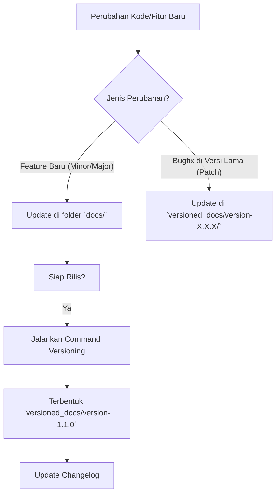

# Workflow Manajemen Dokumentasi

Dokumen ini menjelaskan panduan teknis (Standard Operating Procedure) untuk mengelola dokumentasi Talents Mapping, termasuk strategi versioning, rilis fitur baru, dan pengelolaan changelog.

## 1. Konsep Dasar Versioning

Kita menggunakan fitur versioning bawaan Docusaurus.

*   **`docs/` (Latest/Next)**: Folder ini berisi dokumentasi untuk versi aplikasi yang **sedang dikembangkan** (unreleased) atau versi terbaru yang belum di-*snapshot*.
*   **`versioned_docs/`**: Folder ini berisi snapshot dokumentasi dari versi yang **sudah rilis** (stable), misalnya v1.0.0.

## 2. Standar Penomoran Versi (Semantic Versioning)

Proyek ini mengikuti standar [Semantic Versioning](https://semver.org/) dengan format **MAJOR.MINOR.PATCH** (contoh: 1.0.0).

*   **MAJOR**: Versi dinaikkan jika ada perubahan yang **tidak kompatibel** dengan versi sebelumnya (breaking changes).
*   **MINOR**: Versi dinaikkan jika ada **fitur baru** yang kompatibel dengan versi sebelumnya (backward-compatible).
*   **PATCH**: Versi dinaikkan jika ada **perbaikan bug** (bug fixes) yang kompatibel dengan versi sebelumnya.

### Aturan Reset Versi

Ketika angka di sebelah kiri dinaikkan, maka angka di sebelah kanannya harus **direset menjadi 0**.

Contoh jika versi saat ini adalah `1.7.0`:
*   **Patch Update** -> `1.7.1` (Hanya perbaikan bug)
*   **Minor Update** -> `1.8.0` (Fitur baru, patch reset ke 0)
*   **Major Update** -> `2.0.0` (Perubahan besar, minor & patch reset ke 0)

## 3. Diagram Workflow



## 4. Skenario Penggunaan

### A. Sedang Mengembangkan Fitur Baru (Next Release)

Jika tim sedang mengerjakan fitur yang akan rilis di versi mendatang (misal v1.1.0):

1.  **Edit file di folder `docs/`**.
2.  Jangan edit file di `versioned_docs` kecuali perubahan itu juga berlaku untuk versi lama.
3.  Simpan perubahan. Dokumentasi "Next" akan otomatis terupdate di mode development.

### B. Membuat Rilis Baru (Major/Minor)

Ketika aplikasi siap rilis (misal dari v1.0.0 ke v1.1.0):

1.  Pastikan semua dokumentasi di folder `docs/` sudah lengkap sesuai fitur v1.1.0.
2.  Jalankan perintah versioning di terminal:
    ```bash
    npm run docusaurus docs:version 1.1.0
    ```
3.  Perintah ini akan:
    *   Menyalin isi `docs/` ke `versioned_docs/version-1.1.0/`.
    *   Membuat sidebar baru di `versioned_sidebars/version-1.1.0-sidebars.json`.
    *   Menambahkan "1.1.0" ke `versions.json`.

### C. Melakukan Hotfix/Patch pada Versi Lama

Jika ada typo atau kesalahan info di versi yang sudah rilis (misal v1.0.0), tetapi kita belum siap merilis v1.1.0:

1.  **Edit file di `versioned_docs/version-1.0.0/`**.
2.  Perubahan akan langsung terlihat di dokumentasi versi 1.0.0.
3.  **Penting:** Jika perbaikan tersebut juga relevan untuk versi selanjutnya, jangan lupa aplikasikan perbaikan yang sama di folder `docs/` agar tidak hilang di rilis berikutnya.

### D. Fitur Masih di Development/Staging

Jika ada fitur baru yang sudah deploy di environment Development atau Staging tapi **belum production**:

1.  Buat dokumentasi di folder `docs/`.
2.  Tambahkan **Admonition Warning** di bagian paling atas halaman tersebut agar pembaca tahu fitur ini belum tersedia di Production.
    ```markdown
    :::warning Belum Rilis
    Fitur ini masih dalam tahap pengembangan (Development/Staging) dan belum tersedia di Production.
    :::
    ```
3.  Setelah fitur rilis ke production, hapus warning tersebut.

## 5. Manajemen Changelog

Setiap rilis harus dicatat di Changelog agar pengguna tahu apa yang berubah.

### Lokasi Changelog

Disarankan membuat satu file khusus di folder dokumen, misalnya `docs/changelog.md` (dan dicopy ke setiap versi). Atau gunakan fitur Blog jika ingin update yang lebih naratif.

Untuk struktur file md:

```markdown
---
id: changelog
title: Changelog
sidebar_position: 99
---

# Changelog

Semua perubahan penting pada proyek ini akan didokumentasikan di halaman ini.

## [1.1.0] - TBD
### Added
- Fitur pembayaran via QRIS.
- Dokumentasi API untuk endpoint `/v1/payments`.

### Changed
- Update skema database user (penambahan kolom `phone`).

---

## [1.0.0] - 2024-01-01
### Added
- Rilis awal dokumentasi Talents Mapping.
- Modul Authentication dan Assessment.
```

### Tips Changelog
Gunakan format **Keep a Changelog**:
*   `Added` untuk fitur baru.
*   `Changed` untuk perubahan di fitur yang sudah ada.
*   `Deprecated` untuk fitur yang akan dihapus.
*   `Removed` untuk fitur yang sudah dihapus.
*   `Fixed` untuk perbaikan bug.
*   `Security` untuk perbaikan celah keamanan.

## 6. Checklist Rilis

Sebelum menjalankan perintah versioning `npm run docusaurus docs:version X.X.X`:

- [ ] Cek folder `docs/` apakah sudah mencakup semua fitur baru.
- [ ] Pastikan tidak ada *broken links* (`npm run build`).
- [ ] Update halaman Changelog di `docs/changelog.md` dengan tanggal rilis.
- [ ] Jalankan perintah versioning.
- [ ] Commit dan Push perubahan ke repository git.
