# 2026 Transformation Blueprint

## Glosarium

| **Istilah** | **Definisi** |
| --- | --- |
| **SKU / Varian** | Unit terkecil dari varian produk yang memiliki kode unik dan harga spesifik. |
| **Entitlement (*Tiket Digital*)** | Hak digital yang dimiliki user untuk mengakses layanan, terpisah dari data transaksi keuangan. **Bukan secara explisit** berbentuk tiket, ini hanya di belakang layar |
| **Commission Recipient** | Istilah teknis untuk perorangan (Influencer/Praktisi/Affiliator) yang berhak menerima komisi. |
| **Commission Tier** | Tingkatan level Penerima Komisi (misal: Affiliator *Influencer*, Affiliator *Praktisi, Affiliator umum*) yang menentukan persentase bagi hasil. |
| **Service License** | Tipe *entitlement* khusus untuk layanan jasa (Konsultasi). |
| **Hard-Bundling** | Paket penjualan di mana satu harga mencakup beberapa produk sekaligus (misal: Asesmen + Konsultasi) yang tidak bisa dipisahkan atau dibeli eceran oleh pembeli dalam paket tersebut. Paket diperlakukan sebagai satu unit penjualan, namun secara internal tetap direpresentasikan sebagai kumpulan beberapa produk, sehingga pencatatan dan entitlement tetap dapat dikelola per produk dengan tetap mendapat benefit **bundling** |
| **Delta Price (*Selisih Harga*)** | Salah satu metode perhitungan harga upgrade di mana user hanya membayar selisih antara harga produk baru dikurangi harga produk lama. |
| **Deep Copy (*Salin Data*)** | Proses teknis menyalin data jawaban asesmen lama ke tiket baru secara utuh saat proses upgrade, menjaga agar user tidak perlu mengerjakan ulang. |

&nbsp;

* * *

## BAB 1: Latar Belakang & GAP

### **1.1. Masalah**

Arsitektur sistem saat ini dibangun di mana hak akses layanan terikat secara permanen pada ID Transaksi. Keterikatan erat (*tight coupling*) ini menciptakan hambatan kritikal bagi pengembangan bisnis, antara lain:

- **Hak Akses Kaku:** Sistem tidak dapat memberikan akses parsial atau memisahkan akses layanan dari status pembayaran keuangan.

- **Inkompatibilitas Bundling:** Tidak dimungkinkannya penjualan paket gabungan (misal: Asesmen + Konsultasi) dengan manajemen inventaris yang terpisah, harus membuat produk yang secara khusus mengandung 2 produk dalam inventaris yang sama.

- **Risiko Integritas Data:** Setiap upaya modifikasi fitur (seperti *upgrading* produk) berisiko merusak integritas data historis keuangan karena tidak adanya pemisahan *concern*.

### **1.2. Perbandingan Model (As-Is vs To-Be)**

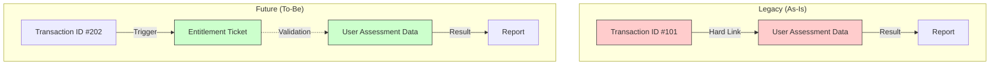

[\[Produk\] GAP Arstektur Sistem Lama dan Baru](./03-analysis/03-product.md)

### **1.3. Tujuan Bisnis**

- Apa yang ingin dicapai bisnis dengan sistem baru ini?

    - Mendukung Skema Produk Varian.

    - Mendukung Skema Komisi Influencer Bertingkat.

    - Memungkinkan User melakukan Upgrade Produk.

    - Menyediakan Tes yang kompatibel dengan upgrade produk.

    - Memisahkan produk berbasis "Jasa/Waktu" (Konsultasi) dengan produk "Barang Digital" (Asesmen).

* * *

## BAB 2: Konsep Arsitektur Utama

### **2.1. Filosofi Design: Service-Oriented**

1.  **Commerce Domain (Transaksi):** Bertanggung jawab mutlak atas katalog, perhitungan harga final, dan validasi pembayaran. Output Akhir: Status Transaksi

2.  **Entitlement Domain (Distribusi):** Bertanggung jawab menerbitkan "Hak Akses" kepada user setelah pembayaran valid. Output: Tiket Digital/Hak Akses (dibelakang layar).

3.  **Commission Domain (Payroll):** Bertanggung jawab menghitung kewajiban perusahaan kepada affiliator, praktisi atau influencer. Output: Credit Komisi.

4.  **End User Service Domain:** Bertanggung jawab untuk menukarkan "Tiket/Hak Akses" agar bisa mendapatkan akses ke Service Konsultasi atau Engine Tes Asesmen

### **2.2. Diagram Blok Sistem**

#### 2.2.1 Sistem Lama

Ciri Khas: Transaction-Centric Monolith. Semua layanan (Asesmen & Konsultasi) serta perhitungan komisi "menembus" langsung ke tabel transaksi untuk validasi. Tidak ada layer penengah.

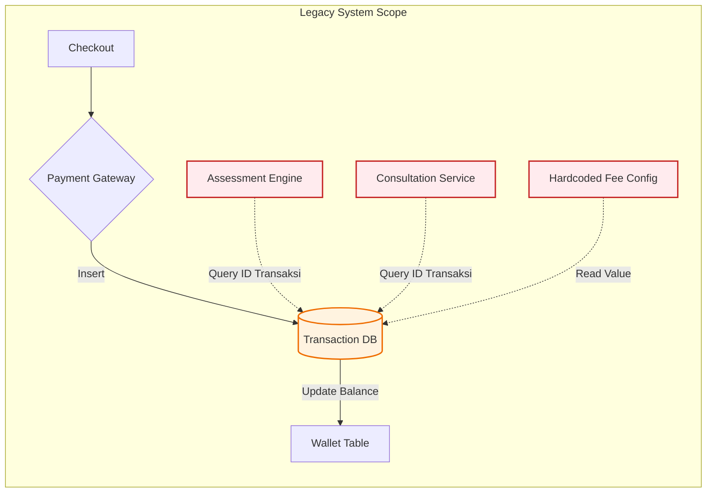

#### 2.2.2 Sistem Baru

*Ciri Khas: **Service-Oriented & Decoupled**. Transaksi hanya memicu penerbitan tiket. Layanan User hanya memvalidasi Tiket (Entitlement), tidak peduli user bayar kapan atau berapa.*

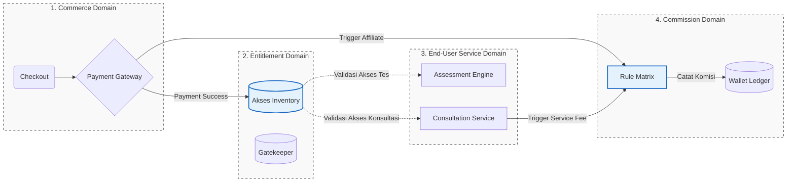

> Jadi Asesmen, Konsultasi atau layanan fitur lain tidak bergantung secara langsung pada transaksi, tetapi ada layer tambahan sebagai pengatur akses ke layanan tersebut.
>
> **Kelebihan:**
>
> - Layanan (asesmen, konsultasi, fitur lain) terlepas dari proses transaksi, sehingga mudah dikembangkan.
> - Hak akses dikelola terpusat melalui entitlement, memudahkan kontrol, audit, dan pembatasan penggunaan.
> - Perubahan pada skema pembayaran atau komisi tidak berdampak langsung ke layanan end user.
> - Arsitektur lebih modular dan scalable untuk keperluan dimasa depan
>
> **Kekurangan:**
>
> - Kompleksitas arsitektur meningkat karena adanya beberapa domain dan alur asinkron.
> - Potensi inkonsistensi data jika sinkronisasi antar domain tidak ditangani dengan baik.
> - Membutuhkan mekanisme observability yang lebih matang (logging, tracing, monitoring).
> - Penanganan edge case (retry, idempotency, rollback) menjadi lebih menantang.

&nbsp;

* * *

## BAB 3: Spesifikasi Domain Fungsional

### **3.1. Domain Produk & Harga (Pricing Engine)**

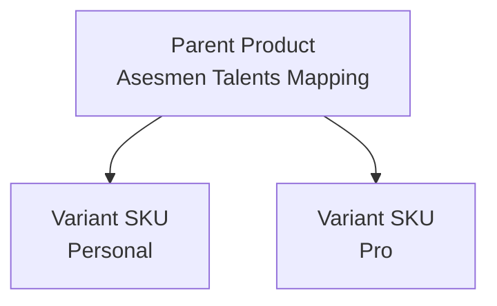

- **Struktur Varian:** Produk dibagi menjadi dua level:

    - *Parent Product:* Entitas pemasaran (Contoh: "Asesmen Talents Mapping").

    - *Product Variant:* Entitas transaksional/SKU (Contoh: "Asesmen Talents Mapping - Personal").

- **Logika Penetapan Harga:** Harga dasar pada SKU dapat di-*override(ditimpa dan diganti)* oleh pricing engine berdasarkan:

    - *Channel:* Apakah user datang dari Link Affiliate atau Organik?

    - *Product:* Apakah produk bundling?

    &nbsp;

- **Aturan Bundling:** Mendukung *Hard-Bundling* (Paket Wajib) di mana satu harga mencakup beberapa SKU sekaligus.

### **3.2. Domain Entitlement**

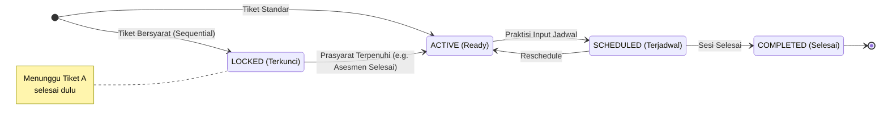

- Transaksi sukses adalah pemicu (*trigger*) penerbitan akses. Satu transaksi bisa menerbitkan banyak akses berbeda.

- **Klasifikasi Entitlement:**

    - **Content License:** Izin akses konten digital. (Contoh: Asesmen, E-Learning). Status: *Open/Closed*.

    - **Service License:** Izin untuk mengklaim layanan jasa. (Contoh: Konsultasi). Entitlement ini bersifat **1-on-1** dengan sesi layanan.

- **Siklus Hidup Akses Layanan:**

    - `Active`: Tiket terbit, User belum memilih jadwal.

    - `Scheduled`: User sudah memilih jadwal (Tiket terhubung ke `feedback_session`).

    - `Completed`: Sesi konsultasi selesai (Trigger pencairan komisi).

    - `Void`: Tiket dibatalkan (Refund/Fraud), akses dicabut.

- #### Mekanisme Ketergantungan (*Chained Entitlement*)

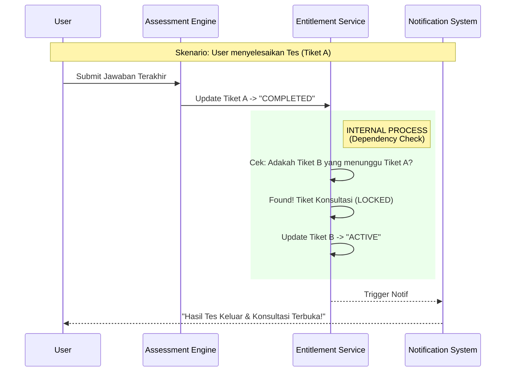

Sistem mendukung aturan **Sequential Access** (Akses Berurutan), di mana penggunaan satu tiket menjadi syarat terbukanya tiket lain.

- **Skenario:** Tiket Konsultasi hanya boleh digunakan setelah Tiket Asesmen selesai.

- **Implementasi:**

    1.  Saat pembelian, Tiket Konsultasi diterbitkan dengan status **LOCKED**.

    2.  Sistem memiliki *Dependency Map* (Peta Ketergantungan) yang mencatat bahwa "Tiket B butuh Tiket A".

    3.  Saat Tiket A berubah status menjadi `COMPLETED`, sistem otomatis memicu *Event Listener* untuk membuka gembok Tiket B menjadi `ACTIVE`.

### 3.3. Domain Komisi

**Konsep Dasar:**

Sistem meninggalkan model lama (*Config Key-Value*) yang kaku. Kini, sistem menggunakan **Matrix Rules** multidimensi yang menyatukan perhitungan untuk semua jenis penerima dana, baik itu Member, Influencer, maupun Praktisi.

**Aktor & Tingkatan (*Tiering Structure*):**

Sistem mengelompokkan aktor ke dalam 3 Tier standar untuk memudahkan manajemen aturan:

1.  **General Member:** User biasa yang menyebar kode referral (Komisi Standar, e.g., 10% dari Laba Bersih).

2.  **Practitioner Affiliate:** Praktisi yang membawa klien (Komisi Menengah + Jasa Layanan).

3.  **Influencer / KOL:** Kerjasama atau lainnya (Komisi Khusus, bisa berupa *Revenue Share* atau *Fixed Fee* per penjualan).

**Mesin Aturan (*The Rule Matrix*):**

Setiap perhitungan komisi ditentukan oleh 5 parameter dalam database:

1.  **Who:** Siapa Tier-nya? (Member/Praktisi/Influencer).

2.  **What:** Apa Produknya? (Asesmen/Konsultasi).

3.  **How:** Apa Aksinya? (*Referral* atau *Service*).

4.  **Base:** Dasar Hitungan? (*Net Profit* atau *Gross Price*).

5.  **Value:** Berapa nilainya? (Persentase % atau Nominal Rp).

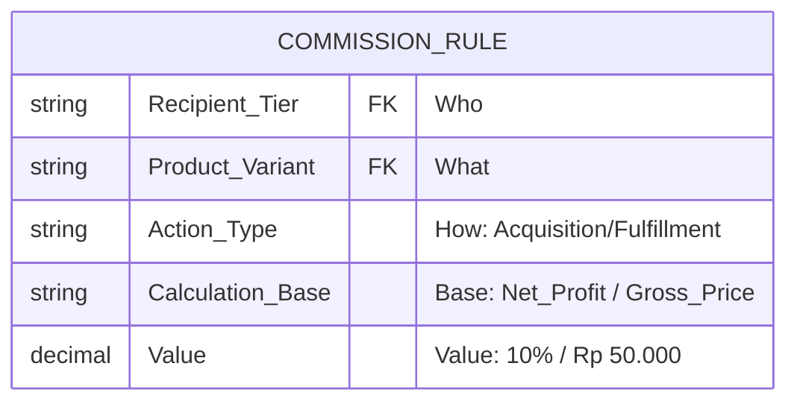

**Logika Pemicu & Aksi (*Triggers & Actions*):**

| **Tipe Komisi** | **Pemicu (Trigger)** | **Logika Sistem** | **Aksi Keuangan** |
| --- | --- | --- | --- |
| **1\. Affiliate (Marketing)** | Transaksi Status: `PAID` | Cek `referral_code` pada data transaksi. Milik siapa? (Misal: Praktisi Dev). | Kreditkan saldo ke Wallet pemilik kode sesuai aturan Tier dia sebagai *Affiliator*. |
| **2\. Service (Fulfillment)** | Layanan Status: `COMPLETED` | Cek `practitioner_id` pada sesi konsultasi. Siapa yang bertugas? (Misal: Dr. Budi). | Kreditkan saldo ke Wallet praktisi sesuai aturan Tier dia sebagai *Penyedia Jasa*. |

**Strategi Penentuan Nilai (*Override Hierarchy*):**

Untuk mengakomodasi kontrak khusus, sistem menggunakan logika "Air Terjun" (*Waterfall Check*) saat menentukan besaran komisi.

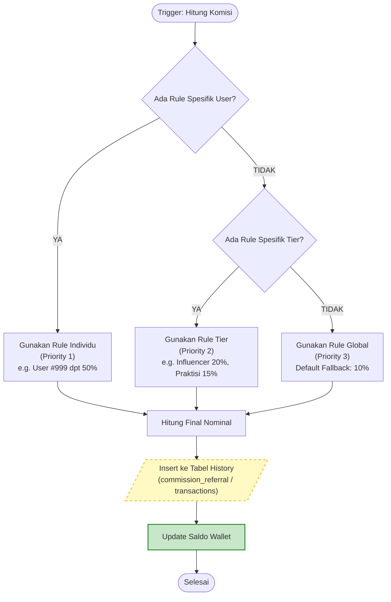

*Penjelasan Diagram:*

1.  **Level 1 (Individual Override):** Admin bisa men-set aturan khusus untuk User ID tertentu (misal: Affiliator A dapat 50%). Ini akan mengalahkan aturan lainnya.

2.  **Level 2 (Tier Rule):** Jika tidak ada aturan individu, sistem melihat Tier-nya (Influencer/Praktisi/Member).

3.  **Level 3 (Global Fallback):** Jika Tier-nya pun belum diatur, sistem menggunakan persentase default agar tidak error.

* * *

## BAB 4: Transisi Proses Bisnis

### 4.1. Alur Pembelian & Aktivasi

#### 4.1.1. Alur Lama (*Legacy: Transaction-Based*)

*Karakteristik: Akses layanan bergantung sepenuhnya pada status pembayaran di tabel transaksi.*

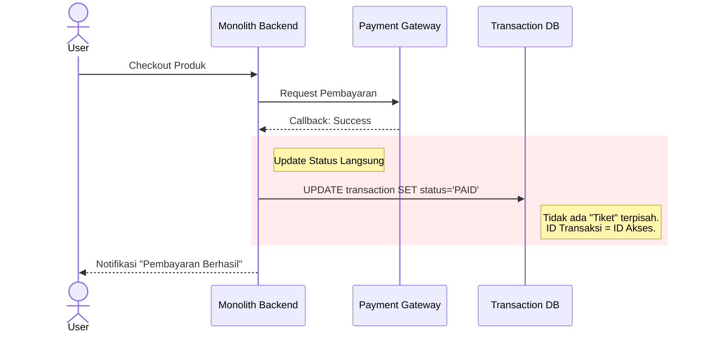

**Proses:**

1.  **Checkout:** User memilih produk.

2.  **Bayar:** User membayar tagihan.

3.  **Flagging:** Sistem hanya mengubah "Bendera" status pada database transaksi menjadi `PAID`. Tidak ada objek baru yang dibuat untuk hak akses.

#### 4.1.2 Alur Baru (*New: Entitlement-Based*)

*Karakteristik: Pembayaran memicu penerbitan "Tiket Digital" yang independen.*

Cuplikan kode

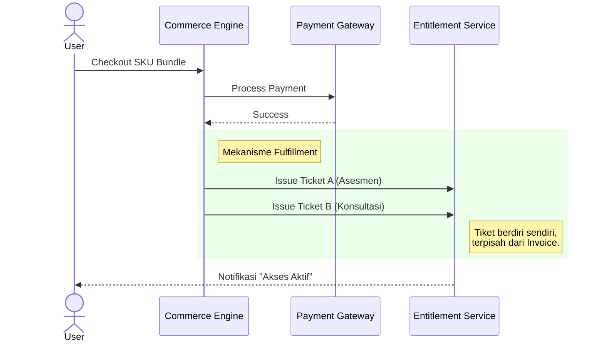

**Proses:**

1.  1.  ******Pilih Produk:****** User memilih paket yang diinginkan di website (misal: Bundle).

    2.  ****Hitung Harga:**** Sistem menghitung total harga (Harga Produk + Biaya Admin - Diskon Kode Promo +- dan lain lain).

    3.  **Pembayaran:** User membayar tagihan.

    4.  **Penerbitan Tiket/Akses (*Issuing*):** Setelah bayar, sistem memerintahkan *Entitlement Service* untuk mencetak tiket digital sesuai isi paket (bisa jadi 1 transaksi menghasilkan 2 tiket berbeda).

    5.  **Notifikasi:** User mendapat notifikasi bahwa akses layanan sudah aktif (bukan sekadar pembayaran berhasil).

### 4.2. Alur Upgrade Produk

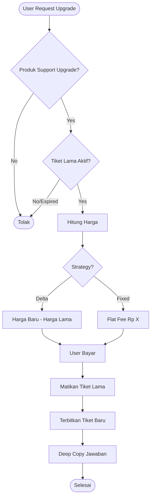

**1\. Validasi Bertingkat:** Sistem melakukan dua pengecekan sebelum mengizinkan proses:

- **Cek Produk:** Sistem mengecek tabel konfigurasi, "Apakah Admin sudah mengizinkan jalur upgrade dari Produk A ke Produk B?". Jika tidak ada jalurnya, tombol upgrade tidak muncul.

- **Cek Tiket:** Sistem mengecek kondisi tiket milik user.

    - Apakah statusnya **Aktif/Selesai** atau **Invalid/Expired** *(Misal karena refund)?* (Tiket *Hangus/Expired* tidak bisa di-upgrade).

    - Apakah tiket ini sudah pernah di-upgrade sebelumnya? (Tiket yang statusnya *Upgraded* tidak bisa dipakai lagi).

**2\. Hitung Biaya Upgrade:**

- **Mode Selisih (*Delta*):** User hanya membayar kekurangan harganya (Harga Baru dikurangi Harga Lama yang tercatat di riwayat transaksi).

- **Mode Harga Tetap (*Fixed*):** User membayar biaya upgrade yang sudah dipatok rata (misal: Flat Rp 50.000, tidak peduli harga belinya dulu berapa).

**3\. Pembayaran:** User membayar tagihan upgrade.

**4\. Pakai Akses:**

- **Matikan Lama:** Akses lama (Personal) statusnya berubah menjadi **Upgraded** (Non-aktif).

- **Terbitkan Baru:** Akses baru (Pro) diterbitkan dengan status **Aktif**.

**5\. Salin Jawaban (*Opsional*):** Jika tiket lama berisi data jawaban tes, sistem menawarkan opsi untuk menyalin jawaban tersebut ke akses baru agar user tidak perlu mengerjakan ulang dari nol.

### 4.3. Alur Konsultasi

1.  **Beli:**

    - User membeli paket konsultasi / konsultasi saja.

    - Sistem menerbitkan **Akses Layanan** dengan status `Active`.

2.  **Negosiasi Jadwal (Off-Platform):**

    - User masuk menu Konsultasi. Karena status tiket `Active`, muncul tombol **"Hubungi Praktisi via WhatsApp"**.

    - User dan Praktisi berdiskusi menentukan waktu yang cocok melalui chat WhatsApp.

3.  **Penguncian Jadwal (System Input):**

    - Setelah *deal*, Praktisi (melalui Dashboard Praktisi) menginput tanggal kesepakatan.

    - Sistem mengubah status tiket User menjadi `OnProgress` (Proses).

4.  **Pelaksanaan & Penyelesaian:**

    - Sesi berjalan.

    - Setelah selesai, Praktisi mengklik tombol "Selesaikan Sesi" di dashboardnya.

    - Status tiket berubah menjadi `Completed` (Komisi cair).

* * *

## BAB 5: Strategi Migrasi & Koeksistensi (Migration Strategy)

### 5.1. Strategi "Hybrid Database"

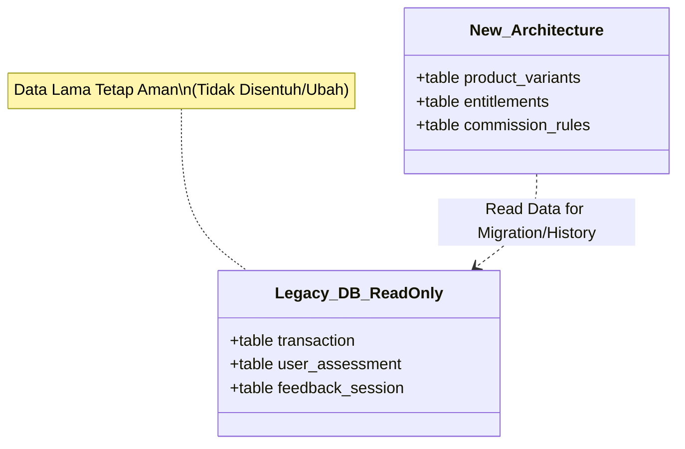

Untuk memitigasi risiko kehilangan data, sistem akan menggunakan pendekatan **Side-by-Side**:

- Tabel Legacy (`transaction`, `user_assessment`) **TIDAK AKAN DIHAPUS** atau diubah strukturnya.

- Tabel Baru (`entitlements`, `product_variants`) akan dibuat berdampingan.

- Aplikasi akan dimodifikasi untuk membaca tabel baru sebagai prioritas utama, namun tetap memiliki akses baca (*read-only*) ke tabel lama.

### 5.2. Rencana Migrasi Data (*Data Seeding Plan*)

Akan dijalankan *Background Script* untuk pengguna lama (Backfilling):

- Sistem memindai transaksi sukses masa lalu.

- Sistem menerbitkan *Entitlement* bagi user lama agar mereka kompatibel dengan fitur baru (seperti Upgrade).

### 5.3. Fase Peluncuran (*Rollout Plan*)

- **Tahap 1 (Internal Pilot):** Admin menggunakan sistem baru untuk input produk dan simulasi transaksi.

- **Tahap 2 (New Product Only):** Produk varian baru (misal: TMA Pro) diluncurkan eksklusif menggunakan sistem baru.

- **Tahap 3 (Full Migration):** Seluruh produk lama dimigrasikan ke struktur varian baru.

&nbsp;
