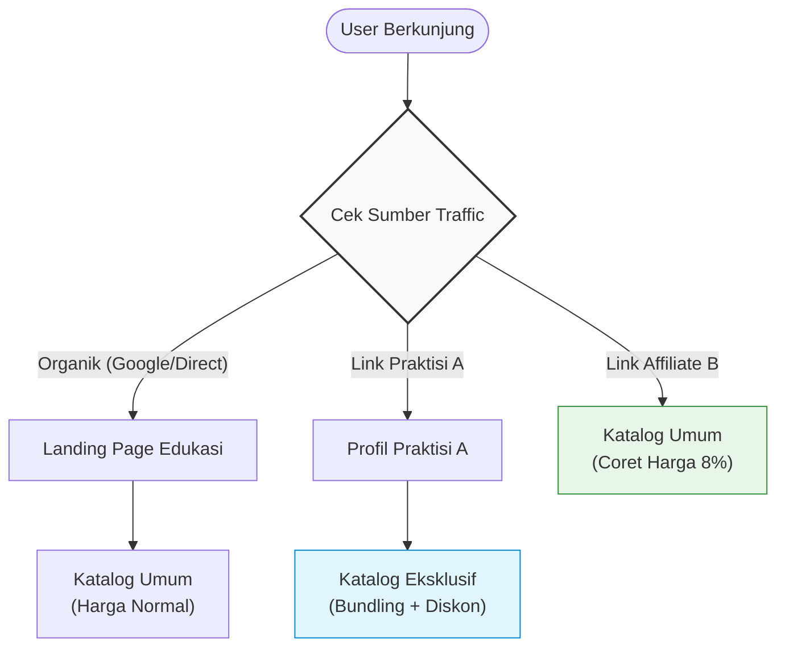
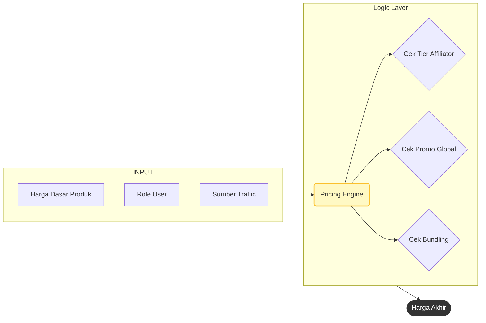
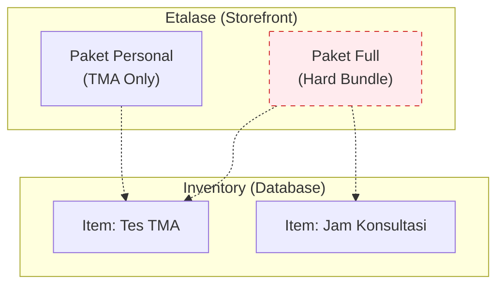
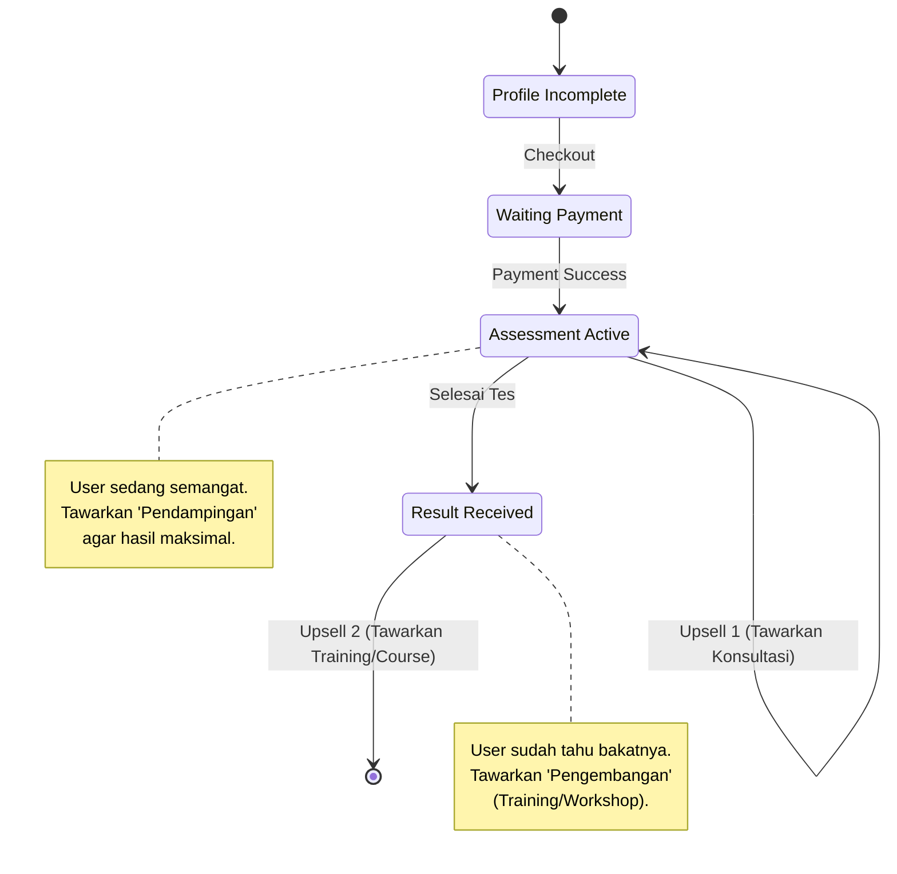

import { FiArrowRight, FiUsers, FiShoppingBag, FiLayers } from 'react-icons/fi';

# Konsep Arsitektur 2026

Dokumen ini menjelaskan 4 Pilar Utama perubahan arsitektur sistem Talents Mapping untuk mendukung skalabilitas bisnis 2026.

---

## Pilar 1: *Context-Aware Acquisition*
**(Sistem yang "Sadar Konteks")**

**Masalah Lama (As-Is):**
Sistem memperlakukan semua pengunjung sama. Homepage adalah satu-satunya pintu gerbang utama. Pembeda hanya di *tracking* (UTM), tapi pengalaman (*experience*) user tetap sama (User Organik & User via Praktisi melihat hal yang sama).

**Konsep Baru (To-Be):**
Sistem memiliki "Front-Door Logic" yang mendeteksi *"Siapa yang datang?"* dan membelokkan mereka ke pengalaman yang relevan.

**Implikasi Arsitektur:**
Database tidak boleh lagi menempelkan harga "mati" atau visibilitas "mati" pada satu produk. Produk harus memiliki *Availability Rules* (Aturan Ketersediaan) yang bergantung pada *Channel Entry*.

---

## Pilar 2: *Decoupled Pricing Engine*
**(Mesin Harga yang Terpisah)**

**Masalah Lama:**
Harga diskon diatur manual (hardcode atau ubah master data). Tidak *scalable* untuk ribuan Affiliator dengan tier komisi berbeda-beda.

**Konsep Baru:**
Harga akhir adalah hasil kalkulasi dinamis, bukan angka statis di database.

**Benefiit Skalabilitas:**
Jika besok Anda ingin Affiliator "Top Tier" memberi diskon 10% dan "Newbie" hanya 5%, kita hanya mengubah konfigurasi *Rule* di Pricing Engine tanpa menyentuh kode aplikasi.

---

## Pilar 3: *Product Bundling & Exclusivity*

**Masalah Lama:**
"Produk A" dan "Produk B" terpisah. Jika mau dijual paket, harus buat "Produk C" (Paket A+B). Inventori berantakan & reporting kacau.

**Konsep Baru (Packaging vs Product):**

- **Hard Bundling:** User membeli "Paket Full", tapi sistem backend mencatat pengurangan stok untuk 2 item (TMA & Konsultasi).
- **Exclusivity (Produk Hantu):** Produk seperti "PSS GRIT" ada di database, tapi ditandai *restricted*. Hanya *Context* Praktisi yang punya kunci untuk menampilkan produk ini.

---

## Pilar 4: *Lifecycle Upselling Orchestration*
**(Pengawal Siklus Hidup)**

**Masalah Lama:**
Transaksi selesai saat status `Paid`. Hubungan putus.

**Konsep Baru:**
Sistem memiliki "State Machine" untuk memandu user ke pembelian berikutnya (Retention).

**Strategy:**
1.  **Upsell 1 (Immediate):** Tawarkan Add-on saat user baru saja bayar (Thank You Page).
2.  **Upsell 2 (Retention):** Tawarkan produk lanjutan (Training/Certification) setelah user melihat hasil asesmennya.

---

### Kesimpulan & Aksi

Untuk mewujudkan ini, perubahan fundamental yang akan dilakukan tim teknis:

1.  **Offering Layer:** Membuat layer "Penawaran" di atas layer "Produk". Satu produk bisa punya banyak wujud penawaran (Harga beda, Bundling beda).
2.  **Channel Context:** Frontend akan selalu mengirimkan "Context Header" (darimana user datang) ke setiap request API.
3.  **LMS Preparation:** Menyiapkan struktur database untuk produk tipe *Course/Training* (bukan hanya asesmen).
