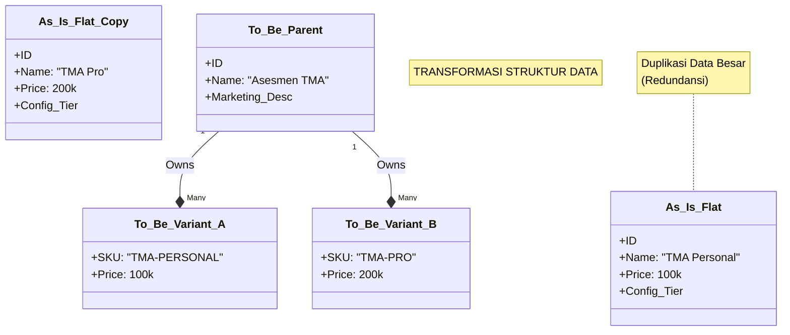
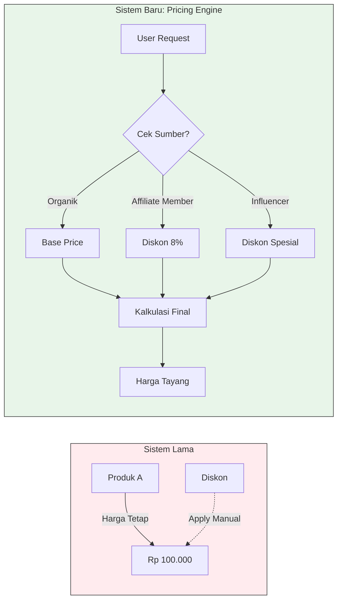
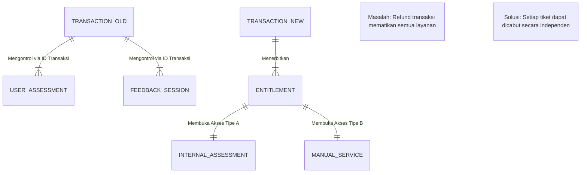
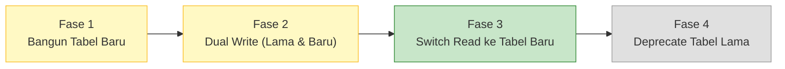

&nbsp;

# Detail Analisis Kesenjangan

## A. Matriks Perbandingan Arsitektur

| **Domain Fungsional** | **Kondisi Saat Ini (As-Is)** | **Kondisi Masa Depan (To-Be)** | **Gap & Implikasi Teknis** |
| --- | --- | --- | --- |
| **Struktur Produk** | **Entitas Tunggal**      Produk adalah satu baris flat di tabel `product`. Variasi dilakukan dengan duplikasi baris manual. | **Hierarki Induk-Varian**      Pemisahan antara Pemasaran (*Parent*) dan SKU Teknis (*Variant*). | **Gap Kritis:** Tabel `product` saat ini tidak mendukung relasi *one-to-many*. Perlu normalisasi tabel `product_variants`. |
| **Strategi Bundling** | **Terikat Lepas (*Loose*)**      Item transaksi hanya merujuk ke produk tunggal. Tidak ada definisi paket di level database. | **Bundling Terintegrasi**      Entitas `product_bundles` mendefinisikan aturan paket sebagai satu kesatuan harga & inventaris. | **Gap Fungsional:** Sulit melacak pendapatan per item dalam paket karena paket dianggap sebagai produk tunggal biasa. |
| **Mekanisme Harga** | **Statis & Terikat Kolom**      Harga mati tersimpan di kolom `price` pada tabel produk. | **Dinamis & Kontekstual**      Harga ditentukan oleh *Pricing Rules* (Channel, User Segment, Promo). | **Gap Logika:** Tidak bisa membedakan harga Organik vs Affiliate untuk produk yang sama tanpa duplikasi data. |
| **Manajemen Akses** | **Berbasis Transaksi**      Hak akses dicek langsung ke keberadaan ID Transaksi di tabel layanan. | **Berbasis Entitlement**      Hak akses dikelola via "Tiket" terpisah. Pembayaran dan Konsumsi layanan terputus (*decoupled*). | **Gap Arsitektur:** Ketergantungan pada tabel transaksi mematikan fitur *partial upgrade* dan *reschedule*. |
| **Akuisisi Pengguna** | **Linear Tunggal**      Satu alur: Beranda -> Checkout. Atribusi hanya via UTM sederhana. | **Multi-Channel**      4 Alur (Organik, Praktisi, Affiliate, Influencer) dengan logika UI unik. | **Gap Pengalaman:** Tidak ada *logic layer* untuk adaptasi UI otomatis berdasarkan sumber trafik. |

* * *

## B. Analisis Visual & Rinci per Domain

### 1\. Transformasi Data Produk

**Masalah As-Is:** Tabel `product` yang "gemuk" (*wide table*). Redundansi data terjadi saat membuat produk serupa (misal: TMA Personal vs TMA Pro).

**Solusi To-Be:** Adopsi pola *Parent-Variant*.

### 2\. Evolusi Mekanisme Penetapan Harga

**Masalah As-Is:** Harga statis. Diskon manual via tabel `discounts`.

**Solusi To-Be:** Implementasi *Pricing Engine* berbasis "Pintu Masuk" (*Entry Point*). Database tidak lagi menyimpan harga akhir, melainkan "Aturan".

### 3\. Perubahan Paradigma Fulfillment

**Masalah As-Is:** *Tight Coupling*. Tabel layanan (`user_assessment`) terkunci pada Foreign Key `transaction_id`. Jika transaksi batal, data layanan jadi ambigu.

**Solusi To-Be:** *Service Entitlement*. Transaksi hanya menerbitkan Hak Akses. Layanan Asesmen, Konsultasi, dan Training memiliki tipe fulfillment masing-masing.

* * *

## C. Kesimpulan & Rekomendasi

Kesenjangan utama terletak pada **kekakuan model data transaksional** lama yang didesain untuk penjualan produk putus (*discrete sales*), bukan untuk ekosistem layanan modern.

**Rekomendasi Tindakan: "Expand & Migrate"**

Alih-alih merombak total yang berisiko merusak data (Destruktif), kita gunakan strategi *Side-by-Side*:

1.  **Jangan Hapus:** Tabel lama dibiarkan untuk arsip.

2.  **Bangun Baru:** Buat tabel `product_variants`, `entitlements`, `price_rules` di sebelahnya.

3.  **Migrasi Bertahap:** Pindahkan logika bisnis pelan-pelan ke struktur baru.

