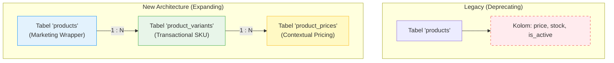
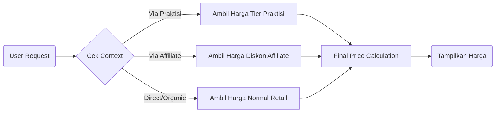

# Strategi **"Expand & Deprecate"**

Untuk mendukung kebutuhan bisnis yang semakin kompleks (Tiering Harga, Bundling, Multi-Varian), kita tidak bisa lagi mengandalkan satu tabel `products` yang "gemuk". Strategi yang dipilih adalah **Expand & Deprecate**: Kita **memperluas** (expand) struktur baru di samping tabel lama, lalu perlahan **meninggalkan** (deprecate) kolom-kolom lama yang tidak relevan tanpa menghapus tabelnya (untuk menjaga kompatibilitas data historis).

## Visualisasi Transisi

---

## Tahap 1: Split "Konsep" vs "Barang Jualan"
**(Handling Multi-Variant)**

Kita memisahkan **Produk Marketing** (Apa yang dilihat user di etalase) dengan **SKU/Varian** (Apa yang sebenarnya masuk ke keranjang belanja).

### 1. Tabel Lama (`products`) -> Marketing Header
Tabel ini tetap dipertahankan, tapi fungsinya bergeser menjadi hanya menyimpan **Informasi Pemasaran** yang bersifat umum.
*   **Fungsi:** Menyimpan Nama Produk (e.g., "Asesmen Talents Mapping"), Deskripsi, Gambar Utama, dan Slug URL.
*   **Deprecate:** Kolom `price`, `stock`, `status` di tabel ini akan diabaikan oleh sistem baru (diberi komentar `-- DEPRECATED`).
*   **Perubahan:** User tidak lagi "membeli produk", tapi "membeli varian dari produk".

### 2. Tabel Baru (`product_variants`) -> Transactional SKU
Tabel ini berisi pecahan item fisik/digital dari parent produk. Inilah yang memiliki stok dan kode SKU unik.
*   **Contoh Implementasi:**
    *   **Parent (ID 101):** "Asesmen Talents Mapping"
    *   **Variant A (SKU-01):** "TMA Personal" (Untuk B2C)
    *   **Variant B (SKU-02):** "TMA Profesional" (Untuk B2B)
    *   **Variant C (SKU-03):** "TMA Bundling Konsul" (Paket Hemat)

> **Benefit:** Kita bisa membuat banyak variasi produk (misal paket hemat, paket corporate) tanpa mengotori data master produk utama.

---

## Tahap 2: Decouple Pricing
**(Handling Dynamic Price & Commission)**

Masalah utama di sistem lama adalah harga yang "menempel" mati di tabel produk. Di sistem baru, harga adalah entitas yang terpisah dan dinamis.

### Tabel Baru (`product_prices`)
Tabel ini bertugas menyimpan aturan harga main (Main Rule). Sistem tidak lagi bertanya *"Berapa harga produk X?"*, tapi bertanya *"Berapa harga produk X untuk User Y yang datang dari Channel Z?"*.

**Logika Penentuan Harga:**

**Struktur Data:**
Tabel `product_prices` menyimpan:
*   `product_variant_id`: Harga ini milik varian mana?
*   `channel_id`: Harga ini berlaku untuk jalur masuk mana? (e.g., "Web Retail", "Panel Mitra", "Link Khusus").
*   `base_price`: Nominal harga jual.
*   `commission_value`: Berapa fee yang didapat perantara (jika ada).

---

## Tahap 3: Definisi Fulfillment
**(Handling Outsourcing vs Engine)**

Produk kita tidak hanya Asesmen Otomatis. Kita mulai menjual Jasa (Konsultasi) dan Barang Fisik (Buku). Sistem harus tahu apa yang harus dilakukan setelah pembayaran sukses.

### Penambahan Kolom `fulfillment_type`
Di tabel `product_variants`, kita tambahkan kolom enum `fulfillment_type` untuk menentukan mekanisme delivery:

| Tipe Fulfillment | Deskripsi | Aksi Sistem (Setelah Paid) |
| :--- | :--- | :--- |
| **`AUTOMATIC_LICENSE`** | Produk digital otomatis by sistem. | Generate Row di tabel `user_assessments` (Tiket Tes). Kirim Email Akses. |
| **`MANUAL_SERVICE`** | Layanan jasa yang butuh jadwal. | Generate Row di tabel `feedback_sessions` (Tiket Konsul). Status `PENDING_SCHEDULE`. |
| **`PHYSICAL_GOODS`** | Barang fisik (Buku/Merch). | Kirim notifikasi ke Admin Logistik. Status `WAITING_DELIVERY`. |
| **`BUNDLE`** | Paket gabungan. | Pecah (Explode) menjadi beberapa item fulfillment sesuai isi paketnya. |

> **Note:** Dengan cara ini, "Assessment Engine" hanya akan merespon jika produknya bertipe `AUTOMATIC_LICENSE`. Layanan lain ditangani oleh modul masing-masing.
