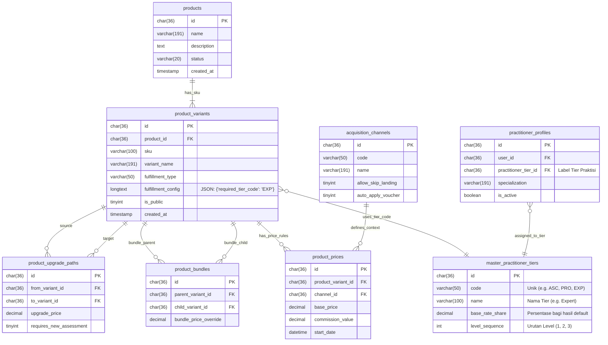

```mermaid
erDiagram
    %% --- CORE PRODUCT MARKETING ---
    products {
        char(36) id PK
        varchar(191) name
        text description
        varchar(20) status
        timestamp created_at
    }

    %% --- PRODUCT VARIANTS (SKU) ---
    product_variants {
        char(36) id PK
        char(36) product_id FK
        varchar(100) sku
        varchar(191) variant_name
        varchar(50) fulfillment_type
        longtext fulfillment_config "JSON: {'required_tier_code': 'EXP'}"
        tinyint is_public
        timestamp created_at
    }

    %% --- NEW: MASTER TIER (Perantara) ---
    master_practitioner_tiers {
        char(36) id PK
        varchar(50) code "Unik (e.g. ASC, PRO, EXP)"
        varchar(100) name "Nama Tier (e.g. Expert)"
        decimal base_rate_share "Persentase bagi hasil default"
        int level_sequence "Urutan Level (1, 2, 3)"
    }

    %% --- USER/PRACTITIONER PROFILE (Existing) ---
    practitioner_profiles {
        char(36) id PK
        char(36) user_id FK
        char(36) practitioner_tier_id FK "Label Tier Praktisi"
        varchar(191) specialization
        boolean is_active
    }

    %% --- CHANNEL CONTEXT ---
    acquisition_channels {
        char(36) id PK
        varchar(50) code
        varchar(191) name
        tinyint allow_skip_landing
        tinyint auto_apply_voucher
    }

    %% --- PRICING ENGINE ---
    product_prices {
        char(36) id PK
        char(36) product_variant_id FK
        char(36) channel_id FK
        decimal base_price
        decimal commission_value
        datetime start_date
    }

    %% --- BUNDLING ---
    product_bundles {
        char(36) id PK
        char(36) parent_variant_id FK
        char(36) child_variant_id FK
        decimal bundle_price_override
    }

    %% --- UPGRADING ---
    product_upgrade_paths {
        char(36) id PK
        char(36) from_variant_id FK
        char(36) to_variant_id FK
        decimal upgrade_price
        tinyint requires_new_assessment
    }

    products ||--|{ product_variants : has_sku

    product_variants }o--|| master_practitioner_tiers : uses_tier_code

    practitioner_profiles }o--|| master_practitioner_tiers : assigned_to_tier

    product_variants ||--o{ product_prices : has_price_rules
    acquisition_channels ||--o{ product_prices : defines_context

    product_variants ||--o{ product_bundles : bundle_parent
    product_variants ||--o{ product_bundles : bundle_child

    product_variants ||--o{ product_upgrade_paths : source
    product_variants ||--o{ product_upgrade_paths : target
```
