# Dokumentasi Service Logic: Pricing Engine & Proportional Distribution

**Dokumen Teknis - Update Retail 2026**
*Status: Ready for Development*

* * *

## 1\. Definisi & Batasan Masalah

### Konteks "Simultan"

Sistem harus mengakomodasi kondisi di mana User memiliki kombinasi potongan harga, meliputi:

- Diskon + Voucher secara bersamaan.
- Kombinasi diskon berbeda tipe.
- Kombinasi voucher berbeda tipe.
- Kombinasi diskon beda tipe + voucher beda tipe.

### Aturan Eksekusi (The Golden Rule)

> Meskipun input bersifat simultan, prosedur pemotongan harga **TETAP SEQUENTIAL (BERURUTAN)**. Tidak ada pemotongan paralel terhadap harga dasar yang sama.

* * *

## 2\. Tiga Pilar Kebijakan Harga

1.  **Pricing Priority:**
    Aturan mutlak: **Bundle Price > Discount Satuan**.
    *Jika User memilih Bundle, sistem dilarang menumpuk diskon satuan ke dalamnya.*
2.  **Reporting Precision:**
    Gunakan metode **Weighted Proration** (Prorata Berbobot) berdasarkan harga normal untuk memecah *revenue* bundle ke masing-masing produk di database.
3.  **Audit Trail:**
    Simpan "Alasan" pembentukan harga (misal: `applied_rule: bundle_override`, `voucher: affiliate_code`) di kolom terpisah pada tabel transaksi agar tim Finance mudah melakukan rekonsiliasi.

* * *

## 3\. Alur Logika Detil

### Fase 1: Penentuan Harga Dasar (Base Price Determination)

Fase ini menentukan harga awal sebelum diskon transaksi.

- **Logika Konflik:**
    - Jika **Bundle** dipilih, maka logika diskon satuan (misal: Promo LP 10%) **DIMATIKAN**.
    - Jika **Produk Satuan** (LP) dipilih, harga = Harga Satuan - Potongan 10%.
- **Bentuk Entitlement:**
    - Pada fase ini, diskon LP atau Bundle diperlakukan sebagai *Diskon Bersyarat* atau *Voucher Bersyarat Tipe Khusus*.

### Fase 2: Potongan Transaksi (Transaction Level)

Fase ini menerapkan diskon tambahan di atas harga yang sudah terbentuk di Fase 1.

- **Urutan:** Potongan Affiliate (misal 5%) baru dihitung **SETELAH** harga Fase 1 terbentuk.
- **Contoh Kasus:**
    - Harga Bundle (Fase 1): Rp 900.000
    - Diskon Affiliate 5%: Rp 45.000
    - **Grand Total (Dibayar User): Rp 855.000**

### Fase 3: Pencatatan Laporan (Reporting & Proration)

Fase ini terjadi di Backend setelah pembayaran sukses. Tujuannya memecah uang total ke masing-masing SKU.

- **Masalah:** User membayar Rp 855.000 untuk paket. Database tidak boleh mencatat revenue "Bundle" saja.
- **Solusi:** Sistem menghitung ulang porsi masing-masing produk berdasarkan **Perbandingan Harga Normal**.
- **Mekanisme Pembulatan (Priority Rounding):**
    1.  Hitung produk *Non-Prioritas* menggunakan fungsi `FLOOR` (pembulatan ke bawah).
    2.  Sisa selisih dimasukkan ke produk *Prioritas*.

* * *

## 4\. Simulasi Perhitungan Prorata (Studi Kasus)

Berikut adalah contoh perhitungan detil untuk skenario **TMA Profesional + Konsultasi Pro**.

**Data Awal:**

- Harga Normal TMA Profesional: **Rp 400.000** (Produk Prioritas)
- Harga Normal Konsultasi Pro: **Rp 200.000**
- **Total Harga Satuan:** Rp 600.000

**Transaksi Bundle:**

- **Harga Bundle:** Rp 500.000
- *Total Pengurangan (Diskon): Rp 100.000*

**Perhitungan Bobot:**

- Rasio = TMA : Konsul = 400k : 200k = **2 : 1**

**Eksekusi Pembagian (Logic Backend):**

1.  **Hitung Produk Non-Prioritas (Konsultasi Pro):**

    - Rumus: `(Harga Normal Item / Total Normal) * Harga Bundle`
    - Hitungan: `(200.000 / 600.000) * 500.000` = 166.666,66666666666666
    - **Action:** Lakukan `FLOOR` -> **Rp 166.000**
2.  **Hitung Produk Prioritas (TMA Profesional):**

    - Rumus: `Total Harga Bundle - Alokasi Produk Lain`
    - Hitungan: `500.000 - 166.000`
    - **Action:** Hasil Akhir -> **Rp 334.000**

**Hasil Pencatatan di Laporan:**

| Produk | Revenue Tercatat | Keterangan (Harga Coret) |
| :--- | :--- | :--- |
| TMA Profesional | **Rp 334.000** | (400.000 - 66.000) |
| Konsultasi Pro | **Rp 166.000** | (200.000 - 34.000) |
| **Total** | **Rp 500.000** | **Valid** |

&nbsp;

* * *

## 5\. Visualisasi Diagram Alur (System Flowchart)

Berikut adalah diagram alur logika sistem untuk implementasi teknis.

```mermaid
flowchart TD
    %% --- STYLE DEFINITIONS ---
    classDef startNode fill:#2962FF,stroke:#0039CB,stroke-width:2px,color:white;
    classDef productData fill:#FFECB3,stroke:#FF6F00,stroke-width:2px;
    classDef promoLP fill:#F8BBD0,stroke:#C2185B,stroke-width:2px,stroke-dasharray: 5 5;
    classDef bundleOverride fill:#C8E6C9,stroke:#2E7d32,stroke-width:4px;
    classDef logicEngine fill:#E1F5FE,stroke:#0277BD,stroke-width:2px;
    classDef finalResult fill:#212121,stroke:#000000,stroke-width:2px,color:white;
    classDef reporting fill:#EEEEEE,stroke:#616161,stroke-width:1px,stroke-dasharray: 3 3;

    %% --- MULAI ALUR ---
    Start(("User Mulai Checkout")):::startNode --> InitData

    %% FASE 1
    subgraph Phase1 ["FASE 1: Penentuan Harga Dasar (Conflict Zone)"]
        direction TB
        InitData["DATA PRODUK NORMAL:<br/>1. TMA Personal: Rp 500.000<br/>2. Konsultasi: Rp 500.000<br/>Total Normal: Rp 1.000.000"]:::productData

        %% Percabangan Logika
        InitData --> PathA
        InitData --> PathB

        %% Jalur A: Logika Satuan (Akan Kalah)
        PathA("DISKON LANDING PAGE (LP)<br/>Diskon 10% untuk TMA<br/>(Potensi Hemat: Rp 50.000)"):::promoLP

        %% Jalur B: Logika Bundle (Pemenang)
        PathB("USER MEMILIH BUNDLE<br/>Override Price: Rp 900.000"):::bundleOverride

        %% Titik Keputusan
        PathA --> Conflict{Cek Tipe Item}
        PathB --> Conflict

        Conflict -- "Item adalah Bundle" --> Winner["GUNAKAN HARGA BUNDLE<br/>Base Price Baru: Rp 900.000"]:::logicEngine

        %% Visualisasi Diskon LP yang Hangus
        Winner -.->|Override & Abaikan| PathA
        PathA -.->|Hangus / Tidak Berlaku| DeadEnd((X)):::promoLP
    end

    Phase1 --> Phase2

    %% FASE 2
    subgraph Phase2 ["FASE 2: Diskon Transaksi (Affiliate)"]
        direction TB
        Winner --> CheckCode{Input Kode?}

        CheckCode -- "Kode Praktisi (5%)" --> CalcDisc["Hitung Diskon dari Base Price<br/>5% x Rp 900.000 = Rp 45.000"]:::logicEngine

        CalcDisc --> GrandTotal["TOTAL DIBAYAR USER<br/>Rp 855.000"]:::finalResult
    end

    Phase2 --> Phase3

    %% FASE 3
    subgraph Phase3 ["FASE 3: Engine Laporan (Weighted Proration)"]
        direction TB
        GrandTotal --> LogicSplit{Mulai Split Revenue}

        %% 1. Hitung Bobot dari Harga Normal
        LogicSplit --> WeightCalc["1. HITUNG BOBOT (Basis Harga Normal)"]:::logicEngine
        WeightCalc --> W_TMA["Bobot TMA:<br/>500k / 1000k = 50%"]:::reporting
        WeightCalc --> W_Konsul["Bobot Konsul:<br/>500k / 1000k = 50%"]:::reporting

        %% 2. Distribusi Uang Rill (855k)
        W_TMA --> RevTMA["2. ALOKASI REVENUE TMA<br/>50% x Rp 855.000"]:::logicEngine
        W_Konsul --> RevKonsul["2. ALOKASI REVENUE KONSUL<br/>50% x Rp 855.000"]:::logicEngine

        %% 3. Masuk Database
        RevTMA --> DB_TMA[("Laporan TMA:<br/>Rp 427.500")]:::finalResult
        RevKonsul --> DB_Konsul[("Laporan Konsul:<br/>Rp 427.500")]:::finalResult
    end
```

