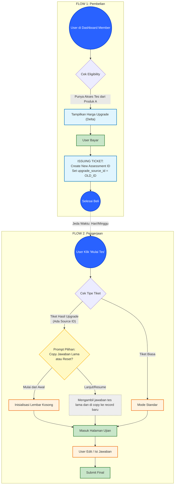

## 1\. Konsep Pemisahan Domain (Separation of Concerns)

### A. Fase Transaksi (Product Layer)

- **Trigger:** Terjadi saat User membeli produk Upgrade di Dashboard Member.
- **Tugas:** Validasi kepemilikan produk lama -> Hitung Delta Price -> Payment -> Terbitkan Tiket Akses Baru.
- **Output:** Record di tabel `user_assessments` baru dengan status `pending`. Kolom `upgrade_source_id` diisi dengan ID asesmen lama.
- *Note:* Pada fase ini, **BELUM ADA** perpindahan data jawaban.

### B. Fase Pengerjaan (Assessment Layer)

- **Trigger:** Terjadi saat User mengklik tombol "Mulai Tes" (bisa detik itu juga, atau minggu depan).
- **Tugas:** Sistem mendeteksi tiket tersebut memiliki `upgrade_source_id`.
- **Logic:** Tampilkan Prompt ke User: *"Lanjutkan data lama atau Mulai baru?" (Pertanyaan 1 Kali)*.
- **Action:**
- Jika **Lanjut**: Sistem melakukan *Deep Copy* jawaban lama ke lembar baru (SQL `INSERT INTO ... SELECT`).
- Jika **Reset**: Sistem menginisialisasi lembar jawaban kosong.

* * *

## 2\. Struktur Data Pendukung

Tabel transaksi/asesmen memiliki kolom penghubung (Foreign Key) ke dirinya sendiri (Self-Reference) untuk keperluan upgrading.

* * *

## 3\. Alur

* * *

**Poin Kunci Keberhasilan:**

1.  **Produk Tetap Bersih:** Layer produk tidak perlu memikirkan ribetnya menyalin 170+ jawaban soal. Produk hanya mengurus uang dan hak akses (`upgrade_source_id`).
2.  **User Centric:** User tidak dipaksa melanjutkan jawaban lama (siapa tahu dia ingin tes ulang karena merasa sudah berubah). Pilihan ada di tangan user sesaat sebelum mengerjakan.
