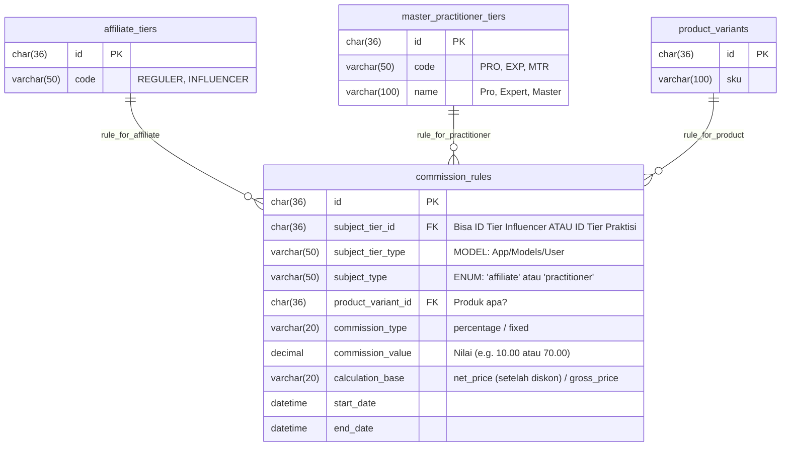

```mermaid
erDiagram
    %% --- ENTITAS SUBJEK (SIAPA YANG JUALAN?) ---

    %% 1. INFLUENCER (Marketing)
    affiliate_tiers {
        char(36) id PK
        varchar(50) code "REGULER, INFLUENCER"
    }

    %% 2. PRAKTISI (Professional Service)
    master_practitioner_tiers {
        char(36) id PK
        varchar(50) code "PRO, EXP, MTR"
        varchar(100) name "Pro, Expert, Master"
    }

    %% --- OBJEK (APA YANG DIJUAL?) ---
    product_variants {
        char(36) id PK
        varchar(100) sku
    }

    %% --- THE BRAIN: COMMISSION RULES ENGINE ---
    commission_rules {
        char(36) id PK

        %% "POLIMORFIK" REFERENCE
        char(36) subject_tier_id FK "Bisa ID Tier Influencer ATAU ID Tier Praktisi"
		varchar(50) subject_tier_type "MODEL: App/Models/User"

        varchar(50) subject_type "ENUM: 'affiliate' atau 'practitioner'"

        char(36) product_variant_id FK "Produk apa?"

        %% LOGIKA HITUNGAN
        varchar(20) commission_type "percentage / fixed"
        decimal commission_value "Nilai (e.g. 10.00 atau 70.00)"
        varchar(20) calculation_base "net_price (setelah diskon) / gross_price"

        datetime start_date
        datetime end_date
    }

    %% RELASI
    affiliate_tiers ||--o{ commission_rules : "rule_for_affiliate"
    master_practitioner_tiers ||--o{ commission_rules : "rule_for_practitioner"
    product_variants ||--o{ commission_rules : "rule_for_product"
```

