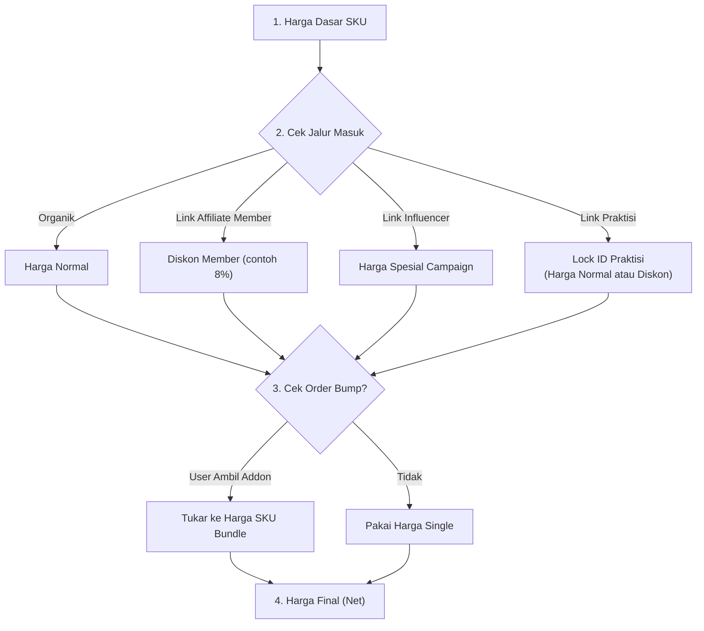

## 1\. Entitlement Registry (Kamus Hak Akses)

### 1.1. Tipe Entitlement

Sistem membedakan dua jenis hak akses dasar:

| **Tipe Entitlement** | **Definisi Bisnis** | **Sifat Akses** | **Contoh Produk** |
| --- | --- | --- | --- |
| **CONTENT_LICENSE** | Hak akses materi digital. | *Self-Paced* (Mandiri). Aktif selama masa berlaku belum habis/hal yang menghanguskan akses tes. Tidak butuh interaksi manusia. | Asesmen TMA. |
| **SERVICE_LICENSE** | Hak klaim layanan jasa. | *One-Time Use* (Sekali Pakai). Membutuhkan reservasi jadwal. Hangus setelah sesi selesai. | Konsultasi. |

### 1.2. Matriks Status Tiket (Lifecycle)

QA wajib memvalidasi perpindahan status ini. Tiket tidak boleh berubah status di luar jalur yang ditentukan.

| **Status Awal** | **Pemicu (Event)** | **Status Akhir** | **Penjelasan Logika** |
| --- | --- | --- | --- |
| `[BARU]` | Pembayaran Sukses | `ACTIVE` | Untuk produk Asesmen atau Konsultasi yang *bundling* dengan Asesmen. |
| `[BARU]` | Pembayaran Sukses | `LOCKED` | Untuk produk "Konsultasi Only" (User belum punya data tes). Menunggu validasi. |
| `LOCKED` | User Upload Dokumen | `IN_REVIEW` | User mengunggah hasil tes dari luar. Fitur booking dikunci. |
| `IN_REVIEW` | Praktisi Menolak | `LOCKED` | Dokumen tidak valid. User harus upload ulang atau beli Asesmen Internal. |
| `IN_REVIEW` | Praktisi Menyetujui | `ACTIVE` | Dokumen valid. Fitur booking dibuka. |
| `ACTIVE` | User/Praktisi Input Jadwal | `SCHEDULED` | Tiket terkunci pada tanggal tertentu. |
| `SCHEDULED` | Praktisi Klik "Selesai" | `COMPLETED` | Jasa telah ditunaikan. Trigger pencairan komisi praktisi. |
| `ANY` | Admin Refund/Cancel | `VOID` | Akses dicabut manual oleh admin (misal: Fraud). |

### 1.3. Logika Kedaluwarsa (*Computed Expiration*)

Sistem **TIDAK** mengubah status di database menjadi 'EXPIRED' secara fisik.

- **Aturan:** Status Expired adalah status *virtual*.

- **Logika:** `IF (Status == ACTIVE) AND (Current_Date > Valid_Until) THEN Display 'EXPIRED'`.

- **Implikasi:** User tidak bisa mengakses layanan, tapi data tiket tetap ada di history sebagai 'ACTIVE' (yang sudah lewat waktu).

* * *

## 2\. Pricing & Discount Logic

Bagaimana sistem menentukan harga akhir saat user melakukan *Direct Checkout*.

### 2.1. Hirarki Penentuan Harga (*Waterfall Logic*)

Sistem menghitung harga dengan urutan prioritas "Dari Atas ke Bawah".

> **Pertanyaan** : Apakah User Organik berkesempatan mendapatkan diskon?

### 2.2. Aturan Order Bump (Cross-Selling)

Ini bukan fitur "Tambah ke Keranjang", melainkan fitur **"Tukar Produk"** (*Product Swapping*).

- **Logika Mekanisme:**

    1.  User memilih **Asesmen TMA Personal** (SKU: `TMA-PERS`, Harga: Rp 100k).

    2.  Di halaman Checkout, User mencentang opsi *"Tambah Konsultasi (Hemat 7%)"*.

    3.  Sistem **TIDAK** menjumlahkan `100k + 100k`.

    4.  Sistem secara otomatis **MENUKAR (SWAP)** item yang sedang dibeli menjadi SKU **Bundle** (SKU: `BUND-TMA-KONSUL`, Harga: Rp 180k).

- **Analisis Dampak & Trade-off (Tanpa Cart):**

    | **Aspek** | **Kelebihan (Pros) - Kondisi Saat Ini** | **Tantangan (Cons) - Risiko Masa Depan** |
    | --- | --- | --- |
    | **Manajemen Harga** | **Mudah.** Penerapan diskon paket (Hard-Bundling) sangat simpel karena harga diskon sudah tertanam di SKU Bundle. Tidak perlu *logic engine* diskon yang rumit di keranjang. | **Ledakan SKU (SKU Explosion).** Jika jumlah variasi produk bertambah banyak, kombinasi bundle akan membengkak secara eksponensial (misal: A+B, A+C, A+B+C). Admin harus rajin membuat SKU bundle baru. |
    | **User Experience (UX)** | **Konversi Tinggi.** User dipaksa fokus pada satu keputusan pembelian ("Ya/Tidak") tanpa terdistraksi untuk *browsing* barang lain. | **Tidak Fleksibel untuk Kuantitas.** User sulit membeli dalam jumlah banyak sekaligus (misal: Beli 1 Bundle untuk diri sendiri + 1 Asesmen untuk teman dalam satu kali bayar). |

* * *

## 3\. Commission Rule Engine

Aturan pembagian uang bagi para mitra (Affiliator/Praktisi).

### 3.1. Definisi Dasar Perhitungan

- **Gross Price:** Harga yang dibayar User (Termasuk Admin Fee PG & Kode Unik).

- **Net Revenue:** Harga Dasar Produk (Sebelum pajak & fee).

- **Basis Komisi:** Semua persentase komisi dihitung dari **Net Revenue**.

### 3.2. Matriks Logika Komisi

| **Skenario** | **Tier Penerima** | **Produk (Context)** | **Rumus Komisi** | **Simulasi** |
| --- | --- | --- | --- | --- |
| **Penjualan Digital** | Member | SKU: `TMA-PERS` | **15%** x Net Revenue | Margin produk tebal, komisi besar. |
| **Penjualan Jasa** | Member | SKU: `KONSUL-ONLY` | **5%** x Net Revenue | Margin tipis (ada fee praktisi), komisi kecil. |
| **Penjualan Bundle** | Member | SKU: `BUND-TMA-KONSUL` | **10%** x Net Revenue | *Blended Rate* (Rata-rata tertimbang). |
| **Jasa Sendiri** | Praktisi | SKU: `KONSUL-ONLY` | **Fixed Rp 150.000** | Fee profesional (bukan persentase). |

### 3.3. Logika "Double Dip" (Pendapatan Ganda)

Satu orang **DIPERBOLEHKAN** menerima dua jenis komisi dalam satu rangkaian transaksi (Case Praktisi sebagai affiliator juga).

- **Kasus:** Dokter Budi menyebar link (Affiliate), User mengklik link tersebut, membeli paket, dan memilih Dokter Budi sebagai konsultan.

- **Hasil:**

    1.  Dokter Budi dapat **Komisi Affiliate (15%)** saat user membayar.

    2.  Dokter Budi dapat **Fee Jasa Konsultasi (Fixed)** saat sesi selesai.

* * *

## 4\. Product Variant Definition

### 4.1. Konvensi Penamaan SKU

**Bisa pakai yang lain - asal terpola supaya semantik**

**Format:** `[TIPE]-[KODE_PRODUK]-[VARIAN]`

1.  **\[TIPE\]**: Kode 3 huruf untuk `product_type`.

    - `ASM` = Asesmen (Digital)

    - `SVC` = Service (Jasa/Konsultasi)

    - `BND` = Bundle (Paket Gabungan)

2.  **\[KODE_PRODUK\]**: Akronim nama produk induk.

    - `TMA` = Talents Mapping Assessment

    - `CSN` = Consultation

    - `ST30` = Strength Typology

3.  **\[VARIAN\]**: Pembeda spesifik.

    - `PERS` = Personal

    - `PRO` = Professional

    - `EXP` = Expert

    - `MTR` = Master

**Contoh Hasil SKU:**

- `ASM-TMA-PERS` (Asesmen TMA Personal)

- `ASM-TMA-PRO` (Asesmen TMA Profesional)

- `SVC-CSN-PRO` (Jasa Konsultasi Umum 1 Jam)

- `BND-TMA-SVC` (Paket Bundling TMA + Service)

### 4.2. Parameter Konfigurasi Produk

Setiap produk di database wajib memiliki parameter logika berikut:

1.  **Linked Entitlement:** Produk ini menerbitkan tiket apa?

    - *Contoh:* SKU `BND-TMA-CSN` -> Menerbitkan \[`CONTENT_LICENSE`, `SERVICE_LICENSE`\].
2.  **Upgrade Target:** (Opsional) Produk ini bisa di-upgrade ke mana?

    - *Contoh:* SKU `TMA-PERS` -> Target: `TMA-PRO`.
3.  **Cross-Sell Offer:** (Opsional) Apa yang ditawarkan di kasir?

    - *Contoh:* SKU `TMA-PERS` -> Offer Add-on: `KONSUL-ONLY`.

    - *Logika:* Jika user mengambil offer ini, tukar SKU menjadi `BUND-TMA-KONSUL`.
