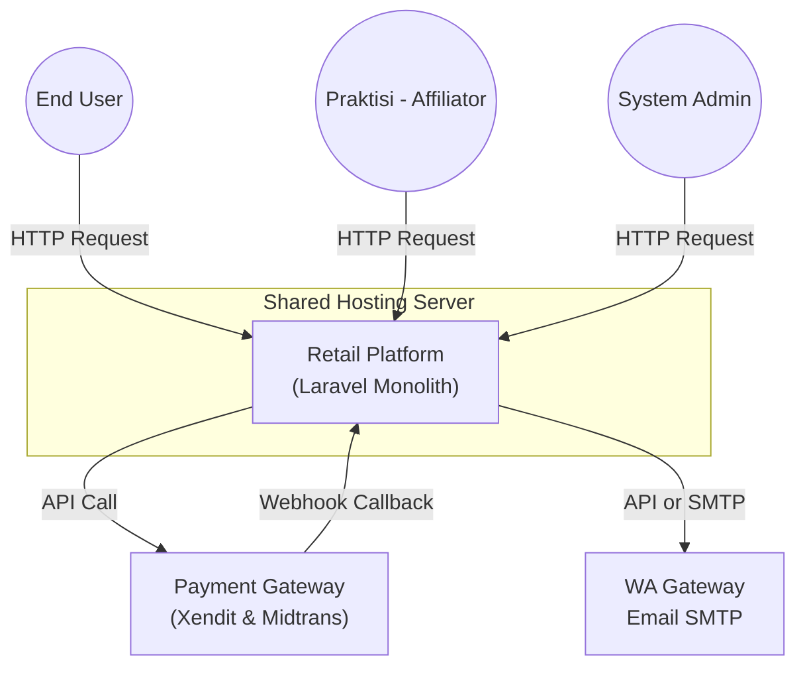
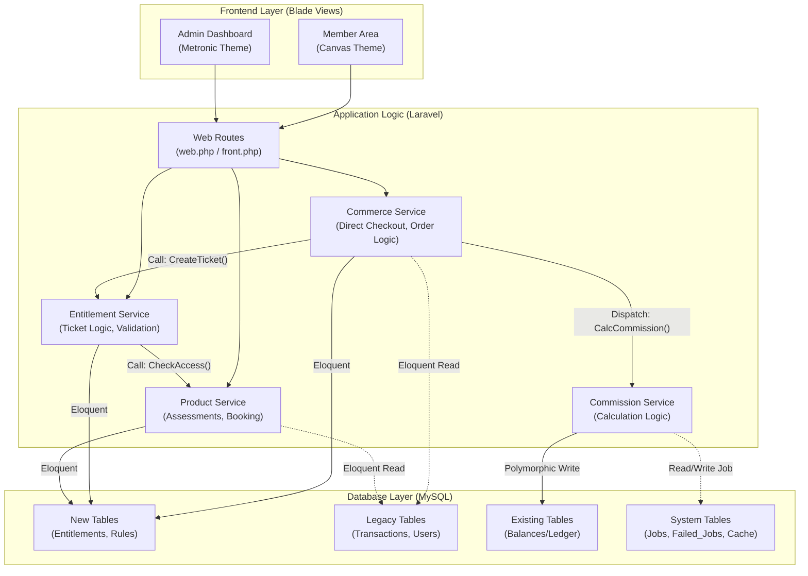

## 1\. Ringkasan

Arsitektur Retail 2026 dirancang menggunakan pendekatan **Modular Monolith**. Aplikasi tetap berada dalam satu *codebase* (Laravel) untuk kemudahan *deployment* dan efisiensi biaya di lingkungan **Shared Hosting**, namun secara internal logika bisnis dipisahkan dengan tegas.

Perubahan dan strategi kunci meliputi:

1.  **Logical Decoupling:** Memisahkan logika Keuangan (Commerce), Hak Akses (Entitlement), dan Operasional (Service) ke dalam *Service Classes* terpisah, menghindari penumpukan logika di Controller.

2.  **Database Driven Infrastructure:** Menggantikan peran Redis (yang tidak tersedia) dengan **Database Queue & Cache** untuk menangani proses berat secara asinkron (background process) menggunakan Cron Job.

3.  **Hybrid Data Strategy:** Tabel Legacy dipertahankan untuk integritas historis, sementara fitur baru berjalan di skema database modern yang memanfaatkan **MySQL JSON Column** .


* * *

## 2\. High-Level Design (HLD)

### 2.1. Context Diagram (Level 1)

Gambaran interaksi makro antara sistem Retail dengan aktor dan pihak ketiga.



### 2.2. Container Diagram (Level 2)

Membedah struktur internal aplikasi Laravel (Modular).

*Catatan: Kotak di bawah ini merepresentasikan Modul/Service dalam satu aplikasi, bukan server terpisah.*



**Penjelasan Modul:**

- **Commerce Engine:** Menangani *Direct Checkout* (tanpa Cart kompleks), penentuan harga (diskon/tier), dan pembayaran.

- **Entitlement Core:** "Gatekeeper". Menyimpan status tiket (Active/Locked/In_Review). Modul lain wajib bertanya ke sini sebelum melayani user.

- **Service Domain:** Logika bisnis spesifik (Menampilkan Soal Tes, Upload Dokumen Luar, Input Jadwal).

- **Commission Engine:** *Worker* di belakang layar yang menghitung bagi hasil dan mencatat ke tabel `balances`.


* * *

## 3\. Technology Stack (Shared Hosting Friendly)

Stack ini dipilih untuk memaksimalkan performa di lingkungan terbatas tanpa akses *root*.

| **Komponen** | **Spesifikasi Teknologi** | **Alasan Pemilihan** |
| --- | --- | --- |
| **Language** | **PHP 8.4+** | Standar performa dan keamanan terbaru. |
| **Framework** | **Laravel 10.x** | Struktur rapi, fitur lengkap, dan *future-proof* untuk API mobile. |
| **Database** | **MySQL 8.0 / MariaDB** | Penyimpanan data utama + JSON Support. |
| **Queue Driver** | **Database** | Pengganti Redis. Job antrian disimpan di tabel `jobs`. |
| **Cache Driver** | **File / Database** | Pengganti Redis. Menyimpan cache query/session. |
| **Web Server** | **LiteSpeed / Apache** | Bawaan Shared Hosting (LiteSpeed disarankan). |
| **Frontend** | **Blade + Bootstrap 5.3** | Render di server, ringan untuk client, SEO friendly. |

* * *

## 4\. Database Strategy (Hybrid Architecture)

### 4.1. Strategi Koeksistensi

Menggunakan strategi "Tabel Baru di sebelah Tabel Lama". Aplikasi baru membaca tabel `users` dan `transactions` lama untuk mengenali user lama, namun menulis data logika baru ke tabel baru.

### 4.2. Skema Tabel Kunci

#### **A. `commission_rules` (Tabel Baru)**

Menyimpan rumus komisi yang dinamis.

SQL **DRAFT**  -  *Desain Lengkap Menyusul*

```
CREATE TABLE commission_rules (
    id BIGINT PRIMARY KEY AUTO_INCREMENT,
    name VARCHAR(255),
    priority INT DEFAULT 0, -- Urutan prioritas override

    -- Kolom Filter (Indexable)
    recipient_tier ENUM('MEMBER', 'PRACTITIONER', 'INFLUENCER'),
    product_variant_id BIGINT,

    -- Kolom Logika (JSON)
    -- Contoh: { "action": "referral", "base": "net_profit", "value": 0.15 }
    rule_config JSON,

    is_active BOOLEAN DEFAULT TRUE,
    created_at TIMESTAMP,
    updated_at TIMESTAMP
);
```

#### **B. `entitlements` (Tabel Baru)**

Pengganti pengecekan transaksi langsung. Mengelola hak akses dan validasi dokumen luar.

SQL **DRAFT** -  *Desain Lengkap Menyusul*

```
CREATE TABLE entitlements (
    id BIGINT PRIMARY KEY AUTO_INCREMENT,
    user_id BIGINT, -- Relasi ke User Lama
    source_transaction_id BIGINT, -- Relasi ke Transaksi Lama/Baru

    product_sku VARCHAR(50),
    -- Status IN_REVIEW ditambahkan untuk validasi dokumen luar
    status ENUM('LOCKED', 'IN_REVIEW', 'ACTIVE', 'SCHEDULED', 'COMPLETED', 'VOID'),

    -- Kolom Validasi Dokumen Eksternal
    external_document_url VARCHAR(255) NULL,
    rejection_reason TEXT NULL,

    valid_until DATETIME,
    metadata JSON, -- Data tambahan (log booking, dll)
    created_at TIMESTAMP,
    updated_at TIMESTAMP
);
```

#### **C. `balances` (Existing Table)**

Tabel mutasi saldo yang sudah ada. Kita akan memanfaatkannya dengan pola **Polymorphic Relationship**.

| **Kolom** | **Tipe Data** | **Keterangan & Penggunaan Baru** |
| --- | --- | --- |
| `id` | char(36) | Primary Key. |
| `wallet_id` | char(36) | Relasi ke Wallet User. |
| `balance_type` | char(3) | Kode Mutasi ('IN' / 'OUT'). |
| `amount` | int(11) | Nominal uang. |
| `ref_type` | varchar(40) | **KUNCI INTEGRASI.** Diisi Nama Model Laravel (e.g., `App\Models\Entitlement`). |
| `ref_id` | char(36) | ID dari referensi di atas. |
| `note` | varchar(512) | Deskripsi (e.g., "Fee Konsultasi Sesi #123"). |
| `commission_feedback_session_id` | char(36) | *Legacy*. Biarkan NULL, gunakan `ref_id`. |

* * *

## 5\. Security Architecture

### 5.1. Autentikasi & Role

- **Authentication:** Menggunakan Session standar Laravel (Web) dan persiapan Sanctum (untuk API Mobile masa depan).

- **Role Management:**

    - **Member:** Akses area Member (Canvas Theme).

    - **Praktisi:** Akses dashboard Praktisi (Metronic Theme).

    - **Partner:** Akses Dashboard B2B.

    - **Affiliator:** Logic check gabungan (`is_member` && `is_practitioner`).

- **Middleware:** Implementasi middleware `CheckEntitlement` pada route Service Domain untuk mencegah akses tanpa tiket valid.


### 5.2. Integritas Data Keuangan

- **Database Transaction:** Setiap operasi yang melibatkan `entitlements` dan `balances` WAJIB dibungkus dalam `DB::transaction()` untuk mencegah data tidak sinkron (contoh: Tiket terbit tapi saldo praktisi tidak bertambah).

- **Append-Only Ledger:** Tabel `balances` tidak boleh di-update/delete sembarangan. Koreksi saldo harus melalui insert baris baru (Adjustment).


* * *
