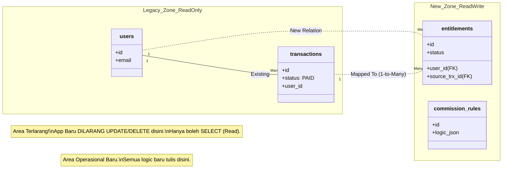
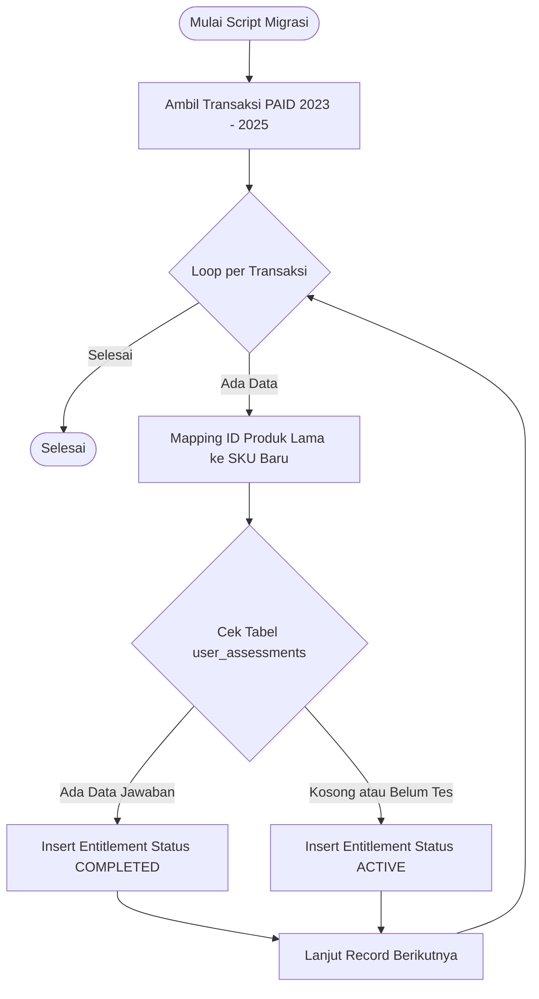
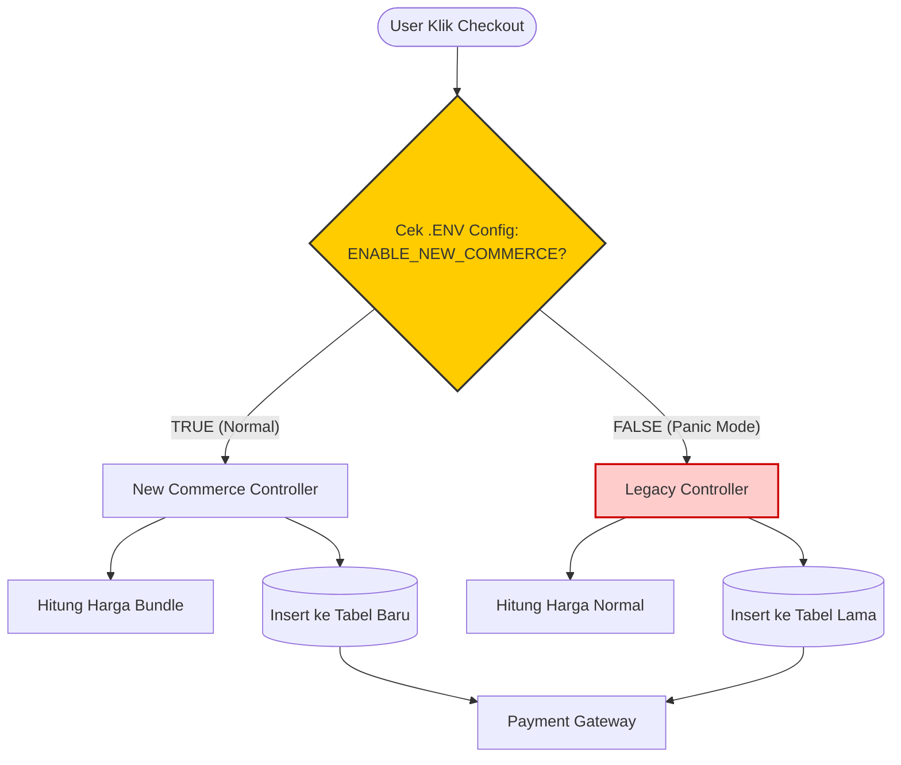

## 1. Mapping Skema Database (Schema Mapping)

### 1.1. Visualisasi Strategi Koeksistensi (*Side-by-Side*)

Diagram ini menjelaskan bagaimana aplikasi baru "hidup" di atas database lama tanpa merusaknya.

---

## 2. Data Seeding Strategy (Skenario Migrasi)

### 2.1. Alur Script Migrasi (*Backfilling Logic*)

Diagram ini menggambarkan logika skrip otomatis yang akan dijalankan oleh tim dev untuk "memberikan" tiket kepada user lama.

---

## 3. Rollback Plan (Rencana Darurat)

### 3.1. Visualisasi Mekanisme *Kill Switch*

Diagram ini menjelaskan bagaimana admin bisa mematikan sistem baru dalam hitungan detik jika terjadi *bug* fatal, tanpa perlu *deploy* ulang.

