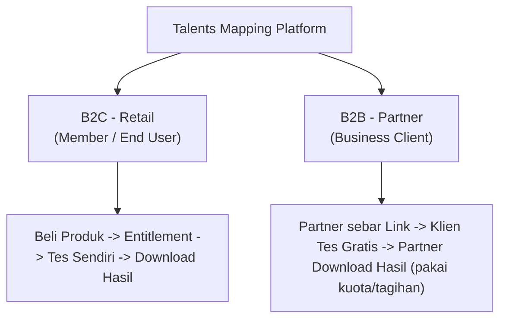
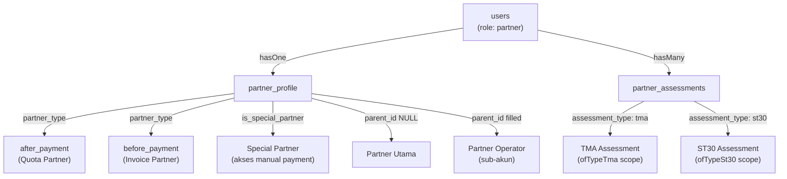
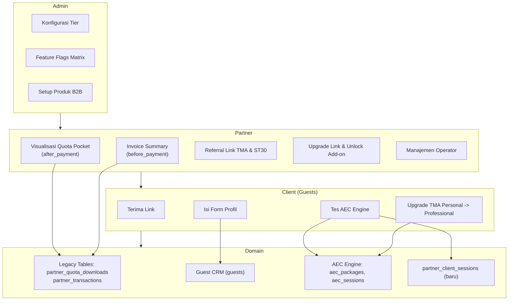
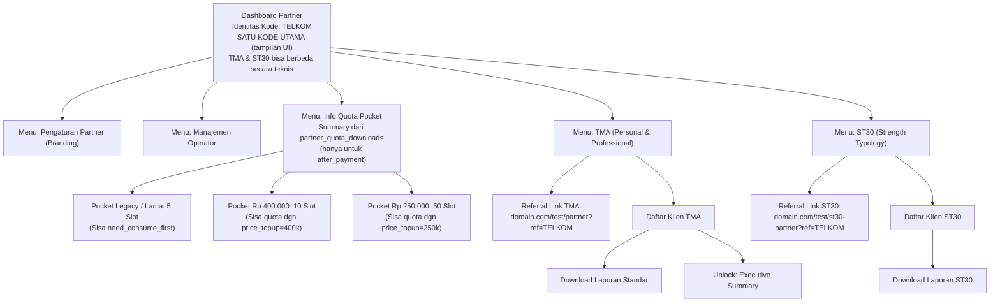
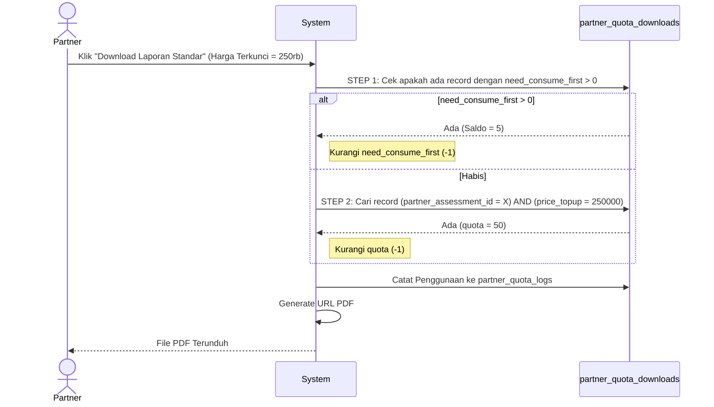
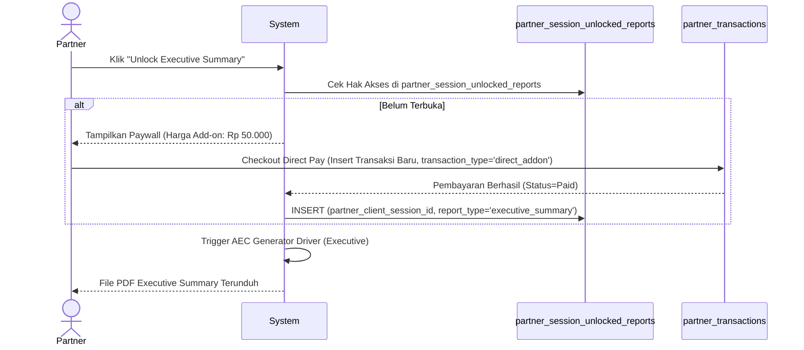
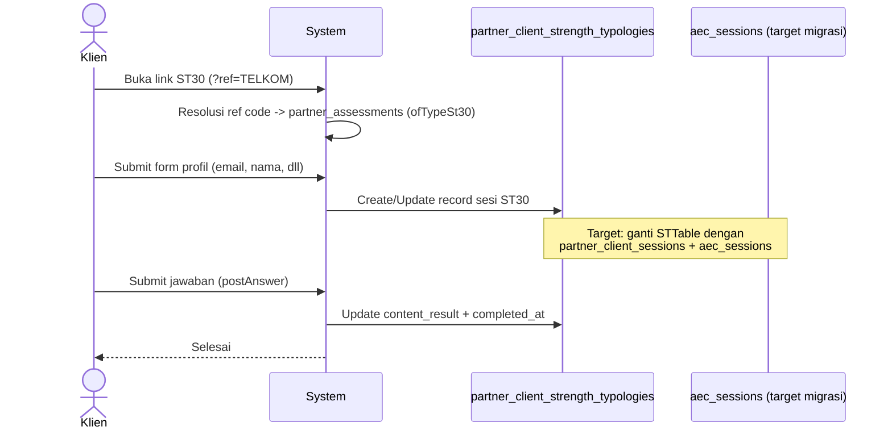
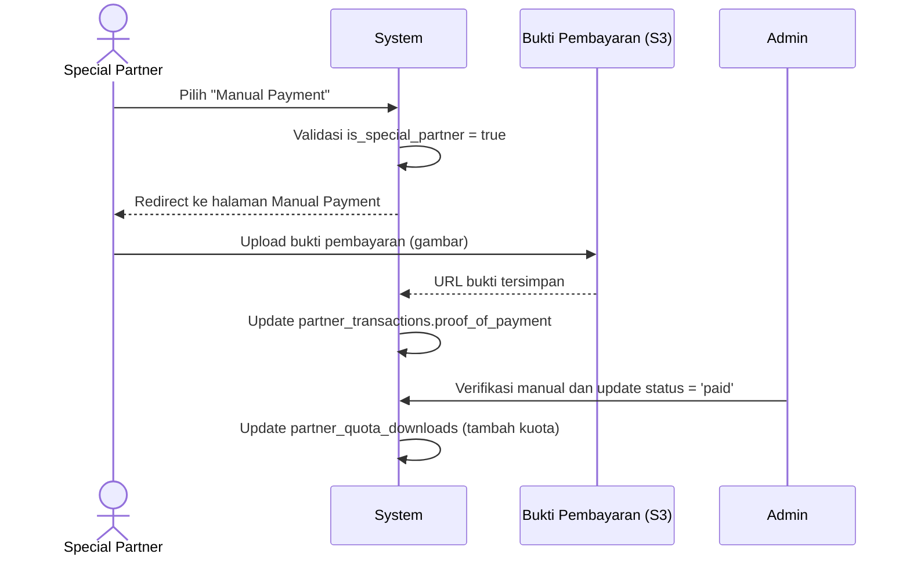
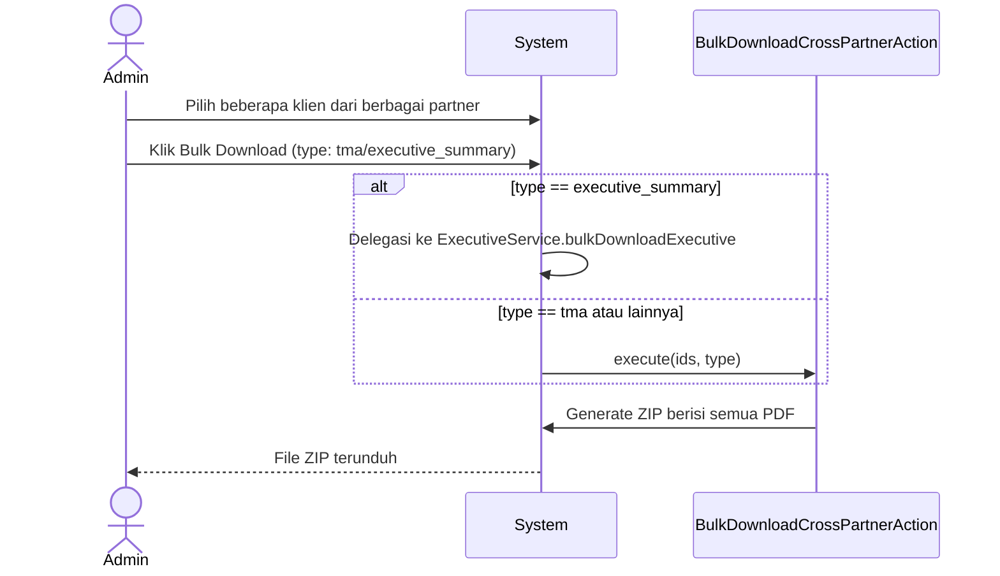
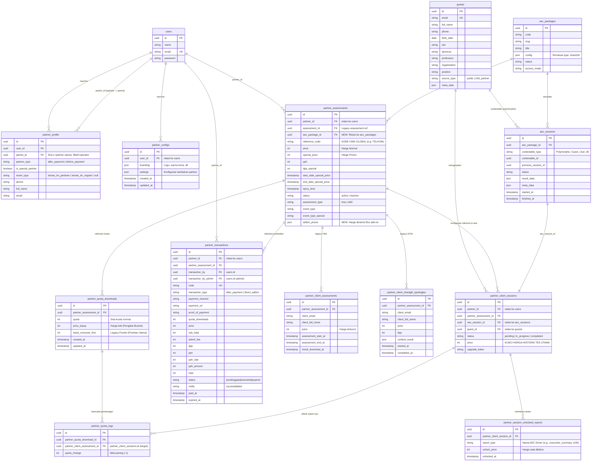

> [!NOTE]
> Dokumen Status **Status:** ARCHITECTURAL DESIGN APPROVED | **Versi:** 3.0.0 (Aligned with Actual Codebase) | **Tanggal:** 26 Mei 2026
> 
> Dokumen ini adalah rencana arsitektur untuk sistem B2B (Business-to-Business) pada platform Talents Mapping. Sistem ini dirancang agar **sejajar dan skalabel** dengan sistem B2C yang sudah ada, menggunakan pola domain yang sama (Entitlement, Commerce, AEC Engine) serta menyelaraskan alur bisnis dengan PRD Enhancement.
>
> **v3.0.0 — Perubahan dari v2.7.0:**
> - Model `partners` dikoreksi menjadi `users` + `partner_profiles` sesuai kode aktual
> - Terminologi `quota/invoice` diubah ke `after_payment/before_payment` (sesuai kode)
> - Ditambahkan: ST30 (Strength Typology), Partner Operator, Special Partner, Event Type
> - ERD & DBML diperbarui lengkap termasuk tabel `partner_configs`
> - BAB 6 diperjelas dengan status migrasi aktual (Mei 2026)
> - BAB 9 baru: Referensi Implementasi Kode

## Glosarium

| Istilah | Definisi |
| --- | --- |
| **Partner** | Entitas bisnis (perusahaan/individu) yang menggunakan platform untuk memproses asesmen klien mereka. Dalam implementasi, Partner adalah `User` (tabel `users`) dengan role `partner` yang memiliki data profil di tabel `partner_profile`. |
| **Partner Operator** | Sub-akun dari Partner Utama, dengan role `partner` + `partner-operator`. Seluruh aksi operator diresolusi ke Partner Utama via `partner_profile.parent_id`. Operator tidak memiliki akses ke beberapa fitur yang hanya tersedia untuk partner utama (e.g., manajemen operator itu sendiri). |
| **after_payment** | Tipe partner yang harus membeli kuota (_topup_) terlebih dahulu sebelum dapat mendownload laporan klien. Identik dengan "quota partner". Dikontrol via `partner_profile.partner_type = 'after_payment'`. |
| **before_payment** | Tipe partner bertipe invoice: klien mengerjakan tes terlebih dahulu, tagihan diakumulasikan, dan partner membayar secara bulanan. Identik dengan "invoice partner". Dikontrol via `partner_profile.partner_type = 'before_payment'`. |
| **Special Partner** | Partner dengan flag `partner_profile.is_special_partner = true`. Mendapat hak akses manual payment meskipun bertipe `after_payment`. |
| **Event Type** | Kategori program mitra (e.g., `teman_tm_jambore`, `teman_tm_reguler`). Nilainya mempengaruhi nilai DPP pajak yang digunakan dalam transaksi dan masa berlaku harga promo. Disimpan di `partner_profile.event_type`. |
| **Guest (Tamu)** | Entitas data terpusat (tabel `guests`) yang merepresentasikan individu peserta tes yang tidak mendaftar sebagai _User_ Retail. Digunakan untuk keperluan histori lintas-partner, riset, dan _upselling_ B2C di masa depan. Model `Guest` sudah ada dan memiliki relasi ke `aec_sessions` (polymorphic) dan `partner_client_assessments`. |
| **Client Partner** | Peserta tes (akan bersumber dari entitas `Guest`) yang sedang diasessmen oleh suatu Partner. |
| **Referral Link** | URL unik berisi kode referensi partner, digunakan untuk menyebar link tes ke klien. Tes **gratis** (tidak memotong kuota di awal). |
| **Reference Code** | Kode unik global yang mewakili identitas tunggal partner (misal: `PFC`). Disimpan di `partner_assessments.reference_code`. Satu partner dapat memiliki dua `partner_assessments` (TMA dan ST30) dengan `reference_code` yang **secara UI terlihat sama**, namun teknisnya adalah dua record terpisah yang di-cascade saat update. |
| **Upgrade Link** | URL unik yang di-generate untuk klien tertentu, memungkinkan upgrade dari Personal ke Professional. Upgrade tidak memotong pembayaran di depan, melainkan bisa dibayar secara bulk — bisa bayar atau pakai kuota dengan harga sesuai. |
| **Unlocked Result (Add-on)** | Mekanisme "Paywall" untuk menebus laporan tambahan dari satu hasil tes yang sama (Misal: Report Executive Summary). Menggunakan sistem _unlock_ dinamis di tabel `partner_session_unlocked_reports`, menghindari _hardcode_ tabel untuk setiap jenis laporan. |
| **Quota Pocket (Mekanisme Kuota)** | Pendekatan UI/UX baru untuk memvisualisasikan stok kuota partner. Menggunakan tabel _legacy_ `partner_quota_downloads`, namun dikemas cerdas oleh backend agar potongan kuota mencocokkan `price_topup` dengan harga terkunci sesi. |
| **Legacy Pocket (need\_consume\_first)** | Kuota khusus dari masa lalu yang belum memiliki rekam harga pasti (`need_consume_first`). Sistem diprogram untuk menghabiskan kuota ini terlebih dahulu sebelum memotong `quota` normal. |
| **Harga Tes** | Harga yang dikunci secara permanen saat klien mulai mengerjakan tes (`effective_price`). Ini menjadi penentu saldo `quota` mana yang akan dipotong saat partner mengunduh hasil. |
| **Partner Feature Flag** | Sistem kontrol hak akses fitur. Dibagi menjadi **Fitur Mutlak (Core)** yang terkunci bawaan sistem, dan **Fitur Tambahan (Add-on)** yang dapat dikontrol on/off oleh Admin per spesifik partner. |
| **Deep Copy (Hydration)** | Proses menyalin jawaban asesmen lama ke sesi upgrade baru agar klien tidak mengulang dari awal. |
| **ST30** | Tes Strength Typology 30 — produk asesmen kedua selain TMA. Memiliki referral link, tabel sesi (`partner_client_strength_typologies`), dan alur download tersendiri. Ke depannya akan bermigrasi ke `partner_client_sessions` + `aec_sessions`. |
| **AEC Engine** | Assessment Engine Core — sistem engine asesmen baru berbasis domain (`app/Domain/Aec`). Terdiri dari `AecPackage` (paket soal), `AecSession` (sesi pengerjaan per peserta, polymorphic via `contextable`), `AecModule`, dan `AecResponse`. `partner_assessments.aec_package_id` merujuk ke tabel `aec_packages`. |

## BAB 1: Latar Belakang & Konteks

### 1.1. Posisi B2B dalam Ekosistem TM

Platform Talents Mapping memiliki dua model bisnis:



**B2B** berfokus pada partner bisnis yang **memproses asesmen untuk klien mereka**. Alur kuncinya:

1.  Partner menyebarkan Referral/Upgrade Link — **klien tes tanpa biaya langsung**.
2.  Saat tes dimulai, harga paket tes detik itu juga dicatat secara permanen di record klien (`effective_price`).
3.  Kuota baru terpakai ketika partner mendownload laporan hasil tes klien tersebut.
4.  Kuota yang terpotong mengacu pada **harga ketika masuk tes**, memastikan tidak ada pihak yang dirugikan saat masa Promo (TemanTM).

### 1.2. Gap Sistem Lama

*   Tidak ada mekanisme upgrade asesmen lintas partner (Cross-Partner Upgrade).
*   Data bio responden (klien) tersebar di setiap sesi tes secara redundan di `partner_client_assessments` dan `partner_client_strength_typologies`.
*   **Frankenstein Schema pada Report:** Setiap penambahan varian report berbayar baru (_Executive Summary_, _ST30_), skema lama membuat tabel transaksi baru (`executive_transactions`, `strength_typology_transactions`) dan menambahkan kolom baru di tabel sesi. Ini sangat tidak skalabel.

### 1.3. Implementasi Model "Partner" di Codebase

> [!IMPORTANT]
> Dalam codebase aktual, entitas "Partner" **bukan** tabel tersendiri. Partner adalah `User` (tabel `users`) yang memiliki role `partner` (via Spatie Permission). Data profil bisnis disimpan di tabel `partner_profile` melalui relasi `hasOne`. Tabel `partner_configs` menyimpan konfigurasi tambahan seperti branding.



Kolom-kolom kunci di `partner_profile`:

| Kolom | Tipe | Nilai | Keterangan |
|-------|------|-------|-----------|
| `partner_type` | varchar | `after_payment` / `before_payment` | Tipe bisnis partner |
| `is_special_partner` | boolean | true / false | Akses manual payment |
| `event_type` | varchar | `teman_tm_jambore` / `teman_tm_reguler` / null | Kategori program mitra, menentukan DPP pajak |
| `parent_id` | uuid\|null | `users.id` | NULL = partner utama, diisi = operator |

## BAB 2: Konsep Arsitektur B2B

### 2.1. Prinsip Desain

1.  **Partner sebagai Distributor Tes:** Klien mengerjakan tes secara bebas — **tidak memerlukan kuota di awal**.
2.  **Centralized CRM (Guests):** Setiap klien yang mengisi form tes akan disimpan ke tabel `guests`. Model `Guest` sudah tersedia, terhubung ke `AecSession` via polymorphic `contextable`.
3.  **Zero-Risk Data Migration:** Tabel _Master Config_ (`partner_assessments`), Transaksi (`partner_transactions`), dan Kuota (`partner_quota_downloads`) dari sistem lama **dipertahankan seutuhnya**. Kita hanya menyuntikkan kolom baru (`aec_package_id`, `addon_prices`) dan merombak _logic_ pemotongannya.
4.  **Scalable Result Unlocks (Micro-Entitlements):** Satu hasil tes (AecSession) dapat menelurkan berbagai jenis file PDF. Partner dapat menebus (_unlock_) laporan tambahan menggunakan _Quota Pocket_ maupun _Direct Payment_ secara dinamis di tabel `partner_session_unlocked_reports`.
5.  **Unified Client Session:** Tabel `partner_client_sessions` menggantikan `partner_client_assessments` dan `partner_client_strength_typologies` — satu tabel untuk semua jenis tes, dengan `aec_session_id` sebagai jembatan ke AEC Engine.

### 2.2. Diagram Blok Sistem B2B



### 2.3. Manajemen Operator Partner

Partner Utama dapat membuat sub-akun Operator untuk mendelegasikan akses operasional:

- Operator dibuat sebagai `User` dengan roles `['partner', 'partner-operator']`
- `partner_profile.parent_id` diisi dengan `id` Partner Utama
- Di semua controller, akses diresolvasi dengan pola:
  ```php
  $partner = $partner->hasRole('partner-operator') ? $partner->profile->parent : $partner;
  ```
- Operator **tidak dapat** membuat/menghapus operator lain (dikontrol via `$isPartnerParent` flag)

## BAB 3: Dashboard Partner — Mekanisme Quota Pocket

### 3.1. Perbedaan UI Berdasarkan Tipe Partner

Dashboard menampilkan konten yang berbeda tergantung `partner_type`:

| Fitur | `after_payment` (Quota) | `before_payment` (Invoice) |
|-------|------------------------|---------------------------|
| Info Saldo | Quota Pocket (sisa kuota per harga) | Total tagihan pending bulan ini |
| Topup Kuota | ✅ Ada | ❌ Tidak ada |
| Invoice Bulanan | ❌ Tidak ada | ✅ Ada |
| Download Laporan | Potong kuota | Catat kredit, bayar belakangan |

### 3.2. Visualisasi Manajemen Kuota — Quota Partner (after_payment)

Meskipun di backend kita menggunakan tabel legacy `partner_quota_downloads`, di bagian UI (_Frontend_) kita menyajikannya sebagai "Keranjang Saldo" (Pocket) agar informatif.



> [!NOTE]
> **Catatan Reference Code TMA vs ST30:** Secara UI, partner melihat satu kode referensi (misal `TELKOM`). Namun di database, TMA dan ST30 adalah dua record `partner_assessments` yang terpisah dan keduanya menyimpan `reference_code` yang sama. Ketika reference code diubah, sistem meng-cascade update ke keduanya sekaligus.

## BAB 4: Alur Distribusi Asesmen & Result Unlock

### 4.1. Referral Link — Klien Mulai Tes (Gratis)

Sistem meresolusi kode referensi URL (`ref=TELKOM`) dan mengambil `aec_package_id` dari `partner_assessments`. Setelah `guests` terdaftar dan divalidasi, sesi baru dibuat di `partner_client_sessions` yang mengunci Harga Terkini (`effective_price`) sebagai `price`.

> [!NOTE]
> **Migrasi Bertahap:** Saat ini, data klien masih tersimpan di `partner_client_assessments` (TMA) dan `partner_client_strength_typologies` (ST30). Migrasi ke `partner_client_sessions` + `guests` adalah target arsitektur yang akan diimplementasikan secara bertahap.

### 4.2. Alur Download Laporan Utama (Mekanisme Legacy Terpoles)

Backend membaca tabel `partner_quota_downloads` dengan alur validasi yang lebih pintar:



### 4.3. Alur "Unlock Result" (Laporan Tambahan Berbayar)



### 4.4. Alur Tes ST30 (Strength Typology)

ST30 memiliki alur yang sejajar dengan TMA namun menggunakan model dan service tersendiri.



**Karakteristik ST30 yang berbeda dari TMA:**
- Data klien ST30 disimpan di `partner_client_strength_typologies` (model: `PartnerClientStrengthTypologyTest`)
- ST30 **tidak memiliki** mekanisme Upgrade Link (hanya TMA Personal → Professional)
- Session key berbeda: `TM-client-st30-profile` vs `TM-client-assessment-profile` (TMA)
- **Target migrasi:** ST30 akan menggunakan `partner_client_sessions` + `aec_sessions`, dengan `aec_session_id` merujuk ke package ST30 di `aec_packages` — tracking nama tes otomatis via relasi `aec_package`

### 4.5. Alur Manual Payment (Special Partner)

Partner dengan flag `is_special_partner = true` memiliki akses manual payment meskipun bertipe `after_payment`:



### 4.6. Alur Cross-Partner Download (Admin)

Admin dapat melakukan bulk download laporan lintas partner menggunakan `BulkDownloadCrossPartnerAction`:



## BAB 5: Model Data — Skema Final (Full Legacy Preservation)

Skema ini mempertahankan kolom-kolom _legacy_ secara lengkap pada `partner_assessments`, `partner_quota_downloads`, dan `partner_transactions`, dengan penambahan tabel baru untuk fitur 2026.

### 5.1. Visualisasi Entity Relationship Diagram (Mermaid)



### 5.2. Skema Database Code (DBML)

Kode di bawah ini diformat dalam **Database Markup Language (DBML)**. Dapat langsung di-_copy_ dan dipetakan pada _tools visualizer_ seperti **dbdiagram.io** untuk ekspor ke SQL _script_.

```dbml
Project B2B_Partner_System {
  database_type: 'MySQL'
  Note: 'Skema Database B2B Talents Mapping 2026 (v3.0 - Aligned with Codebase)'
}

Table users {
  id char(36) [pk]
  name varchar(191)
  email varchar(191) [unique, not null]
  password varchar(255)
  created_at timestamp
  updated_at timestamp
}

Table partner_profile {
  id char(36) [pk]
  user_id char(36) [ref: > users.id, not null]
  parent_id char(36) [ref: > users.id, note: 'NULL=partner utama; filled=operator sub-akun']
  full_name varchar(191)
  email varchar(191)
  phone varchar(50)
  partner_type varchar(50) [note: 'after_payment | before_payment']
  is_special_partner boolean [default: false, note: 'Akses manual payment meskipun after_payment']
  event_type varchar(50) [note: 'teman_tm_jambore | teman_tm_reguler | null']
  created_at timestamp
  updated_at timestamp
}

Table partner_configs {
  id char(36) [pk]
  user_id char(36) [ref: > users.id, not null]
  branding json [note: 'Logo URL, warna tema, dll']
  settings json [note: 'Konfigurasi tambahan spesifik partner']
  created_at timestamp
  updated_at timestamp
}

Table guests {
  id char(36) [pk]
  email varchar(191) [unique, not null]
  full_name varchar(191) [not null]
  phone varchar(50)
  birth_date date
  sex varchar(20)
  alumnus varchar(191)
  profession varchar(191)
  organization varchar(191)
  position varchar(191)
  source_type varchar(50) [default: 'public', note: 'public | b2b_partner']
  meta_data json [note: 'Data tambahan fleksibel']
  created_at timestamp
  updated_at timestamp
}

Table aec_packages {
  id char(36) [pk]
  code varchar(50) [not null]
  slug varchar(191) [unique]
  title varchar(191)
  config json [note: 'Termasuk type: tma | st30']
  status varchar(50)
  access_mode varchar(50)
  created_at timestamp
  updated_at timestamp
  deleted_at timestamp
}

Table aec_sessions {
  id char(36) [pk]
  aec_package_id char(36) [ref: > aec_packages.id]
  contextable_type varchar(191) [note: 'Polymorphic: App\Models\Guest, App\Models\User, dll']
  contextable_id char(36)
  previous_session_id char(36) [ref: > aec_sessions.id, note: 'Untuk upgrade session (Deep Copy)']
  status varchar(50) [note: 'pending | in_progress | completed']
  current_aec_module_id char(36)
  result_data json
  meta_data json
  duration_in_seconds int
  started_at timestamp
  finished_at timestamp
  created_at timestamp
  updated_at timestamp
  deleted_at timestamp
}

Table partner_assessments {
  id char(36) [pk]
  partner_id char(36) [ref: > users.id]
  assessment_id char(36) [note: 'Legacy assessment ref (assessments table)']
  aec_package_id char(36) [ref: > aec_packages.id, note: 'NEW: Relasi absolut ke AEC Engine']
  reference_code varchar(191) [note: 'Kode unik global e.g. TELKOM — TMA & ST30 cascade bersama']
  price int [default: 0, note: 'Harga Normal']
  special_price int [note: 'Harga Promo']
  pph int
  dpp_special int
  start_date_special_price timestamp
  end_date_special_price timestamp
  injury_time timestamp
  status varchar(50) [default: 'active', note: 'active | inactive']
  assessment_type varchar(50) [note: 'tma | st30']
  event_type varchar(50)
  event_type_special varchar(191)
  addon_prices json [note: 'NEW: Harga dinamis fitur add-on']
  created_at timestamp
  updated_at timestamp
}

Table partner_quota_downloads {
  id char(36) [pk]
  partner_assessment_id char(36) [ref: > partner_assessments.id]
  quota int [default: 0, note: 'Sisa kuota normal']
  price_topup int [note: 'Harga beli (Pengikat Bucket)']
  need_consume_first int [default: 0, note: 'Legacy Pocket (Prioritas Utama sebelum potong quota)']
  created_at timestamp
  updated_at timestamp
}

Table partner_transactions {
  id char(36) [pk]
  partner_id char(36) [ref: > users.id]
  partner_assessment_id char(36) [ref: > partner_assessments.id]
  transaction_by char(36) [ref: > users.id, note: 'Partner/Operator yang transaksi']
  transaction_by_admin char(36) [ref: > users.id, note: 'Admin yang memproses']
  code varchar(191) [unique, note: 'Invoice Number']
  transaction_type varchar(50) [default: 'after_payment', note: 'after_payment | direct_addon']
  payment_channel varchar(191)
  payment_url varchar(2048)
  proof_of_payment varchar(512) [note: 'URL bukti bayar (untuk Special Partner manual payment)']
  quota_downloads int
  price int [note: 'Harga per slot']
  sub_total int
  admin_fee int
  dpp int
  ppn int
  pph_rate int
  pph_amount int
  total int [note: 'Total Nilai Transaksi']
  status varchar(50) [default: 'pending', note: 'pending|paid|canceled|expired']
  notify varchar(50) [note: 'success|failed']
  paid_at timestamp
  expired_at timestamp
  created_at timestamp
  updated_at timestamp
}

// TARGET TABEL BARU (menggantikan partner_client_assessments & partner_client_strength_typologies)
Table partner_client_sessions {
  id char(36) [pk]
  partner_id char(36) [ref: > users.id]
  partner_assessment_id char(36) [ref: > partner_assessments.id]
  aec_session_id char(36) [ref: > aec_sessions.id, note: 'Via aec_package bisa diketahui jenis tes']
  guest_id char(36) [ref: > guests.id]
  status varchar(50) [default: 'pending', note: 'pending | in_progress | completed']
  price int [note: 'Kunci harga historis tes utama (effective_price saat klien mulai tes)']
  upgrade_token varchar(191) [note: 'Token untuk Upgrade Link TMA Personal -> Professional']
  created_at timestamp
  updated_at timestamp
}

Table partner_quota_logs {
  id char(36) [pk]
  partner_quota_download_id char(36) [ref: > partner_quota_downloads.id]
  partner_client_assessment_id char(36) [ref: > partner_client_sessions.id, note: 'Akan menunjuk ke partner_client_sessions setelah migrasi']
  quota_change int [note: 'Nilai potong, misal: -1']
  created_at timestamp
}

Table partner_session_unlocked_reports {
  id char(36) [pk]
  partner_client_session_id char(36) [ref: > partner_client_sessions.id]
  report_type varchar(191) [note: 'Nama AEC Driver e.g., executive_summary, st30_pro']
  unlock_price int [note: 'Harga saat ditebus via Paywall']
  unlocked_at timestamp
}
```

## BAB 6: Strategi Migrasi Data

### 6.1. Retensi Total Data Finansial & Kuota

Tabel `partner_assessments`, `partner_quota_downloads`, dan `partner_transactions` **TIDAK DIMIGRASI KE TABEL BARU**. Skema ini dipertahankan seutuhnya, sehingga tidak ada risiko hilangnya saldo kuota atau terputusnya riwayat transaksi historis.

*   Hanya dilakukan _Schema Alteration_ (penambahan kolom) pada `partner_assessments` berupa `aec_package_id` dan `addon_prices`.

### 6.2. Konsolidasi Transaksi Terpecah (Executive & ST30)

> [!WARNING]
> **Status: PLANNED (Belum Dikerjakan — Mei 2026)**
> `ExecutiveService` dan tabel `executive_transactions` masih aktif digunakan di production. Endpoint `PartnerHistoryTransactionController::datatableExecutive()` dan `datatableStrengthTypology()` masih berjalan sebagai legacy layer.

Rencana konsolidasi:

1.  Data dari `executive_transactions` dipindahkan ke tabel `partner_transactions` dengan label `transaction_type = 'direct_addon'`.
2.  Hubungan aksesnya (kolom _hardcode_ di tabel asesmen) dipindahkan ke `partner_session_unlocked_reports`.
3.  Setelah Backfill selesai dan divalidasi, endpoint legacy diarahkan ke rute baru yang dapat diakses secara mandiri oleh developer untuk memastikan semua aman sebelum dihapus.
4.  Tabel `executive_transactions`, `strength_typology_transactions` dapat di-_drop_.

### 6.3. Transformasi Data Sesi & Pembentukan CRM (Guests)

> [!IMPORTANT]
> **Keputusan Arsitektur:** Mulai sprint ini, kita menggunakan `partner_client_sessions` + `guests` sebagai pendekatan scalable untuk semua jenis tes (TMA & ST30). Data klien lama di `partner_client_assessments` dan `partner_client_strength_typologies` akan di-backfill ke struktur baru.

Langkah migrasi:
1.  Ekstrak bio klien unik dari `partner_client_assessments` dan `partner_client_strength_typologies` → insert ke `guests` (by `client_email` sebagai key unik).
2.  Buat record `aec_sessions` untuk setiap sesi yang sudah selesai, dengan `contextable_type = 'App\Models\Guest'`.
3.  Insert ke `partner_client_sessions` dengan memetakan `guest_id`, `aec_session_id`, dan `price` dari data lama.
4.  Tabel legacy (`partner_client_assessments`, `partner_client_strength_typologies`) dipertahankan sementara hingga validasi selesai.

### 6.4. Status Migrasi Aktual (Mei 2026)

| Komponen | Status | Keterangan |
|----------|--------|------------|
| Tabel `guests` + Model `Guest` | ✅ Sudah Ada | Live, dengan relasi ke `aec_sessions` (polymorphic) dan `partner_client_assessments` |
| Tabel `aec_packages`, `aec_sessions` | ✅ Sudah Ada | Live di `app/Domain/Aec` |
| Tabel `partner_client_strength_typologies` | ✅ Sudah Ada | Live (ST30 legacy) |
| Tabel `partner_client_assessments` | ✅ Sudah Ada | Live (TMA legacy) |
| Tabel `partner_quota_downloads`, `partner_transactions`, `partner_assessments` | ✅ Sudah Ada | Legacy tables, tetap dipakai |
| Schema Alteration `partner_assessments` (+ `aec_package_id`, `addon_prices`) | 🔴 Belum | Kolom belum ada di migration |
| Tabel `partner_client_sessions` (baru) | 🔴 Belum | Perlu dibuat via migration baru |
| Tabel `partner_session_unlocked_reports` (baru) | 🔴 Belum | Perlu dibuat via migration baru |
| Tabel `partner_configs` | 🔴 Belum | Perlu dibuat (sekarang config ada di `partner_profile` atau tidak ada) |
| Konsolidasi `executive_transactions` → `partner_transactions` | 🔴 Belum | `ExecutiveService` masih aktif |
| Backfill `guests` dari `partner_client_assessments` | 🔴 Belum | Bergantung pada tabel baru |

## BAB 7: Feature Flag Matrix (Core vs Add-on)

Daftar fitur mutlak didaftarkan secara statis di `config/partner.php`. Tabel `partner_feature_flags` menyimpan _override_.

### 7.1. Definisi Konfigurasi (Code as Source of Truth)

```php
// config/partner.php
return [
	'features' => [
		// 1. FITUR MUTLAK (CORE)
		'postpaid_billing' => [
			'label' => 'Tagihan Pasca-Bayar (Invoice)',
			'type' => 'core',
			// Aktif jika partner_profile.partner_type = 'before_payment'
			'condition' => fn ($partner) => $partner->profile->partner_type === 'before_payment',
		],
		'cross_partner_claim' => [
			'label' => 'Tarik Klien Eksternal (Admin Bulk Download)',
			'type' => 'core',
			'condition' => fn ($partner) => true, // Semua partner
		],
		'special_partner_manual_payment' => [
			'label' => 'Manual Payment (Special Partner)',
			'type' => 'core',
			// Aktif jika partner_profile.is_special_partner = true
			'condition' => fn ($partner) => $partner->profile->is_special_partner,
		],
		// 2. FITUR TAMBAHAN (ADD-ON)
		'custom_branding' => [
			'label' => 'Kustomisasi Tema & Logo',
			'type' => 'addon',
			'default' => false,
		],
		'st30_assessment' => [
			'label' => 'Akses Tes ST30 (Strength Typology)',
			'type' => 'addon',
			'default' => false,
		],
	],
];
```

### 7.2. Mekanisme Event Type & Perhitungan DPP

`event_type` di `partner_profile` mempengaruhi nilai DPP yang digunakan dalam kalkulasi pajak transaksi:

| Event Type | Config Key DPP TMA | Config Key DPP ST30 |
|------------|-------------------|---------------------|
| `teman_tm_jambore` | `product_dpp_teman_tm_jambore` | `product_dpp_st30_jambore` |
| `teman_tm_reguler` | `product_dpp_teman_tm_reg` | `product_dpp_st30_reg` |
| null (default) | `product_dpp` | `product_dpp_st30` |

Nilai DPP ini diambil dari tabel `config_fees` dan digunakan saat klien mulai mengerjakan tes (bukan saat topup). Logika ini ada di `PartnerAssessmentController::clientCompleteProfileAssessment()` dan `PartnerStrengthTypologyController::clientCompleteProfileStrengthTypology()`.

## BAB 8: Kesimpulan Rekonsiliasi PRD

Dengan mempertahankan struktur utuh `partner_transactions`, `partner_assessments`, dan `partner_quota_downloads`, kita mendapatkan skenario migrasi yang paling aman bagi perusahaan (Zero-Risk):

*   **100% Data Preservation:** Saldo kuota, kode partner, histori bayar, pajak (PPN/PPh), dll sama sekali tidak disentuh.
*   **Modernization at the Edge:** Modernisasi (Micro-Entitlements & Upgrade Hydration) ditambahkan sebagai layer penyempurna di sekeliling struktur _legacy_, tanpa merusak _core constraint_ database lama.
*   Menghentikan praktik pembuatan tabel/kolom baru setiap kali produk laporan baru diluncurkan dengan memanfaatkan tabel dinamis `partner_session_unlocked_reports`.
*   **Unified Client Session:** Migrasi ke `partner_client_sessions` menyatukan TMA dan ST30 dalam satu tabel, dengan jenis tes dapat diidentifikasi otomatis via relasi `aec_session → aec_package`.

## BAB 9: Referensi Implementasi Kode

Pemetaan komponen kode yang relevan dengan arsitektur ini:

### 9.1. Controller & Service

| Layer | File | Tanggung Jawab Utama |
|-------|------|---------------------|
| Service | `app/Services/Impl/PartnerServiceImpl.php` | CRUD partner, operator, assessment, transaksi |
| Controller (Front) | `app/Http/Controllers/Front/PartnerAssessmentController.php` | Dashboard TMA, payment flow, download |
| Controller (Front) | `app/Http/Controllers/Front/PartnerStrengthTypologyController.php` | Alur tes ST30 end-to-end |
| Controller (Front) | `app/Http/Controllers/Front/PartnerOperatorController.php` | CRUD operator partner |
| Controller (Front) | `app/Http/Controllers/Front/PartnerInvoicingController.php` | Invoice & receipt PDF |
| Controller (Front) | `app/Http/Controllers/Front/PartnerHistoryTransactionController.php` | Riwayat transaksi (TMA, Executive, ST30) |
| Controller (Admin) | `app/Http/Controllers/Admin/AdminPartnerAssessmentController.php` | Admin topup, bulk download, cross-partner |

### 9.2. Actions (Domain Layer)

| Action | Tanggung Jawab |
|--------|----------------|
| `DownloadAssessmentPartnerResultAction` | Logic download single result (TMA) |
| `BulkDownloadAssessmentPartnerResultAction` | Logic bulk download partner sendiri |
| `BulkDownloadCrossPartnerAction` | Admin cross-partner download |
| `CreatePartnerAssessmentTransactionAction` | Buat transaksi (after & before payment) |
| `UpdateTransactionStatusAction` | Webhook payment notification |
| `UpdatePartnerAssessmentReferenceAction` | Update reference code (cascade TMA + ST30) |
| `CreatePartnerOperatorAction` | Buat sub-akun operator |

### 9.3. Models Kunci

| Model | Table | Keterangan |
|-------|-------|-----------|
| `User` | `users` | Entitas Partner utama |
| `PartnerProfile` | `partner_profile` | Profil & tipe partner, parent_id |
| `PartnerAssessment` | `partner_assessments` | Master config tes per partner |
| `PartnerQuotaDownload` | `partner_quota_downloads` | Stok kuota per harga |
| `PartnerTransaction` | `partner_transactions` | Riwayat transaksi komersial |
| `PartnerClientAssessment` | `partner_client_assessments` | **Legacy** sesi klien TMA |
| `PartnerClientStrengthTypologyTest` | `partner_client_strength_typologies` | **Legacy** sesi klien ST30 |
| `Guest` | `guests` | CRM terpusat klien |
| `AecPackage` | `aec_packages` | Paket tes di AEC Engine |
| `AecSession` | `aec_sessions` | Sesi pengerjaan per peserta (polymorphic) |

### 9.4. Scope Penting di PartnerAssessment

```php
// Membedakan TMA vs ST30 via assessment_type di tabel assessments
$partner->partnerAssessment()->ofTypeTma()->first();  // TMA
$partner->partnerAssessment()->ofTypeSt30()->first(); // ST30

// Computed attribute: harga efektif (normal atau promo jika masih dalam periode)
$partnerAssessment->effective_price; // Mempertimbangkan start/end_date_special_price
```
