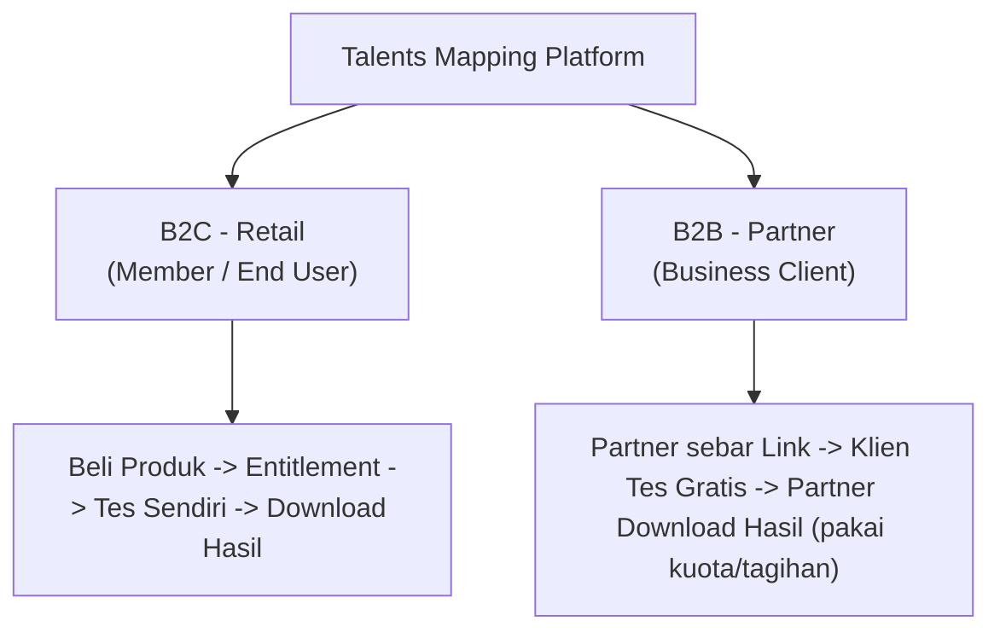
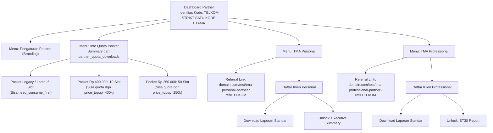
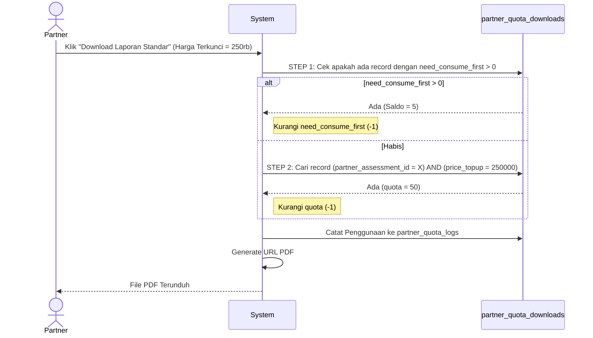
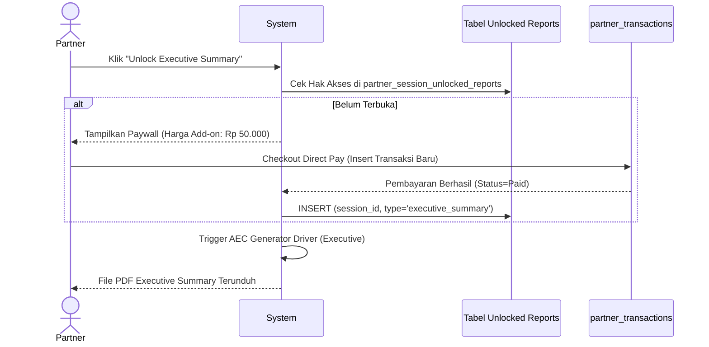
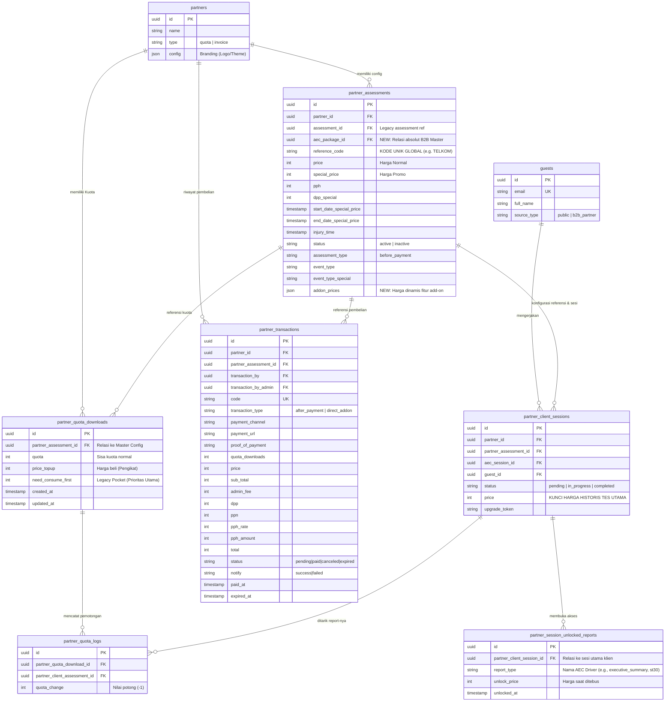

> [!NOTE]
> Dokumen Status **Status:** ARCHITECTURAL DESIGN APPROVED | **Versi:** 2.7.0 (Zero-Risk Migration + DBML Schema) | **Tanggal:** 26 Mei 2026
> 
> Dokumen ini adalah rencana arsitektur untuk sistem B2B (Business-to-Business) pada platform Talents Mapping. Sistem ini dirancang agar **sejajar dan skalabel** dengan sistem B2C yang sudah ada, menggunakan pola domain yang sama (Entitlement, Commerce, AEC Engine) serta menyelaraskan alur bisnis dengan PRD Enhancement.

## Glosarium

| Istilah | Definisi |
| --- | --- |
| **Partner** | Entitas bisnis (perusahaan/individu) yang menggunakan platform untuk memproses asesmen klien mereka. |
| **Guest (Tamu)** | Entitas data terpusat (tabel `guests`) yang merepresentasikan individu peserta tes yang tidak mendaftar sebagai _User_ Retail. Digunakan untuk keperluan histori lintas-partner, riset, dan _upselling_ B2C di masa depan. |
| **Client Partner** | Peserta tes (berasal dari entitas `Guest`) yang sedang diasessmen oleh suatu Partner. |
| **Referral Link** | URL unik berisi kode referensi partner, digunakan untuk menyebar link tes ke klien. Tes **gratis** (tidak memotong kuota di awal). |
| **Upgrade Link** | URL unik yang di-generate untuk klien tertentu, memungkinkan upgrade dari Personal ke Professional. **Upgrade tidak memotong pembayaran di depan, melainkan bisa membayar secara bulk ketika akan memproses hasil - Bisa bayar atau pakai kuota dengan price sesuai** |
| **Unlocked Result (Add-on)** | Mekanisme “Paywall” untuk menebus laporan tambahan dari satu hasil tes yang sama (Misal: Report ST30 Pro, Report Executive Summary). Menggunakan sistem _unlock_ dinamis, menghindari _hardcode_ tabel untuk setiap jenis laporan. |
| **Quota Pocket (Mekanisme Kuota)** | Pendekatan UI/UX baru untuk memvisualisasikan stok kuota partner. Menggunakan tabel _legacy_ `partner_quota_downloads`, namun dikemas cerdas oleh backend agar potongan kuota mencocokkan `price_topup` dengan harga terkunci sesi. |
| **Legacy Pocket (need\_consume\_first)** | Kuota khusus dari masa lalu yang belum memiliki rekam harga pasti (`need_consume_first`). Sistem diprogram untuk menghabiskan kuota ini terlebih dahulu sebelum memotong `quota` normal. |
| **Reference Code** | Kode unik global yang mewakili identitas tunggal partner (misal: `PFC`). Disimpan langsung di dalam tabel _Master Config_ (`partner_assessments`). |
| **Harga Tes** | Harga yang dikunci secara permanen saat klien mulai mengerjakan tes. Ini menjadi penentu saldo `quota` mana yang akan dipotong saat partner mengunduh hasil. |
| **Partner Feature Flag** | Sistem kontrol hak akses fitur. Dibagi menjadi **Fitur Mutlak (Core)** yang terkunci bawaan sistem, dan **Fitur Tambahan (Add-on)** yang dapat dikontrol on/off oleh Admin per spesifik partner. |
| **Deep Copy (Hydration)** | Proses menyalin jawaban asesmen lama ke sesi upgrade baru agar klien tidak mengulang dari awal. |

## BAB 1: Latar Belakang & Konteks

### 1.1. Posisi B2B dalam Ekosistem TM

Platform Talents Mapping memiliki dua model bisnis:



**B2B** berfokus pada partner bisnis yang **memproses asesmen untuk klien mereka**. Alur kuncinya:

1.  Partner menyebarkan Referral/Upgrade Link — **klien tes tanpa biaya langsung**.
2.  Saat tes dimulai, harga paket tes detik itu juga dicatat secara permanen di record klien.
3.  Kuota baru terpakai ketika partner mendownload laporan hasil tes klien tersebut.
4.  Kuota yang terpotong mengacu pada **harga ketika masuk tes**, memastikan tidak ada pihak yang dirugikan saat masa Promo (TemanTM).

### 1.2. Gap Sistem Lama

*   Tidak ada mekanisme upgrade asesmen lintas partner (Cross-Partner Upgrade).
*   Data bio responden (klien) tersebar di setiap sesi tes secara redundan.
*   **Frankenstein Schema pada Report:** Setiap penambahan varian report berbayar baru (_Executive Summary_, _ST30_), skema lama membuat tabel transaksi baru (`executive_transactions`, `strength_typology_transactions`) dan menambahkan kolom baru di tabel sesi. Ini sangat tidak skalabel.

## BAB 2: Konsep Arsitektur B2B

### 2.1. Prinsip Desain

1.  **Partner sebagai Distributor Tes:** Klien mengerjakan tes secara bebas — **tidak memerlukan kuota di awal**.
2.  **Centralized CRM (Guests):** Setiap klien yang mengisi form tes akan disimpan ke tabel `guests`.
3.  **Zero-Risk Data Migration:** Tabel _Master Config_ (`partner_assessments`), Transaksi (`partner_transactions`), dan Kuota (`partner_quota_downloads`) dari sistem lama **dipertahankan seutuhnya**. Kita hanya menyuntikkan kolom baru (`aec_package_id`, `addon_prices`) dan merombak _logic_ pemotongannya.
4.  **Scalable Result Unlocks (Micro-Entitlements):** Satu hasil tes (AecSession) dapat menelurkan berbagai jenis file PDF. Partner dapat menebus (_unlock_) laporan tambahan menggunakan _Quota Pocket_ maupun _Direct Payment_ secara dinamis di tabel `partner_session_unlocked_reports`.

### 2.2. Diagram Blok Sistem B2B

```mermaid
flowchart TB
	subgraph Admin
		A1[Konfigurasi Tier]
		A2[Feature Flags Matrix]
		A3[Setup Produk B2B]
	end

	subgraph Partner
		B1[Visualisasi Quota Pocket]
		B2[Tema & Branding Custom]
		B3[Referral Link Utama]
		B4[Upgrade Link & Unlock Add-on]
	end

	subgraph Client["Client (Guests)"]
		C1[Terima Link]
		C2[Validasi Form]
		C3[Tes AEC]
		C4[Upgrade (Hydration)]
	end

	subgraph Domain
		D1[Legacy Tables: Transaksi & Kuota]
		D2[Guest Directory (CRM)]
		D3[AEC Engine & Result Generators]
		D4[Partner]
	end

	Admin --> Partner
	Partner --> Client
	Client --> Domain
	B1 --> D1
	C2 --> D2
	C3 --> D3
	C4 --> D3
```

## BAB 3: Dashboard Partner — Mekanisme Quota Pocket

### 3.1. Visualisasi Manajemen Kuota (UI Layer)

Meskipun di backend kita menggunakan tabel legacy `partner_quota_downloads`, di bagian UI (_Frontend_) kita menyajikannya sebagai "Keranjang Saldo" (Pocket) agar informatif.



## BAB 4: Alur Distribusi Asesmen & Result Unlock

### 4.1. Referral Link — Klien Mulai Tes (Gratis)

Sistem meresolusi kode referensi URL (`ref=TELKOM`) dan mengambil `aec_package_id`. Sistem mencocokkan hal tersebut dengan record di tabel `partner_assessments`. Setelah `guests` terdaftar, sesi baru mengunci Harga Terkini (dari `price` atau `special_price`) ke tabel `partner_client_sessions.price`.

### 4.2. Alur Download Laporan Utama (Mekanisme Legacy Terpoles)

Backend membaca tabel `partner_quota_downloads` dengan alur validasi yang lebih pintar:



### 4.3. Alur "Unlock Result" (Laporan Tambahan Berbayar)



## BAB 5: Model Data — Skema Final (Full Legacy Preservation)

Skema ini mempertahankan kolom-kolom _legacy_ secara lengkap pada `partner_assessments`, `partner_quota_downloads`, dan `partner_transactions`, dengan penambahan tabel baru untuk fitur 2026.

### 5.1. Visualisasi Entity Relationship Diagram (Mermaid)



### 5.2. Skema Database Code (DBML)

Kode di bawah ini diformat dalam **Database Markup Language (DBML)**. Dapat langsung di-_copy_ dan dipetakan pada _tools visualizer_ seperti **dbdiagram.io** untuk ekspor ke SQL _script_.

```
Project B2B_Partner_System {  database_type: 'MySQL'  Note: 'Skema Database B2B Talents Mapping 2026 (Zero-Risk Migration)'}Table guests {  id char(36) [pk]  email varchar(191) [unique, not null]  full_name varchar(191) [not null]  source_type varchar(50) [default: 'public']  meta_data longtext [note: 'JSON format metadata']  created_at timestamp  updated_at timestamp}Table partners {  id char(36) [pk]  name varchar(191)  type varchar(50) [note: 'quota | invoice']  config json [note: 'Branding Logo & Theme Colors']  created_at timestamp  updated_at timestamp}Table partner_assessments {  id char(36) [pk]  partner_id char(36) [ref: > partners.id]  assessment_id char(36) [note: 'Legacy assessment ref']  aec_package_id char(36) [note: 'NEW: Relasi absolut B2B Master']  reference_code varchar(191) [note: 'Kode unik global e.g. TELKOM']  price int [default: 0]  special_price int  pph int  dpp_special int  start_date_special_price timestamp  end_date_special_price timestamp  injury_time timestamp  status varchar(50) [default: 'active']  assessment_type varchar(50) [default: 'before_payment']  event_type varchar(50)  event_type_special varchar(191)  addon_prices json [note: 'NEW: Harga dinamis fitur add-on']  created_at timestamp  updated_at timestamp}Table partner_quota_downloads {  id char(36) [pk]  partner_assessment_id char(36) [ref: > partner_assessments.id]  quota int [default: 0, note: 'Sisa kuota normal']  price_topup int [note: 'Harga beli (Pengikat Bucket)']  need_consume_first int [default: 0, note: 'Legacy Pocket (Prioritas Utama)']  created_at timestamp  updated_at timestamp}Table partner_transactions {  id char(36) [pk]  partner_id char(36) [ref: > partners.id]  partner_assessment_id char(36) [ref: > partner_assessments.id]  transaction_by char(36)  transaction_by_admin char(36)  code varchar(191) [unique]  transaction_type varchar(50) [default: 'after_payment', note: 'after_payment | direct_addon']  payment_channel varchar(191)  payment_url varchar(2048)  proof_of_payment varchar(512)  quota_downloads int  price int [note: 'Harga Beli']  sub_total int  admin_fee int  dpp int  ppn int  pph_rate int  pph_amount int  total int [note: 'Total Nilai Transaksi']  status varchar(50) [default: 'pending', note: 'pending|paid|canceled|expired']  notify varchar(50)  paid_at timestamp  expired_at timestamp  created_at timestamp  updated_at timestamp}Table partner_client_sessions {  id char(36) [pk]  partner_id char(36) [ref: > partners.id]  partner_assessment_id char(36) [ref: > partner_assessments.id]  aec_session_id char(36)  guest_id char(36) [ref: > guests.id]  status varchar(50) [default: 'pending', note: 'pending | in_progress | completed']  price int [note: 'Kunci harga historis tes utama']  upgrade_token varchar(191)  created_at timestamp  updated_at timestamp}Table partner_quota_logs {  id char(36) [pk]  partner_quota_download_id char(36) [ref: > partner_quota_downloads.id]  partner_client_assessment_id char(36) [ref: > partner_client_sessions.id]  quota_change int [note: 'Nilai potong, misal: -1']  created_at timestamp}Table partner_session_unlocked_reports {  id char(36) [pk]  partner_client_session_id char(36) [ref: > partner_client_sessions.id]  report_type varchar(191) [note: 'Nama AEC Driver e.g., executive_summary, st30']  unlock_price int [note: 'Harga saat ditebus via Paywall']  unlocked_at timestamp}// Catatan Tambahan Relasi Lintas TabelRef: partner_transactions.transaction_by > guests.id // Atau ke Users, disesuaikan dengan legacyRef: partner_transactions.transaction_by_admin > guests.id // Atau ke Users admin
```

## BAB 6: Strategi Migrasi Data 

### 6.1. Retensi Total Data Finansial & Kuota

Tabel `partner_assessments`, `partner_quota_downloads`, dan `partner_transactions` **TIDAK DIMIGRASI KE TABEL BARU**. Skema ini dipertahankan seutuhnya, sehingga tidak ada risiko hilangnya saldo kuota atau terputusnya riwayat transaksi historis.

*   Hanya dilakukan _Schema Alteration_ (penambahan kolom) pada `partner_assessments` berupa `aec_package_id` dan `addon_prices`.

### 6.2. Konsolidasi Transaksi Terpecah (Executive & ST30)

Skema lama yang membuat tabel _fat_ untuk laporan terpisah akan dihancurkan secara elegan:

1.  Data dari `executive_transactions` dan `strength_typology_transactions` dipindahkan ke tabel utama `**partner_transactions**` dengan memberikan label `transaction_type = 'direct_addon'` dan keterangan di tabel pembantu.
2.  Hubungan aksesnya yang lama (kolom _hardcode_ di tabel asesmen) dipindahkan ke tabel `**partner_session_unlocked_reports**`.
3.  Setelah migrasi (Backfill) selesai, tabel terpisah yang lama tersebut dapat di-_drop_.

### 6.3. Transformasi Data Sesi & Pembentukan CRM (Guests)

Data bio klien lama diekstrak dari tabel _legacy_ dan disuntikkan ke dalam tabel sentral `guests`. Tabel `partner_client_sessions` baru akan bertindak sebagai relasi ringan, sementara JSON jawaban utamanya masuk ke `aec_sessions`.

## BAB 7: Feature Flag Matrix (Core vs Add-on)

Daftar fitur mutlak didaftarkan secara statis di `config/partner.php`. Tabel `partner_feature_flags` menyimpan _override_.

### 7.1. Definisi Konfigurasi (Code as Source of Truth)

```php
// config/partner.php
return [
	'features' => [
		// 1. FITUR MUTLAK (CORE)
		'postpaid_billing' => [
			'label' => 'Tagihan Pasca-Bayar (Invoice)',
			'type' => 'core',
			'condition' => fn ($partner) => $partner->type === 'invoice',
		],
		'cross_partner_claim' => [
			'label' => 'Tarik Klien Eksternal',
			'type' => 'core',
			'condition' => fn ($partner) => true,
		],
		// 2. FITUR TAMBAHAN (ADD-ON)
		'custom_branding' => [
			'label' => 'Kustomisasi Tema & Logo',
			'type' => 'addon',
			'default' => false,
		],
	],
];
```

## BAB 8: Kesimpulan Rekonsiliasi PRD

Dengan mempertahankan struktur utuh `partner_transactions`, `partner_assessments`, dan `partner_quota_downloads`, kita mendapatkan skenario migrasi yang paling aman bagi perusahaan (Zero-Risk):

*   **100% Data Preservation:** Saldo kuota, kode partner, histori bayar, pajak (PPN/PPh), dll sama sekali tidak disentuh.
*   **Modernization at the Edge:** Modernisasi (Micro-Entitlements & Upgrade Hydration) ditambahkan sebagai layer penyempurna di sekeliling struktur _legacy_, tanpa merusak _core constraint_ database lama.
*   Menghentikan praktik pembuatan tabel/kolom baru setiap kali produk laporan baru diluncurkan dengan memanfaatkan tabel dinamis `partner_session_unlocked_reports`.