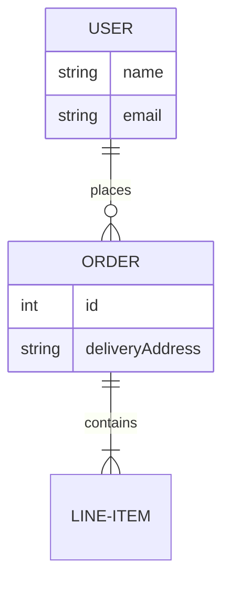

# Database Schema: [Module Name]

## ER Diagram
*Use Mermaid to visualize relationships.*

## Tables

### `users`
| Column | Type | Nullable | Default | Description |
| :--- | :--- | :--- | :--- | :--- |
| `id` | bigint | No | Auto Inc | Primary Key |
| `email` | string | No | - | Unique login email |
| `password` | string | No | - | Hashed password |

### `orders`
| Column | Type | Nullable | Default | Description |
| :--- | :--- | :--- | :--- | :--- |
| `id` | bigint | No | Auto Inc | Primary Key |
| `user_id` | bigint | No | - | FK to `users` |
| `total` | decimal | No | 0.00 | Total amount |

## Indexes
- `users_email_unique` (`email`)
- `orders_user_id_index` (`user_id`)

## Migration File
`database/migrations/2026_01_01_000000_create_orders_table.php`
