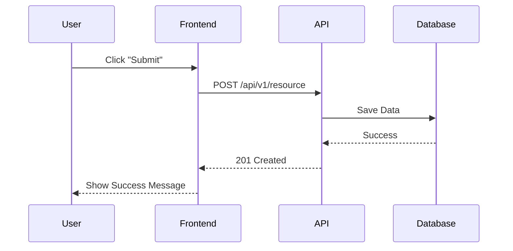

# Feature Specification: [Feature Name]

| Metadata | Details |
| :--- | :--- |
| **Status** | `Draft` / `Review` / `Approved` / `Implemented` |
| **Owner** | [Name] |
| **Date** | YYYY-MM-DD |
| **Priority** | High / Medium / Low |

## 1. Overview & Business Context
*Describe the purpose of this feature. Why are we building it? Who is it for?*

### User Story
> As a [User Role], I want to [Action], so that [Benefit].

## 2. Functional Requirements
- [ ] Requirement 1
- [ ] Requirement 2

## 3. Technical Design

### 3.1 Flowchart / Sequence Diagram


### 3.2 Database Schema Changes
*List any new tables or modifications.*

```sql
Schema::create('new_table', function (Blueprint $table) {
    $table->id();
    $table->string('name');
    $table->foreignId('user_id')->constrained();
    $table->timestamps();
});
```

### 3.3 API Endpoints
| Method | Endpoint | Description |
| :--- | :--- | :--- |
| GET | `/api/v1/resource` | List resources |
| POST | `/api/v1/resource` | Create resource |

## 4. Security & Permissions
- **Middleware**: `auth:sanctum`, `role:admin`
- **Validation**: Ensure input X is validated against rule Y.

## 5. Frontend Implementation
- **Components**: `ResourceTable.vue`, `ResourceForm.vue`
- **State Management**: Pinia Store `useResourceStore`

## 6. Testing Strategy
- [ ] Unit Test: `ResourceServiceTest`
- [ ] Feature Test: `ResourceApiTest`
