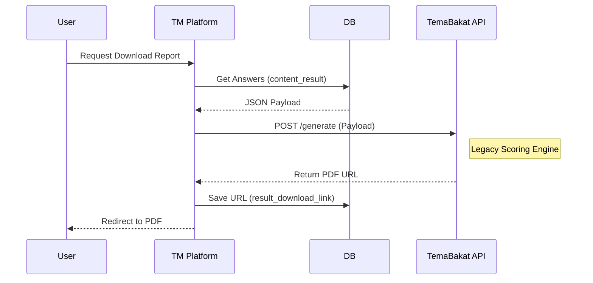

# Assessment Features

Nilai inti dari platform Talents Mapping adalah administrasi dan pemrosesan berbagai asesmen psikologis.

## Assessment Types

| Tipe Asesmen | Controller | Deskripsi Singkat | Target User |
| :--- | :--- | :--- | :--- |
| **ST-30 (Retail)** | `StrengthTypologyTestController` | Versi Personal. Dibeli satuan oleh member. | Pengguna Umum (B2C) |
| **ST-30 (Partner)** | `PartnerStrengthTypologyTestController` | Versi B2B. Didistribusikan via Kode Referensi. | Karyawan/Siswa (B2B) |
| **Full TM (Retail)** | `QuizController` | Asesmen lengkap 34 bakat (TM + PSS + GRIT). | Pengguna Berbayar (Retail) |
| **Full TM (Partner)** | `PartnerAssessmentController` | Asesmen lengkap untuk korporasi. | Karyawan/Siswa (B2B) |

## Alur Pengerjaan (Full TM)

1.  **Purchase**: Pengguna membeli Product (Asesmen).
2.  **Creation**: Record `UserAssessment` dibuat.
3.  **Quiz Sections**:
    -   **TM (Talents Mapping)**: Memetakan bakat utama.
    -   **PSS (Personal Strength Statement)**: Pernyataan kekuatan pribadi.
    -   **GRIT**: Mengukur ketekunan.
4.  **Submission**: Jawaban disimpan sementara (cache) di Session selama tes. Setelah selesai, `finishQuiz` menggabungkan jawaban ke dalam JSON `content_result`.

## Scoring & Report Generation Flow

Aplikasi ini **tidak** melakukan perhitungan psikometrik lengkap secara internal, melainkan menggunakan API eksternal.



### Data Payload Structure

Contoh struktur data yang dikirim ke API eksternal:

```json
{
    "nama": "Nama Lengkap User",
    "email": "user@example.com",
    "tm": "1234567890...",
    "pss": "GGGGGRRRR...",
    "grit": "55554444..."
}
```

:::warning External Dependency
Pembuatan laporan sangat bergantung pada `temabakat.com`. Kegagalan pada API eksternal akan mencegah pengguna mengunduh laporan mereka.
:::

## Code Reference

### `QuizController`
**Path**: `App\Http\Controllers\Front\QuizController.php`

#### `finishQuiz(Request $request)`
Menangani penyelesaian tes dan penyimpanan jawaban.

1.  **Validation**: Memastikan tidak ada jawaban kosong pada sesi `tm`, `pss`, `grit` (Session Based).
2.  **Aggregation**: Menggabungkan jawaban parsial dari `Session::get('user_answer')` menjadi string sequence.
3.  **Payload Construction**: Membentuk JSON `content_result` yang berisi profil user + string jawaban.
    ```json
    {
        "nama": "...",
        "email": "...",
        "tm": "123123...",
        "pss": "GGGRRR...",
        "grit": "555444..."
    }
    ```
4.  **Persistence**:
    -   Update `UserAssessment` dengan `content_result`.
    -   *Note*: Pemanggilan API `temabakat.com` dilakukan secara **asynchronous** (via Job/Action terpisah) atau ditangani di flow selanjutnya setelah data tersimpan.

