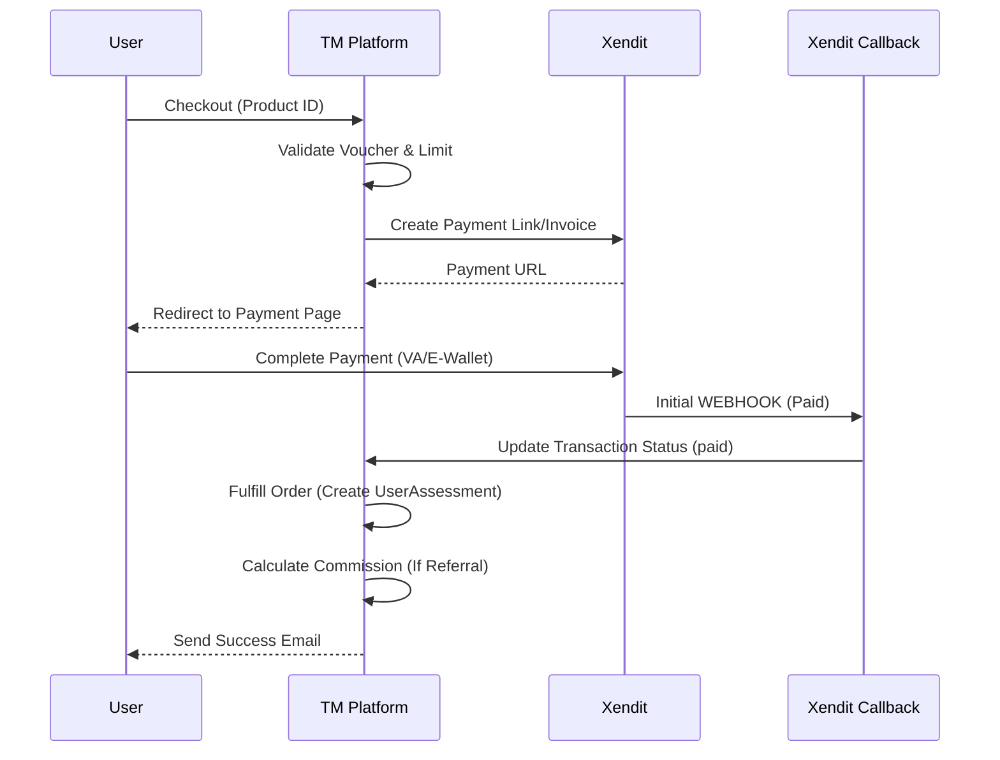

# Payment & Transactions

Platform menangani pembayaran untuk Customer Retail (Assessment & Counseling) dan **Partner** (Top-up Quota/Credit).

## Payment Gateway
Aplikasi terintegrasi dengan **Xendit** sebagai **Payment Gateway** utama. Terdapat juga dukungan warisan/alternatif untuk **Midtrans** dan **Doku** dalam skema database, tetapi Xendit adalah implementasi aktif untuk versi saat ini.

-   **Service**: `PaymentXenditService`
-   **Webhook**: `HandlePaymentXenditController`

## Transaction Flow (Retail)

Berikut adalah diagram alur proses pembayaran dari checkout hingga konfirmasi:

## Wallet & Commission System

Platform mencakup sistem **Wallet** khusus, terutama untuk melacak **Referral Commission** bagi Afiliator dan **Practitioner**.

### Components

| Komponen | Model | Deskripsi |
| :--- | :--- | :--- |
| **Wallet** | `App\Models\Wallet` | Menyimpan `current_earning` (saldo saat ini) dan `total_earning` (total pendapatan) user. |
| **Balance** | `App\Models\Balance` | Mencatat riwayat semua transaksi (masuk/keluar) yang mempengaruhi wallet. |
| **Commission** | `CommissionUserConfig` | Konfigurasi persentase atau nominal komisi per user/level. |

## Code Reference

### `PaymentXenditService`
**Path**: `App\Services\PaymentXenditService.php`

#### `createPayment(...)`
Membuat Invoice di Xendit.
-   **Environment Check**: Durasi invoice disesuaikan (Dev: 1-2 menit, Prod: 1 hari - 14 hari untuk Corporate).
-   **Customer Data**: Mengirim data user (nama, email, no hp) ke Xendit untuk pre-fill.

### `PaymentController`
**Path**: `App\Http\Controllers\Front\Transaction\PaymentController.php`

#### `pay(Request $request)`
Logic utama checkout retail.
1.  **Pricing Calculation**: Harga Produk + Admin Fee + PPN - Kode Voucher.
2.  **Invoice Creation**: Panggil service Xendit.
3.  **Data Persistence**: Simpan `Transaction`, `TransactionItem`.
4.  **Practitioner Assignment**: Jika user memilih spesifik praktisi, simpan ke `TransactionPractitionerAssignments`.

### `HandlePaymentXenditController` (Webhook)
**Path**: `App\Http\Controllers\Front\Transaction\HandlePaymentXenditController.php`

Menangani Callback dari Xendit.
1.  **Transaction Type Detection**:
    -   `Retail`: User beli asesmen/konsul.
    -   `Partner`: Topup kuota / bayar tagihan.
    -   `Executive`: Executive Summary.
2.  **Retail Flow (`PAID`)**:
    -   Update Status Transaksi.
    -   **Commission**: Hitung komisi Referral & Feedback Session (jika ada).
    -   **Fulfillment**:
        -   Buat record `UserAssessment` (token tes).
        -   Atau buat/update `UserFeedbackSessionOnly` (slot konsul).
    -   **Email**: Kirim `NotificationPaymentSuccessMail`.

### Referral Logic
1.  **Trigger**: Transaksi berhasil dengan `referral_code`.
2.  **Calculation**: Cek `CommissionUserConfig` referrer.
3.  **Credit**: Tambah saldo ke `Wallet` referrer.
4.  **Log**: Buat entry `Balance` tipe `referral_commission`.
