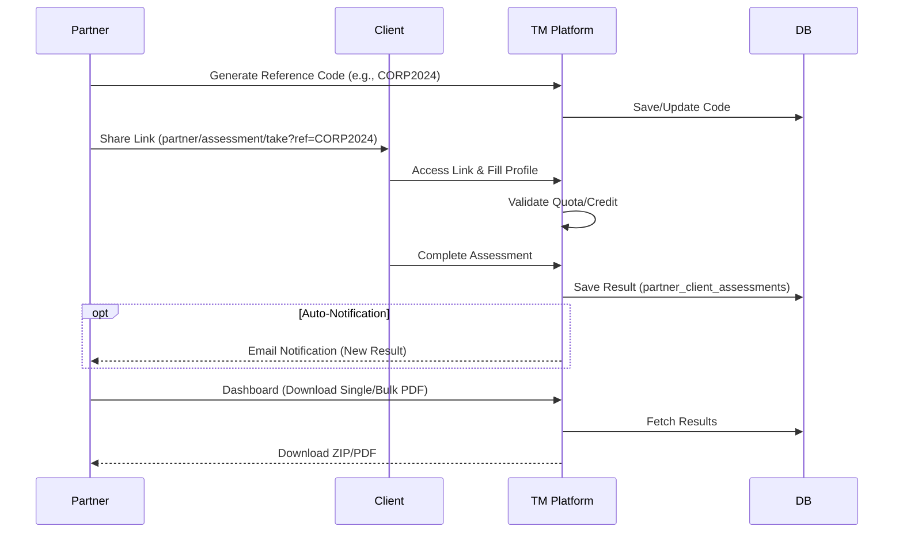

# Partner & Corporate Features

Platform mendukung operasi B2B di mana **Partner** (**Corporate**, Sekolah, atau **Reseller**) dapat mendistribusikan asesmen kepada klien/karyawan mereka.

## Partner Types

Perbandingan antara tipe **Pre-paid** dan **Post-paid**:

| Fitur | Pre-paid (After Payment) | Post-paid (Before Payment) |
| :--- | :--- | :--- |
| **Model** | `after_payment` | `before_payment` |
| **Pembayaran** | Di muka (Top-up). | Di belakang (Invoice Bulanan). |
| **Kontrol** | Berbasis **Quota**. Habis = Stop. | Berbasis **Credit/Limit**. Terus jalan sampai ditagih. |
| **Cocok Untuk** | Reseller Kecil, Sekolah (Batch). | Perusahaan Besar, Langganan Rutin. |
| **Flag** | Default. | `is_special_partner` (biasanya). |

## Assessment Distribution Flow

Berikut adalah alur bagaimana **Partner** mendistribusikan tes ke klien:

## Management Dashboard

-   **List Client**: Melihat daftar semua peserta tes.
-   **Status Indicators**:
    -   `Pending Download`: Tes selesai, laporan belum diambil.
    -   `Complete`: Laporan sudah diunduh.
-   **Actions**:
    -   **Single Download**: Mengunduh satu PDF.
    -   **Bulk Download**: Mengunduh ZIP dari beberapa PDF (`PartnerService`).
    -   **Top-up/Payment**: Mengunggah Bukti Pembayaran (**Proof of Payment**) untuk top-up manual (`confirmationManualPayment`).

## Code Reference

### Partner Assessment Controller
**File:** `app/Http/Controllers/Front/PartnerAssessmentController.php`

Controller yang menangani alur pengerjaan asesmen oleh partner dan client-nya.

*   **Quiz Execution (`questionAssessment`, `postUserAnswer`)**:
    *   Menangani tampilan pertanyaan dan penyimpanan jawaban per halaman/bagian.
    *   Menggunakan `Session` ('client_answer') untuk menyimpan progress pengerjaan sementara (draft), meminimalisir interaksi database yang berlebihan saat pengerjaan.
    *   Penyimpanan ke database (`timer_in_seconds`, dll) dilakukan saat bagian soal tertentu selesai atau saat finish.

*   **Completion (`finishQuiz`)**:
    *   **Validasi**: Memastikan semua soal (TM, PSS, GRIT) telah terisi.
    *   **Result Payload**: Mengkonstruksi JSON payload (`content_result`) yang berisi data diri klien dan string jawaban yang digabungkan. Format payload disesuaikan untuk kebutuhan generator report (External API).
    *   **Persistence**: Menyimpan `content_result` ke tabel `partner_client_assessments`.
    *   **Note**: Method ini *tidak* langsung memicu request ke API report, hanya menyiapkan datanya. Trigger report terjadi saat aksi "Download".

### Partner Service Logic
**File:** `app/Services/Impl/PartnerServiceImpl.php`

Service layer yang menangani bisnis logic kompleks terkait partner, termasuk transaksi dan generasi laporan.

*   **Report Generation (`singleDownloadAssessmentResult`)**:
    *   **Validation**: Memastikan user berhak (role partner sesuai), asesmen sudah lengkap (`tm`, `pss`, `grit` filled), dan sesi belum expired.
    *   **Quota Check**: Untuk partner tipe `after_payment`, mengecek ketersediaan kuota pada `PartnerQuotaDownload`. Mengembalikan error jika kuota habis.
    *   **API Integration (temabakat.com)**:
        *   Mengirim payload `content_result` ke API eksternal (`temabakat.com/apiv1/` atau `backbone`).
        *   Mendapatkan URL PDF balasan dari API.
        *   Pada environment `local`/`dev`, terdapat logic mocking atau penggunaan endpoint dev khusus.
    *   **Persisting & Logging**:
        *   Menyimpan link download (`result_download_link`) di database untuk cache di masa depan.
        *   Mengurangi kuota partner (`quotaLogs`) dan mencatat aktivitas user.

*   **Bulk Download (`bulkDownloadAssessmentResult`)**:
    *   **Flow**: Menerima list `ids`. Melakukan validasi kuota total di awal.
    *   **Zipping**: Membuat file `.zip` sementara di `assets/media/tmp`.
    *   **Iteration**: Loop melalui setiap ID, memanggil `singleDownloadAssessmentResult` (re-use logic), mendownload file PDF dari URL yang dikembalikan, dan menambahkannya ke dalam Zip.
    *   **Cleanup**: Jika proses sukses, mengembalikan link zip. Jika gagal di tengah jalan, menghapus file zip sementara dan rollback.
