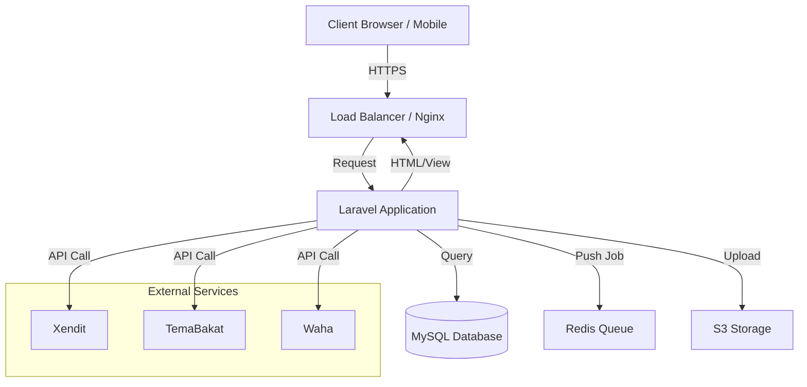
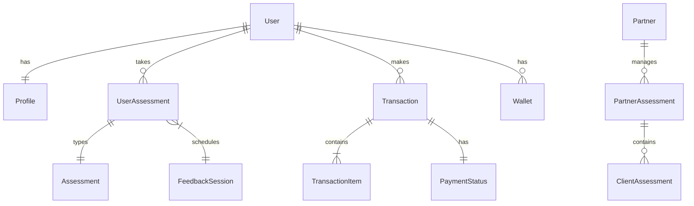
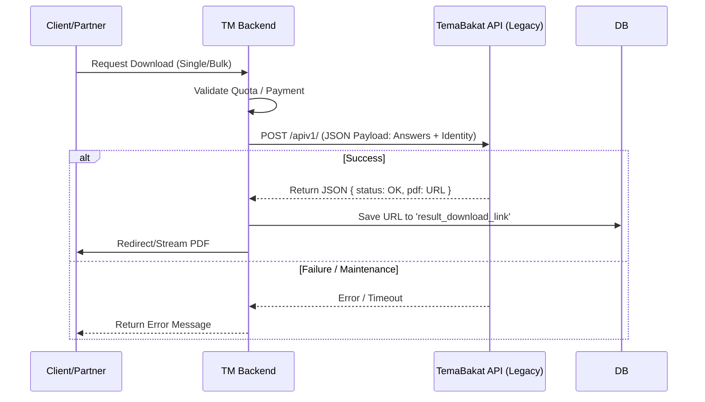

# Technical Architecture

Dokumen ini menguraikan infrastruktur teknis dan pola desain yang digunakan dalam platform Talents Mapping (v1.0.0).

## Tech Stack Overview

### Layers



### Backend Components
-   **Framework**: Laravel 10.x (PHP 8.2+)
-   **Database**: MySQL 8.0 / MariaDB
-   **Queue Driver**: Database / Redis (untuk pemrosesan **Job**)
-   **Architecture**: Monolithic MVC (Model-View-Controller). Controller mengembalikan View (Blade) secara langsung.
-   **API**: Internal API terbatas hanya untuk kebutuhan tertentu (seperti AJAX call), bukan API-first approach.

### Frontend Components
-   **Blade Templates**: Core rendering engine.
-   **Bootstrap 5.3**: CSS Framework untuk komponen UI.
-   **Livewire**: Digunakan untuk komponen dinamis di panel Admin/Dashboard (**Theme: Metronic by Keenthemes**).
-   **JavaScript**: Vanilla JS + jQuery (Legacy Support) untuk elemen interaktif.

## Key Architectures

### 1. Multi-auth System
Aplikasi menggunakan beberapa **guards** (`config/auth.php`) untuk memisahkan context user:
-   `web`: Untuk user **Admin** (`App\Models\Admin`).
-   `front`: Untuk **Member** dan **Partner** (`App\Models\User`).
-   `api`: Untuk konsumen API eksternal.

### 2. Service Pattern
Logika bisnis semakin dipindahkan dari Controller ke **Services** (`App\Services`).
-   **PartnerService**: Menangani logika beragam untuk berbagai tipe Partner.
-   **PaymentXenditService**: Mengisolasi logika komunikasi dengan Payment Gateway.

### 3. Assessment & Scoring
-   **Data Collection**: Aplikasi Laravel mengumpulkan jawaban mentah.
-   **Scoring Engine**: Calculation **offloaded** ke sistem eksternal legacy melalui API.
-   **Result Storage**: Hasil akhir (Link PDF dan JSON mentah) disimpan di `user_assessments` dan `partner_client_assessments`.

## Database Schema (Core Models)

Berikut adalah relasi utama antar model penting dalam sistem:



### Key Models Descriptions

| Model Group | Utama | Deskripsi |
| :--- | :--- | :--- |
| **Users** | `User`, `Admin` | Tabel user inti, dibedakan dengan Scope. |
| **Profiles** | `UserProfile` | Data tambahan user (No HP, Alamat, dll). |
| **Transactions** | `Transaction`, `TransactionItem` | Menyimpan riwayat pembelian Retail. |
| **Assessments** | `Assessment`, `UserAssessment` | Data master tes dan hasil pengerjaan user. |
| **Partner** | `PartnerAssessment`, `ClientAssessment` | Struktur khusus untuk B2B (Quota & Credit). |

> **Lihat Detail Lengkap**: Penjelasan mendalam mengenai setiap model dapat dilihat pada bagian [Database Schema](./database/users-schema).

## Directory Structure Overview

Struktur direktori utama yang menampung logika bisnis aplikasi:

```bash
app/
├── Actions/           # Logika tunggal yang reusable (e.g., RequestConsultation)
├── Console/           # Custom Artisan Commands
├── Enums/             # Definisi Enum (Status, Tipe Transaksi)
├── Helpers/           # Global Helper functions (WhatsApp, Formatters)
├── Http/
│   ├── Controllers/   # Request Handlers
│   │   ├── Admin/     # Back-office Logic
│   │   ├── Auth/      # Authentication Logic
│   │   └── Front/     # User/Partner Facing Logic
│   ├── Requests/      # Form Validation Classes
│   └── Middleware/    # Route Protection & Filtering
├── Jobs/              # Queued Jobs (Email, PDF Generation)
├── Models/            # Eloquent ORM Classes
├── Services/          # Service Layer (Business Logic Complex)
│   ├── Impl/          # Implementation Classes
│   └── PartnerService # Interface Contracts
└── Traits/            # Reusable Code Snippets
```

## Critical System Flows

### Report Generation Process (Dependency)

Sistem sangat bergantung pada layanan eksternal untuk generasi laporan PDF. Berikut adalah detail alurnya:



> **Catatan Penting**: Dependency ke `temabakat.com` bersifat kritikal. Jika layanan tersebut down, fitur download laporan di seluruh platform akan terhenti.

## Background Jobs & Queues

Aplikasi menggunakan Queue untuk tugas berat agar tidak memblokir user interface:

*   **Email Sending**:
    *   `SendEmailInvoice`: Mengirim invoice transaksi.
    *   `SendEmailAccountRegistered`: Notifikasi pendaftaran user baru.
*   **Notifications**:
    *   Integrasi WhatsApp (Waha) seringkali dipanggil secara synchronous atau via helper, namun idealnya dipindahkan ke Job untuk keandalan.

## Security & Access Control

*   **RBAC (Role-Based Access Control)**: Menggunakan `spatie/laravel-permission`.
*   **Middleware**:
    *   `auth:front`: Melindungi route member/partner.
    *   `role:admin`: Melindungi route back-office.
    *   `verified`: Memastikan email user telah diverifikasi.
