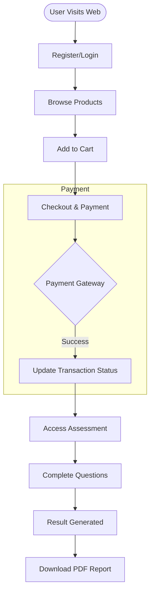
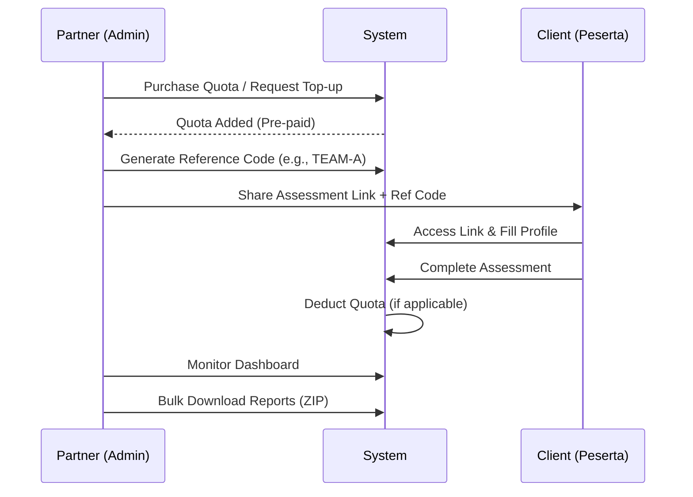
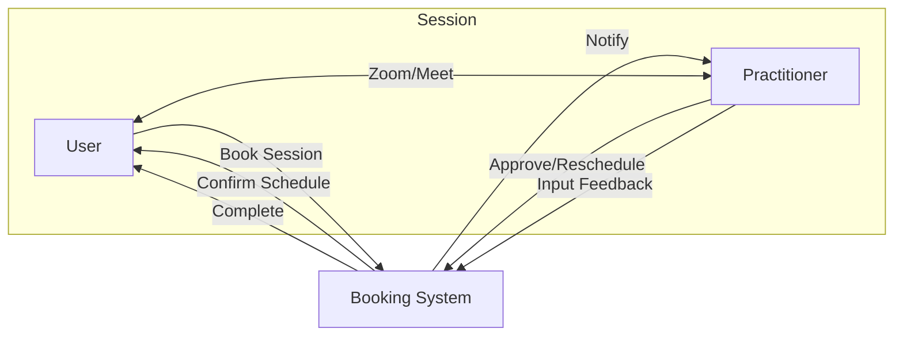

# Business Flow & User Journeys

Dokumen ini menjelaskan alur bisnis utama dalam ekosistem Talents Mapping.

## 1. Retail User Journey (Personal)

Alur untuk pengguna perorangan yang ingin membeli dan mengerjakan asesmen.

## 2. Partner B2B Journey

Alur untuk Sekolah, Perusahaan, atau Reseller yang mengelola banyak peserta.

## 3. Practitioner Consultation Flow

Alur verifikasi dan konsultasi hasil asesmen bersama praktisi.

