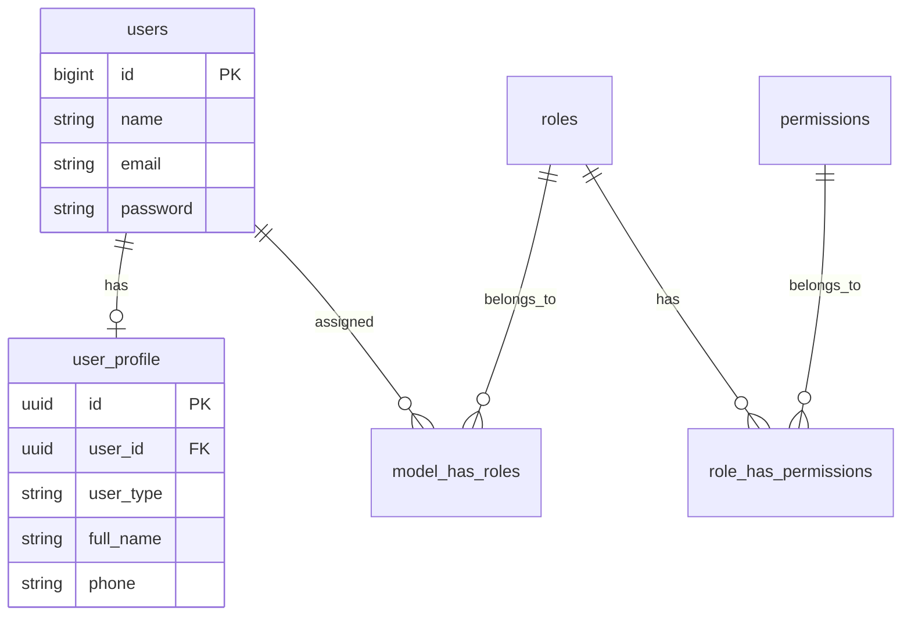

# Users & Authorization Schema

This section documents the schema for User Management, Profiles, and Role-Based Access Control (RBAC).

## ER Diagram

## Tables

### `users`
The core authentication table for all user types (Admin, Member, Partner).

| Column | Type | Constraint | Description |
| :--- | :--- | :--- | :--- |
| `id` | `BIGINT` | `PK`, `AUTO_INCREMENT` | Unique identifier. |
| `name` | `VARCHAR(255)` | `NOT NULL` | User's display name. |
| `email` | `VARCHAR(255)` | `UNIQUE`, `NOT NULL` | User's email address (login credential). |
| `email_verified_at` | `TIMESTAMP` | `NULLABLE` | Timestamp of email verification. |
| `password` | `VARCHAR(255)` | `NOT NULL` | Hashed password. |
| `remember_token` | `VARCHAR(100)` | `NULLABLE` | "Remember me" token. |
| `timestamps` | `TIMESTAMP` | - | `created_at` and `updated_at`. |

### `user_profile`
Extended profile information for a user.

| Column | Type | Constraint | Description |
| :--- | :--- | :--- | :--- |
| `id` | `UUID` | `PK` | Unique Profile ID. |
| `user_id` | `UUID` | `FK` | Linked to `users.id` (Note: Migration uses UUID, verify actual usage if `users` is BIGINT). |
| `user_type` | `VARCHAR(36)` | `NOT NULL` | Type: `member`, `practitioner`, `partner`, `admin`. |
| `full_name` | `VARCHAR(255)` | `NOT NULL` | Official full name. |
| `sex` | `CHAR(1)` | `NULLABLE` | Gender: `L` (Male) / `P` (Female). |
| `phone` | `VARCHAR(16)` | `NULLABLE` | Phone number (formatted). |
| `email` | `VARCHAR(100)` | `NULLABLE` | Secondary email or copy of main email. |
| `profile_image` | `VARCHAR(512)` | `NULLABLE` | Path to profile image. |
| `bio` | `VARCHAR(8192)` | `NULLABLE` | User biography/description. |
| `profession_id` | `UUID` | `NULLABLE` | Linked to `master_professions`. |
| `birth_date` | `DATE` | `NULLABLE` | User's date of birth. |
| `city` | `VARCHAR(100)` | `NULLABLE` | City name. |
| `address` | `VARCHAR(255)` | `NULLABLE` | Detailed address. |
| `is_verified` | `BOOLEAN` | `DEFAULT FALSE` | Verification status. |
| `status` | `VARCHAR(10)` | `DEFAULT 'active'` | Account status: `active`, `inactive`. |
| `is_deleted` | `BOOLEAN` | `DEFAULT FALSE` | Soft delete flag (Application level). |

### `roles`
Defined roles in the system (Spatie Permission).

| Column | Type | Constraint | Description |
| :--- | :--- | :--- | :--- |
| `id` | `BIGINT` | `PK`, `AUTO_INCREMENT` | Unique Role ID. |
| `name` | `VARCHAR(125)` | `NOT NULL` | Role name (e.g., `super-admin`, `member`). |
| `guard_name` | `VARCHAR(125)` | `NOT NULL` | Guard context (`web`, `front`). |

### `model_has_roles`
Pivot table linking Users to Roles.

| Column | Type | Constraint | Description |
| :--- | :--- | :--- | :--- |
| `role_id` | `BIGINT` | `FK` | Linked to `roles.id`. |
| `model_type` | `VARCHAR(255)` | `NOT NULL` | Class name (e.g., `App\Models\User`). |
| `model_id` | `UUID/BIGINT` | `NOT NULL` | Linked to `users.id`. |

### `permissions`
Granular permissions (Spatie Permission).

| Column | Type | Constraint | Description |
| :--- | :--- | :--- | :--- |
| `id` | `BIGINT` | `PK`, `AUTO_INCREMENT` | Unique Permission ID. |
| `name` | `VARCHAR(125)` | `NOT NULL` | Permission name. |
| `guard_name` | `VARCHAR(125)` | `NOT NULL` | Guard context. |
