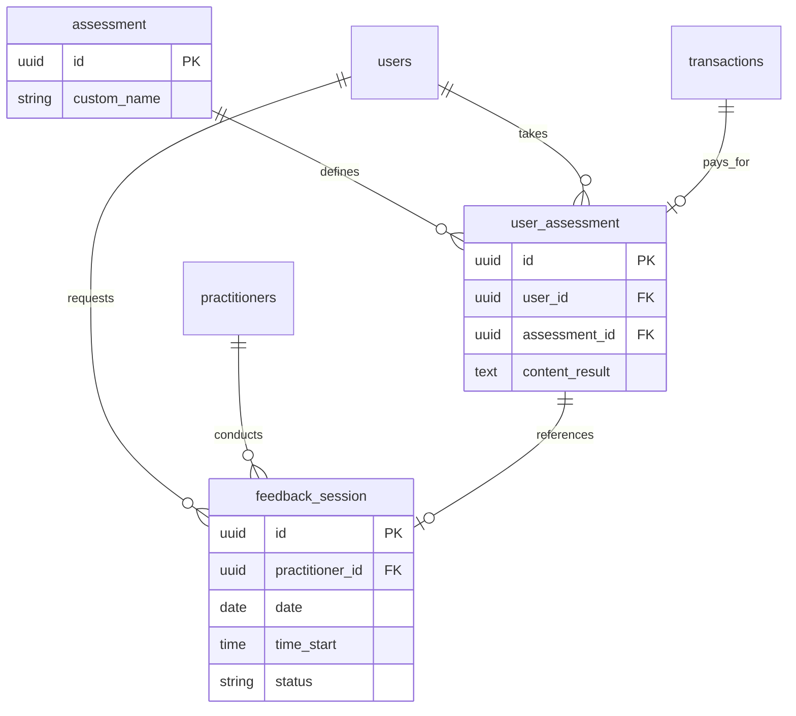

# Assessments & Consultations Schema

This section documents the schema for Assessment Products, User Results, and Consultation Sessions.

## ER Diagram

## Tables

### `assessment`
Master table for assessment products/types.

| Column | Type | Constraint | Description |
| :--- | :--- | :--- | :--- |
| `id` | `UUID` | `PK` | Unique ID. |
| `product_id` | `UUID` | `FK` | Linked to `products` (Pricing/Commerce). |
| `feedback` | `BOOLEAN` | `DEFAULT FALSE` | Does this assessment include consultation? |
| `assessment_link` | `VARCHAR(255)` | `NULLABLE` | Link to external test (if applicable). |
| `question_group_id` | `VARCHAR(255)` | `NULLABLE` | ID of question set. |
| `custom_name` | `VARCHAR(255)` | `NULLABLE` | Display name override. |
| `status` | `VARCHAR(10)` | `DEFAULT 'active'` | Status: `active`, `inactive`. |

### `user_assessment`
Stores the result of a user taking an assessment.

| Column | Type | Constraint | Description |
| :--- | :--- | :--- | :--- |
| `id` | `UUID` | `PK` | Unique Result ID. |
| `user_id` | `UUID` | `FK` | Member who took the test. |
| `assessment_id` | `UUID` | `FK` | Type of assessment. |
| `transaction_id` | `UUID` | `FK`, `NULLABLE` | Linked to purchase transaction. |
| `result_raw` | `TEXT` | `NULLABLE` | Raw sequence of answers (e.g., `123123...`). |
| `data_payload` | `JSON` | `NULLABLE` | Payload sent to scoring engine. |
| `content_result` | `TEXT` | `NULLABLE` | Complete JSON result from scoring engine. |
| `result_download_link` | `VARCHAR(512)` | `NULLABLE` | URL to PDF Report. |
| `timer_in_seconds` | `INTEGER` | `DEFAULT 0` | Time taken to complete. |
| `assessment_start_at` | `TIMESTAMP` | `NULLABLE` | Start time. |
| `assessment_end_at` | `TIMESTAMP` | `NULLABLE` | Completion time. |
| `result_received_at` | `TIMESTAMP` | `NULLABLE` | Time when result was received from API. |

### `feedback_session`
Represents a scheduled consultation session between a Member and a Practitioner.

| Column | Type | Constraint | Description |
| :--- | :--- | :--- | :--- |
| `id` | `UUID` | `PK` | Unique Session ID. |
| `user_id` | `UUID` | `FK` | Member (Client). |
| `practitioner_id` | `UUID` | `FK` | Practitioner (Counselor). |
| `product_id` | `UUID` | `FK` | Product purchased. |
| `assessment_id` | `UUID` | `FK`, `NULLABLE` | Linked assessment context. |
| `date` | `DATE` | `NULLABLE` | Scheduled Date. |
| `time_start` | `TIME` | `NULLABLE` | Start Time. |
| `time_end` | `TIME` | `NULLABLE` | End Time. |
| `type` | `VARCHAR(7)` | `NULLABLE` | `online` or `offline`. |
| `meeting_link` | `VARCHAR(512)` | `NULLABLE` | Google Meet / Zoom link. |
| `status` | `VARCHAR(15)` | `DEFAULT 'pending'` | `pending`, `on_progress`, `completed`. |
| `note` | `TEXT` | `NULLABLE` | Practitioner notes. |
| `documentation_image` | `VARCHAR(512)` | `NULLABLE` | Proof of session (screenshot). |
