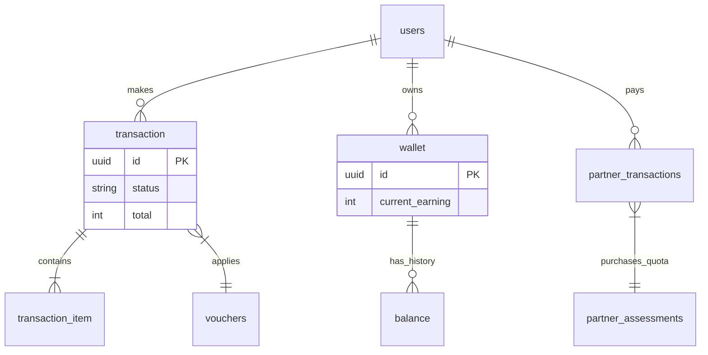

# Transactions & Finance Schema

This section documents the schema for Retail Payments, Partner Top-ups, Wallet System, and Vouchers.

## ER Diagram

## Tables

### `transaction`
Records retail purchases (User buying Assessment/Consultation).

| Column | Type | Constraint | Description |
| :--- | :--- | :--- | :--- |
| `id` | `UUID` | `PK` | Unique Transaction ID. |
| `user_id` | `UUID` | `FK` | Buyer. |
| `code` | `VARCHAR(20)` | `UNIQUE` | Human-readable Reference ID (e.g., `INV/2024/...`). |
| `sub_total` | `INTEGER` | `DEFAULT 0` | Price before tax/discount. |
| `admin_fee` | `INTEGER` | `DEFAULT 0` | Platform/Payment gateway fee. |
| `tax` | `INTEGER` | `DEFAULT 0` | PPN/Tax amount. |
| `total` | `INTEGER` | `DEFAULT 0` | Final amount to be paid. |
| `status` | `VARCHAR(20)` | `DEFAULT 'pending'` | `pending`, `paid`, `expired`, `cancelled`. |
| `payment_url` | `VARCHAR(2048)` | `NULLABLE` | Xendit Invoice URL. |
| `paid_at` | `TIMESTAMP` | `NULLABLE` | Time of payment confirmation. |

### `transaction_item`
Detailed items within a retail transaction.

| Column | Type | Constraint | Description |
| :--- | :--- | :--- | :--- |
| `id` | `UUID` | `PK` | Unique Item ID. |
| `transaction_id` | `UUID` | `FK` | Parent transaction. |
| `product_id` | `UUID` | `FK` | Product being purchased. |
| `price` | `INTEGER` | `DEFAULT 0` | Unit price at time of purchase. |
| `qty` | `INTEGER` | `DEFAULT 0` | Quantity. |
| `total` | `INTEGER` | `DEFAULT 0` | Line total. |

### `partner_transactions`
Records B2B payments (Top-up Quota or Bill Payment).

| Column | Type | Constraint | Description |
| :--- | :--- | :--- | :--- |
| `id` | `UUID` | `PK` | Unique ID. |
| `partner_id` | `UUID` | `FK` | Partner (User). |
| `code` | `VARCHAR(20)` | `UNIQUE` | Invoice Code. |
| `quota_downloads` | `INTEGER` | - | Number of assessment quotas purchased. |
| `sub_total` | `INTEGER` | - | Base amount. |
| `admin_fee` | `INTEGER` | - | Fee. |
| `dpp` | `INTEGER` | - | Dasar Pengenaan Pajak. |
| `ppn` | `INTEGER` | - | PPN Amount. |
| `total` | `INTEGER` | - | Grand Total. |
| `status` | `ENUM` | `pending`, `paid`, ... | Payment status. |

### `wallet`
Stores user's earning and commission capability.

| Column | Type | Constraint | Description |
| :--- | :--- | :--- | :--- |
| `id` | `UUID` | `PK` | Unique Wallet ID. |
| `user_id` | `UUID` | `FK` | Owner. |
| `current_earning` | `INTEGER` | `DEFAULT 0` | Withdrawable balance. |
| `total_earning` | `INTEGER` | `DEFAULT 0` | Lifetime earnings. |

### `balance`
Ledger/History of all wallet mutations.

| Column | Type | Constraint | Description |
| :--- | :--- | :--- | :--- |
| `id` | `UUID` | `PK` | Unique Ledger ID. |
| `wallet_id` | `UUID` | `FK` | Affected Wallet. |
| `amount` | `INTEGER` | `DEFAULT 0` | Mutation amount. |
| `balance_type` | `CHAR(3)` | `in`, `out` | Mutation direction. |
| `ref_type` | `VARCHAR(40)` | `NULLABLE` | Source: `withdrawal`, `referral_commission`, etc. |
| `ref_id` | `UUID` | `NULLABLE` | Polymorphic ID to source record. |

### `vouchers`
Discount codes.

| Column | Type | Constraint | Description |
| :--- | :--- | :--- | :--- |
| `id` | `UUID` | `PK` | Unique ID. |
| `code` | `VARCHAR(50)` | `UNIQUE` | The actual code entered by user. |
| `discount_type` | `ENUM` | `percent`, `nominal` | Type of calculation. |
| `discount_amount` | `INTEGER` | - | Value (e.g. 10 for 10% or 10000). |
| `usage_limit` | `INTEGER` | `DEFAULT 1` | Max uses global/per-user (logic dependent). |
| `valid_from` | `TIMESTAMP` | - | Start date. |
| `valid_until` | `TIMESTAMP` | - | Expiry date. |
