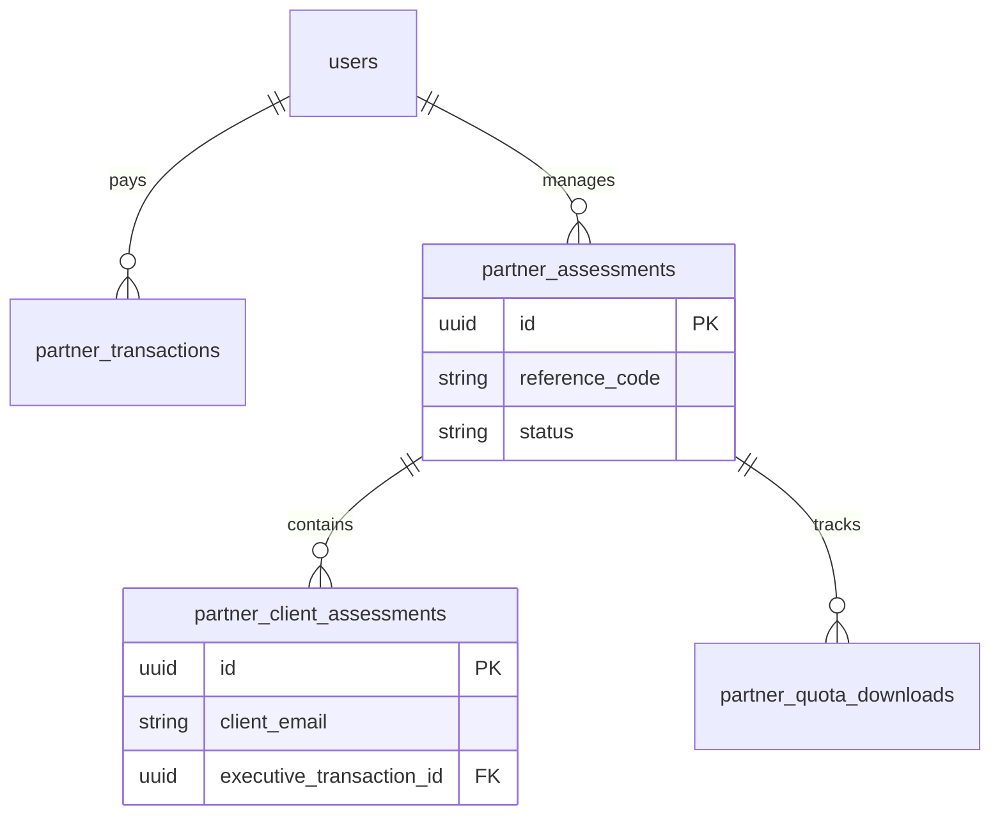

# Partner & B2B Schema

This section documents the schema for Partner management, Assessment distribution, and Client supervision.

## ER Diagram

## Tables

### `partner_assessments`
Represents an Assessment Event or Campaign created by a Partner. Clients join this event using the `reference_code`.

| Column | Type | Constraint | Description |
| :--- | :--- | :--- | :--- |
| `id` | `UUID` | `PK` | Unique Event ID. |
| `partner_id` | `UUID` | `FK` | The Partner (User). |
| `assessment_id` | `UUID` | `FK` | The Assessment Product type. |
| `reference_code` | `VARCHAR(255)` | `UNIQUE` | Code shared to clients (e.g., `CORP2024`). |
| `price` | `VARCHAR(255)` | `NULLABLE` | Custom price (if override). |
| `is_special_price` | `BOOLEAN` | `DEFAULT FALSE` | Flag for special pricing. |
| `end_date_special_price` | `TIMESTAMP` | `NULLABLE` | Expiry of special price. |
| `status` | `ENUM` | `active`, `inactive` | Event status. |

### `partner_client_assessments`
Represents a Client (Assessments Taker) within a Partner's event. Similar to `user_assessment` but for non-registered/shadow users.

| Column | Type | Constraint | Description |
| :--- | :--- | :--- | :--- |
| `id` | `UUID` | `PK` | Unique Client Result ID. |
| `partner_assessment_id` | `UUID` | `FK` | Parent Event. |
| `client_email` | `VARCHAR(255)` | `NOT NULL` | Client identifier. |
| `client_full_name` | `VARCHAR(255)` | `NOT NULL` | Client Name. |
| `client_organization` | `VARCHAR(255)` | `NULLABLE` | Company/School Name. |
| `client_position` | `VARCHAR(255)` | `NULLABLE` | Job Title/Role. |
| `result_raw` | `TEXT` | `NULLABLE` | Raw answers. |
| `result_download_link` | `VARCHAR(512)` | `NULLABLE` | PDF URL. |
| `executive_available` | `BOOLEAN` | `DEFAULT FALSE` | Has Executive Summary? |
| `executive_transaction_id` | `UUID` | `FK`, `NULLABLE` | Linked payment for Exec Summary. |

### `partner_quota_downloads`
Tracks the specific quota available for a Partner Assessment event (Pre-paid model).

| Column | Type | Constraint | Description |
| :--- | :--- | :--- | :--- |
| `id` | `UUID` | `PK` | Unique ID. |
| `partner_assessment_id` | `UUID` | `FK` | Parent Event. |
| `quota` | `INTEGER` | `DEFAULT 0` | Remaining/Allocated quota. |

### `partner_credits`
Tracks usage for Post-paid partners (Pay-per-use / Bill later).

| Column | Type | Constraint | Description |
| :--- | :--- | :--- | :--- |
| `id` | `UUID` | `PK` | Unique ID. |
| `partner_client_assessment_id` | `UUID` | `FK` | Linked Client Result. |
| `status` | `ENUM` | `pending`, `paid` | Billing status. |
