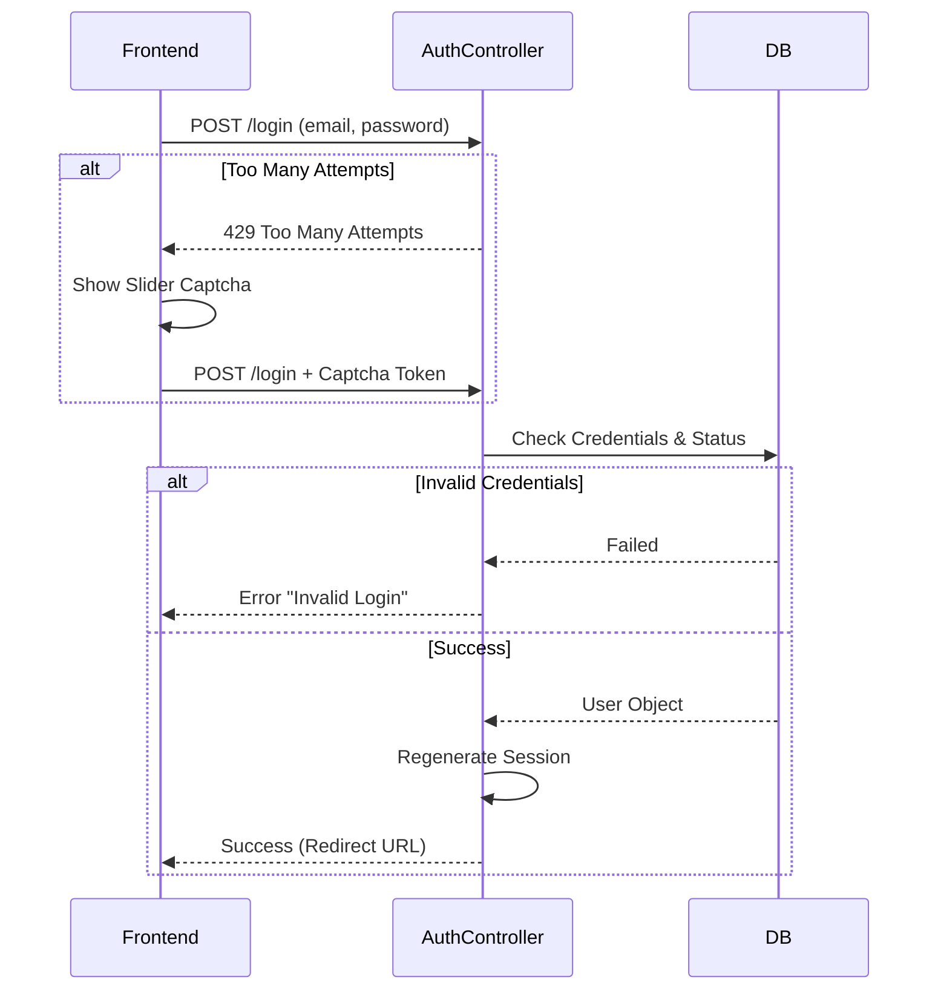

# Authentication & Authorization

Sistem menggunakan multi-auth (banyak **guards**) Laravel untuk membedakan antara Pengguna Umum/Member, **Partner**, dan Administrator.

## Guards

Didefinisikan dalam `config/auth.php`:

| Guard | Model User | Driver | Tabel | Deskripsi |
| :--- | :--- | :--- | :--- | :--- |
| **`web`** | `App\Models\Admin` | Session | `users` | Digunakan khusus untuk **Administrator** backend. |
| **`front`** | `App\Models\User` | Session | `users` | Digunakan untuk **Member**, **Partner**, dan **Practitioner**. |
| **`api`** | `App\Models\UserAPI` | Token (Sanctum) | `users` | Akses API eksternal (Jarang digunakan). |

## User Model

Meskipun tabel dasarnya sama (`users`), logika dipisahkan melalui Eloquent Models berbeda:

### `User` (Member & Partner)
-   **Lokasi**: `App\Models\User.php`
-   **Fitur**:
    -   Memiliki relasi ke `Profile` (`user_profile`).
    -   Menggunakan Spatie Permission (`HasRoles`).
    -   Memiliki `Wallet` untuk saldo/komisi.
    -   Memiliki relasi ke `UserAssessment` (hasil tes).

### `Admin`
-   **Lokasi**: `App\Models\Admin.php`
-   **Fitur**:
    -   Hanya dapat mengakses panel admin (Filament/Backpack/Custom Admin).
    -   Memiliki hak akses penuh atau terbatas berdasarkan role admin.

## Authentication Flow

### Login Flow

Berikut adalah diagram alur proses Login, termasuk mekanisme keamanan seperti Slider Captcha dan Rate Limiting.

### Registration Logic
-   **Controller**: `AuthController@store`
-   **Logika Penting**:
    1.  Validasi input (termasuk validasi nomor telepon dengan `libphonenumber`).
    2.  Membuat user baru di tabel `users`.
    3.  Membuat profil di tabel `user_profile` (Default tipe: `member`).
    4.  Menetapkan role default (`member`).
    5.  Logika opsional: Redirect jika user mendaftar saat proses checkout (memiliki keranjang belanja).

## Role Management (RBAC)

Menggunakan bungkusan `spatie/laravel-permission`.

| Role | Deskripsi | Akses Utama |
| :--- | :--- | :--- |
| `super-admin` | Pengguna level tertinggi. | Semua akses backend. |
| `admin` | Administrator operasional. | Manajemen user, transaksi, laporan (terbatas). |
| `member` | Pengguna akhir (Retail). | Beli asesmen, kerjakan tes, booking konseling. |
| `partner` | Mitra bisnis (B2B). | Beli kuota, generate kode referensi, unduh laporan klien. |
| `practitioner` | Konselor Profesional. | Verifikasi hasil tes, manajemen jadwal konsultasi. |

## Code Reference

### `AuthController`
**Path**: `App\Http\Controllers\Front\Auth\AuthController.php`

#### `store(Request $request)`
Menangani pendaftaran pengguna baru.
1.  **Phone Validasi**: Menggunakan `libphonenumber` untuk memastikan format internasional (E164) dan validitas provider Indonesia.
2.  **Transactions**: Menggunakan `DB::beginTransaction()` untuk atomicity.
3.  **Creation**:
    -   `User`: Dibuat dengan UUID.
    -   `Profile`: Dibuat dengan default `user_type: member`.
    -   `Role`: `assignRole('member')`.
4.  **Notifications**:
    -   `SendEmailAccountMemberRegistered`: Job antrian email.
    -   `WhatsAppHelper::sendMessageWooWaJob`: Notifikasi WA via Waha.

#### `login(Request $request)`
1.  **Rate Limiting**: Maksimal 10 percobaan per IP. Jika lebih, wajib geser **Slider Captcha**.
2.  **Credentials**: Email & Password.
3.  **Validation**:
    -   Cek `is_verified` (opsional/disable di kode saat ini).
    -   Cek status akun `active`.
    -   Cek Role Guard (`front`).

