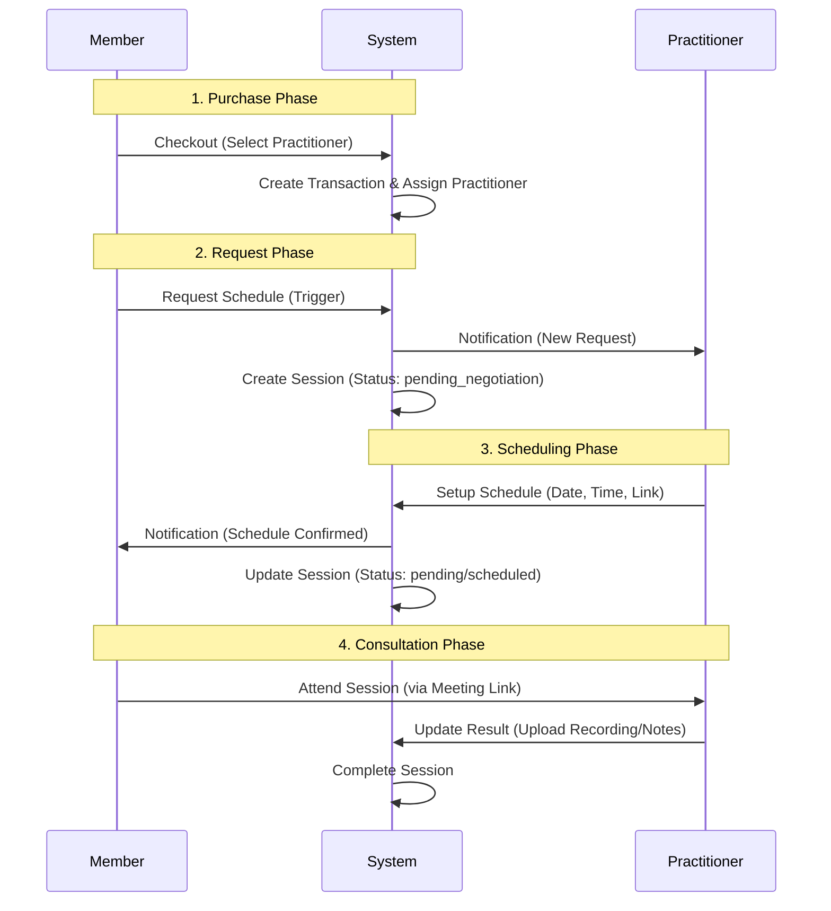

# Booking & Consultation

Platform memfasilitasi **Booking** sesi **Verification/Counseling** antara User (**Member**) dan **Practitioner**.

## Overview

Berbeda dengan sistem lama di mana User memilih jadwal, pada versi terbaru (**Latest Flow**), **Practitioner** memegang kendali penuh dalam penentuan jadwal. User hanya memilih **Practitioner** di awal (saat Checkout) dan mengajukan permintaan (Trigger), kemudian **Practitioner** yang akan menentukan tanggal dan waktu sesi.

## Consultation Flow

Berikut adalah alur proses konsultasi dari pemilihan hingga penyelesaian:

## Tahapan Detail

### 1. Practitioner Selection
Pada versi terbaru, pemilihan **Practitioner** terjadi secara spesifik saat proses **Checkout**.
- User memilih produk layanan.
- User memilih **Practitioner** yang tersedia untuk tier produk tersebut.
- Sistem mengunci pasangan User-Practitioner ini dalam `Transaction`.

### 2. Request Schedule (User Trigger)
Setelah pembayaran berhasil, User tidak langsung memilih tanggal.
- **Action**: User menekan tombol untuk mengajukan jadwal.
- **System**: Membuat record `FeedbackSession` dengan status awal (misalnya `pending_negotiation`).
- **Notifikasi**: **Practitioner** menerima info bahwa ada klien yang menunggu jadwal.

### 3. Scheduling (Practitioner Action)
**Practitioner** memiliki kendali penuh untuk mengatur jadwal melalui dashboard mereka.
- **Controller**: `PractitionerConsultationController`
- **Actions**:
    - `store()`: Membuat jadwal baru.
    - `update()`: Mengubah jadwal yang sudah ada.
- **Input Data**:
    - `scheduled_date`: Tanggal sesi.
    - `time_start` & `time_end`: Durasi sesi.
    - `meeting_link`: Tautan pertemuan (Google Meet/Zoom).

### 4. Status Lifecycle

Berikut adalah perubahan status pada `FeedbackSession`:

| Status | Deskripsi | Aktor/Pemicu |
| :--- | :--- | :--- |
| `pending_negotiation` | User telah meminta jadwal, menunggu Practitioner. | User Trigger |
| `pending` / `scheduled` | Jadwal telah ditentukan, menunggu hari H. | Practitioner (`store`) |
| `on_progress` | Sesi sedang berlangsung (opsional/manual flag). | System/Practitioner |
| `completed` | Sesi selesai, laporan/hasil telah diunggah. | Practitioner (Upload Result) |
| `canceled` | Sesi dibatalkan. | User/Practitioner |
| `failed` | Gagal/Dibatalkan. | Sesi dibatalkan karena alasan teknis/admin. |

## Code Reference

### `NewScheduleController`
**Path**: `App\Http\Controllers\Front\NewScheduleController.php`

#### `listPractitioners(Request $request)`
Menampilkan daftar praktisi yang tersedia.
-   **Filtering**: Hanya menampilkan praktisi dengan Tier Produk yang sesuai.
-   **Sorting Model**:
    1.  **Productivity**: Jumlah sesi `completed` bulan lalu.
    2.  **Activity**: Log aktivitas sistem bulan lalu.
    3.  **Completeness**: Kelengkapan profil (Foto, Bio, Profesi).

#### `selectPractitioner(Request $request)`
User memilih praktisi untuk konsultasi.
-   Memanggil Action Class (`RequestConsultation...`).
-   Mengembalikan URL WhatsApp `https://wa.me/{phone}?text=...` untuk negosiasi jadwal manual.

### Actions
**Path**: `App\Domain\Consultation\Action\`

#### `RequestConsultationUserAssessmentAction`
Menangani permintaan konsultasi dari hasil asesmen.
1.  **Validation**: Pastikan asesmen milik user yang login.
2.  **Duplication Check**: Mencegah double request jika status masih `pending_negotiation` atau `on_progress`.
3.  **Persistence**: Membuat record `feedback_session` dengan status `pending_negotiation`.
4.  **Notification**: Mengirim notifikasi ke praktisi (Email/WA).

## Data Structure

### `feedback_session`

Tabel utama yang menyimpan detail sesi konsultasi.

| Kolom | Tipe | Deskripsi |
| :--- | :--- | :--- |
| `id` | UUID | ID Unik Sesi. |
| `practitioner_id` | UUID | ID Practitioner yang menangani. |
| `user_id` | UUID | ID Member (Klien). |
| `status` | String | Status sesi (lihat tabel di atas). |
| `scheduled_date` | Date | Tanggal sesi (diisi Practitioner). |
| `time_start` | Time | Jam mulai. |
| `time_end` | Time | Jam selesai. |
| `meeting_link` | URL | Link video conference. |
| `result_link` | Text | Link rekaman/catatan hasil sesi. |

### `user_schedule`

Tabel pendukung untuk menampilkan jadwal di kalender (Digunakan untuk sinkronisasi tampilan).

- Terhubung dengan `feedback_session`.
- Digunakan oleh `PractitionerConsultationController@index` untuk menampilkan event di kalender dashboard.
