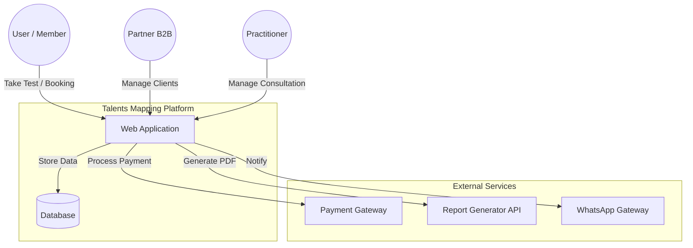

# Pengantar Talents Mapping

Selamat datang di Dokumentasi Teknis Talents Mapping (Versi 1.0.0). Dokumentasi ini mencakup arsitektur, fitur utama, dan detail implementasi dari platform web Talents Mapping.

## Apa itu Talents Mapping?

Talents Mapping (TM) adalah metode asesmen berbasis kekuatan yang dirancang untuk mengidentifikasi dan mengembangkan bakat unik individu. Metode ini membantu pengguna dalam membuat keputusan terkait karier, pendidikan, dan pengembangan diri berdasarkan pemetaan 34 bakat (mirip dengan CliftonStrengths).

Platform ini berfungsi sebagai sarana digital untuk:
1.  Melakukan asesmen psikologis (Strength Typology, Personal Strength Statement, dll).
2.  Menghasilkan laporan bakat yang komprehensif.
3.  Menghubungkan pengguna dengan **Practitioner** (Konselor) untuk verifikasi dan konsultasi.

## Ecosystem Overview

Berikut adalah gambaran besar bagaimana pengguna dan layanan berinteraksi dalam ekosistem Talents Mapping:

## Fitur Utama

| Fitur | Deskripsi | Aktor Utama |
| :--- | :--- | :--- |
| **Online Assessment** | Pengguna dapat membeli dan mengerjakan berbagai jenis tes bakat (ST-30, TM Lengkap). | Member, Partner Client |
| **Payment Integration** | Pembayaran otomatis via Virtual Account, E-Wallet, QRIS. | Member, Partner |
| **Partner (B2B)** | Manajemen asesmen massal untuk Korporasi dan Sekolah. | Corporate, Reseller |
| **Booking & Consultation** | Penjadwalan sesi konseling verifikasi bakat. | Member, Practitioner |
| **Practitioner Management** | Dashboard pengelolaan klien dan jadwal praktik. | Practitioner |

## Tech Stack

Aplikasi ini dibangun menggunakan teknologi berikut:

-   **Backend**: PHP 8.4+ dengan Framework Laravel 10.x.
-   **Database**: MySQL 8.0 / MariaDB.
-   **Frontend**: Blade Templates, Bootstrap 5.3, dan Livewire.
-   **Server**: Linux (Ubuntu/CentOS).
-   **Third-Party Services**:
    -   **Xendit**: Payment Gateway.
    -   **TemaBakat API**: Generator Laporan PDF (Legacy System).
    -   **Waha (WhatsApp)**: Notifikasi WhatsApp.

## Struktur Dokumentasi

Dokumentasi ini dibagi menjadi beberapa bagian:

1.  **[Authentication](./authentication)**: Bagaimana pengguna mendaftar dan masuk (Multi-user guard).
2.  **[Assessment Features](./features-assessments)**: Alur pengerjaan tes dan penyimpanan hasil.
3.  **[Payment](./features-payments)**: Integrasi Xendit dan manajemen transaksi.
4.  **[Booking](./features-booking)**: Logika penjadwalan antara User dan **Practitioner**.
5.  **[Partner](./features-partners)**: Fitur khusus untuk reseller dan klien **Corporate**.
6.  **[Technical Architecture](./technical-architecture)**: Penjelasan mendalam tentang struktur kode dan database.
